<div style="page-break-after: always;"></div>

<br>
<br>
<br>
<br>
<br>
<br>
<br>
<br>
<br>
<br>
<br>
<br>
<br>
<br>
<br>
<br>


# DFMPro ユーザーガイド

DFMPro for Creo Parametric 

<!--
## Copyright Notice 

© HCL Technologies Limited. All rights reserved. 

No part of this document (whether in hardcopy or electronic form) may be reproduced, stored in a 
retrieval system, or transmitted, in any form or by any means, electronic, mechanical, photocopying, 
recording, or otherwise, to any third party without the written permission of HCL Technologies Limited. 
HCL Technologies Limited reserves the right to change the information contained in this document 
without prior notice. 
The names, trademarks, or registered trademarks used in this document are the sole property of the 
respective owners. They are governed/protected by the relevant trademark and copyright laws. 
This document is provided by HCL Technologies Limited for informational purposes only, without 
representation or warranty, and HCL Technologies Limited shall not be liable for errors or omissions with 
respect to the document. The information contained herein is provided on an “AS-IS” basis and to the 
maximum extent permitted by applicable law, HCL Technologies Limited hereby disclaims all other 
warranties and conditions, either express, implied, or statutory, including but not limited to any (if any) 
implied warranties, duties or conditions of merchantability, of fitness for a particular purpose, accuracy 
or completeness of responses, of results, of workmanlike effort, of lack of viruses, and lack of negligence, 
all with regard to the document. 
THERE IS NO WARRANTY OR CONDITION OF NON-INFRINGEMENT OF ANY INTELLECTUAL PROPERTY 
RIGHTS WITH REGARD TO THE DOCUMENT. IN NO EVENT WILL HCL TECHNOLOGIES LIMITED BE LIABLE TO 
ANY OTHER PARTY FOR LOST PROFITS, LOSS OF USE, LOSS OF DATA, OR ANY INCIDENTAL, 
CONSEQUENTIAL, DIRECT, INDIRECT, OR SPECIAL DAMAGES, WHETHER UNDER CONTRACT, TORT, 
WARRANTY, OR OTHERWISE, ARISING IN ANY WAY OUT OF THIS DOCUMENT, WHETHER OR NOT SUCH 
PARTY HAD ADVANCE NOTICE OF THE POSSIBILITY OF SUCH DAMAGES. 
-->

<div style="page-break-after: always;"></div>

## 著作権表示

© HCL Technologies Limited. 無断転載を禁じます。

本書（紙媒体または電子媒体を問わず）のいかなる部分も、HCL Technologies Limited の書面による許可なく、第三者に対して複製、検索システムへの保存、またはいかなる形式・手段（電子的、機械的、コピー、録音、その他の方法を含む）による送信を行うことはできません。

HCL Technologies Limited は、本書に含まれる情報を事前の通知なく変更する権利を有します。

本書で使用されている名称、商標、または登録商標は、それぞれの所有者に帰属するものです。これらは関連する商標法および著作権法によって管理・保護されています。

本書は情報提供のみを目的として HCL Technologies Limited によって提供されるものであり、いかなる表明または保証も伴いません。また、本書に関する誤りや記載漏れについて、HCL Technologies Limited は一切責任を負いません。

本書に含まれる情報は「現状のまま（AS-IS）」で提供されるものであり、適用される法律で許される最大限の範囲において、HCL Technologies Limited は、本書に関して、明示的・黙示的・法定を問わず、その他のすべての保証および条件（商品性、特定目的への適合性、回答の正確性または完全性、成果、専門的努力の品質、ウイルスの不存在、過失の不存在などの黙示的保証を含むがこれらに限定されない）を否認します。

また、本書に関していかなる知的財産権の非侵害保証も提供されるものではありません。

いかなる場合においても、HCL Technologies Limited は、本書に起因して発生する利益の損失、使用不能、データ損失、または付随的損害、結果的損害、直接的損害、間接的損害、特別損害について、契約、不法行為、保証その他の法的根拠のいかんを問わず責任を負いません。たとえそのような損害の可能性について事前に通知されていた場合であっても同様とします。

<!--
## Confidentiality Notice 
This document is disclosed only to the recipient pursuant to a confidentiality relationship under which the 
recipient has confidentiality obligations defined herein after. This document constitutes confidential and 
proprietary information belonging to HCL Technologies Limited. The recipient, by its receipt of this 
document, acknowledges the same. The recipient shall use the confidential information only for the 
purpose defined above for which this document is supplied. The recipient must obtain HCL Technologies 
Limited’s written consent before disclosing any information on this document's contents, subject matter, 
or part thereof to any third party, including an individual, firm, or company or an employee or employee 
of such a firm or company. The recipient acknowledges its obligation to comply with the provisions of this 
confidentiality notice.
-->


## 秘密保持に関する通知

本書は、秘密保持関係に基づき、その後に定義される秘密保持義務を負う受領者に対してのみ開示されるものです。

本書は、HCL Technologies Limited に帰属する機密かつ専有の情報を含む文書です。本書を受領した時点で、受領者はその事実を認識したものとみなされます。

受領者は、本書が提供された目的のためにのみ、本書に含まれる機密情報を使用するものとします。

受領者は、本書の内容、主題、またはその一部について、個人、法人、会社、またはそれらの従業員を含むいかなる第三者に対しても開示する場合には、事前に HCL Technologies Limited の書面による同意を得なければなりません。

受領者は、本秘密保持通知の規定を遵守する義務があることを認識するものとします。


<!--# DFMPro: Introduction -->

<!--
# DFMPro: 概要

## Purpose of DFMPro  
DFMPro is a Design for Manufacturability and Assembly (DFM/A) software developed by HCL 
Technologies Ltd. It is fully integrated within Creo Parametric®, solid modeling software. DFMPro 
for Creo Parametric is a tool for designers that facilitates upstream manufacturability validation 
and assembly within Creo Parametric software and takes corrective actions without multiple 
design iterations. It identifies designing areas that are difficult, expensive, or impossible to 
manufacture. The built-in interactive reports facility helps streamline collaboration with 
manufacturing and even suppliers. 

## Scope of this guide 
This guide provides an opportunity to learn DFMPro for Creo Parametric step-by-step features 
and functions. 

Exercises in this guide are intended to show how to use DFMPro for Creo Parametric. They may 
not correspond to actual machining practices. 

Exercise parts get installed when DFMPro for Creo Parametric is installed. They are available in 
the Examples sub-folder of DFMPro for Creo Parametric folder. 

(Typical Location: Drive C:\Program Files\Geometric\DFMPro for Creo Parametric (x64)\Examples). 

## Troubleshooting 
In case of any questions or concerns about DFMPro for Creo Parametric's User Interface User 
Guide, please contact us at dfmpro.support@hcl-software.com. 

## Disclaimer  
All pictures in this document are for illustrative purposes only!
-->

<div style="page-break-after: always;"></div>

# DFMPro：概要

## DFMPro の目的

DFMPro は、HCL Technologies Ltd. によって開発された Design for Manufacturability and Assembly（DFM/A：製造性および組立性設計）ソフトウェアです。
本ソフトウェアは、3Dソリッドモデリングソフトウェアである **Creo Parametric®** に完全に統合されています。

**DFMPro for Creo Parametric** は、設計者向けのツールであり、Creo Parametric 環境内で製造性および組立性の検証を上流工程で実施できるようにします。また、設計の繰り返しを何度も行うことなく、必要な修正対応を行うことが可能です。

DFMPro は、製造が困難・高コスト・または不可能となる可能性のある設計箇所を特定します。
さらに、組み込みのインタラクティブレポート機能により、製造部門やサプライヤーとの連携を効率化することができます。


## 本ガイドの範囲

本ガイドでは、**DFMPro for Creo Parametric** の機能および操作方法を、段階的に学習できるよう説明します。

本ガイドに含まれる演習は、DFMPro for Creo Parametric の使用方法を理解することを目的としています。
そのため、必ずしも実際の加工方法や製造工程を正確に反映しているものではありません。

演習用の部品データは、DFMPro for Creo Parametric のインストール時に自動的にインストールされます。
これらのデータは、DFMPro for Creo Parametric フォルダ内の **Examples サブフォルダ**に保存されています。

（一般的なインストール先の例）

```C:\Program Files\Geometric\DFMPro for Creo Parametric (x64)\Examples```

## トラブルシューティング

DFMPro for Creo Parametric のユーザーインターフェースガイドに関してご質問や問題がある場合は、以下のサポート窓口までお問い合わせください。

```dfmpro.support@hcl-software.com```


## 免責事項

本書に掲載されているすべての画像は、説明目的のみで使用されています。


<!--6 -->


<div style="page-break-after: always;"></div>

<!--# DFMPro User Interface -->

# DFMPro ユーザーインターフェース
<!--
## Launch DFMPro 

1. Install the latest version of DFMPro for Creo Parametric. Then, follow all the steps mentioned in the Installation Guide of DFMPro for Creo Parametric and complete the recommended setup procedure. 
2. Start Creo Parametric. 
3. Open a part document containing a single solid body or an assembly. 
-->

## DFMProの起動

1. **DFMPro for Creo Parametric の最新バージョンをインストール**します。その後、**DFMPro for Creo Parametric のインストールガイドに記載されている手順に従い、推奨されるセットアップ手順を完了してください。**

2. **Creo Parametric を起動**します。

3. **単一のソリッドボディを含むパーツドキュメント、またはアセンブリを開きます。**


<div style="text-align: center;">
  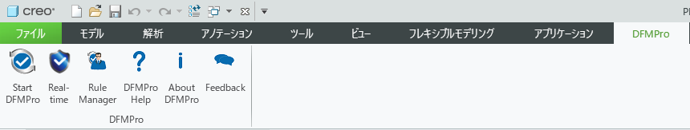
</div>


<div style="text-align: center; color: blue; font-weight: bold;">
DFMPro メニューのUI
</div>


<!--
## Commands available on the DFMPro Menu 
-->

## DFMPro メニューで使用できるコマンド


<table style="border-collapse: collapse; width: 100%;">
  <thead>
    <tr>
      <th style="border: 1px solid black; padding: 8px; text-align: center;">アイコン</th>
      <th style="border: 1px solid black; padding: 8px; text-align: center;">コマンド名</th>
      <th style="border: 1px solid black; padding: 8px; text-align: center;">説明</th>
    </tr>
  </thead>
  <tbody>
    <tr>
      <td style="border: 1px solid black; padding: 8px; text-align: center;">
        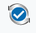
      </td>
      <td style="border: 1px solid black; padding: 8px; text-align: center;">DFMProの開始</td>
      <td style="border: 1px solid black; padding: 8px;">
        DFMPro のユーザーインターフェースを起動します。
      </td>
    </tr>
    <tr>
      <td style="border: 1px solid black; padding: 8px; text-align: center;">
        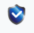
      </td>
      <td style="border: 1px solid black; padding: 8px; text-align: center;">リアルタイム</td>
      <td style="border: 1px solid black; padding: 8px;">
        フィーチャの作成または編集中に、DFMPro から迅速かつ即時のフィードバックや推奨事項を提供する Real-Time モードを起動します。
      </td>
    </tr>
    <tr>
      <td style="border: 1px solid black; padding: 8px; text-align: center;">
        
      </td>
      <td style="border: 1px solid black; padding: 8px; text-align: center;">ルールマネージャー</td>
      <td style="border: 1px solid black; padding: 8px;">
        このコマンドを実行すると、Rule Manager ウィンドウが表示され、必要に応じてデフォルトのルールを編集することができます。
      </td>
    </tr>
    <tr>
      <td style="border: 1px solid black; padding: 8px; text-align: center;">
        
      </td>
      <td style="border: 1px solid black; padding: 8px; text-align: center;">DFMPro ヘルプ</td>
      <td style="border: 1px solid black; padding: 8px;">
        コンテキストに応じたヘルプファイルを表示します。
      </td>
    </tr>
    <tr>
      <td style="border: 1px solid black; padding: 8px; text-align: center;">
        
      </td>
      <td style="border: 1px solid black; padding: 8px; text-align: center;">DFMProについて</td>
      <td style="border: 1px solid black; padding: 8px;">
        DFMPro - About ダイアログボックスには、バージョン、ビルド番号、ビルド日などの詳細情報が表示されます。
      </td>
    </tr>
    <tr>
      <td style="border: 1px solid black; padding: 8px; text-align: center;">
        
      </td>
      <td style="border: 1px solid black; padding: 8px; text-align: center;">Feedback</td>
      <td style="border: 1px solid black; padding: 8px;">
        サポートチームへ直接フィードバックメールを送信します。
        (<a href="mailto:dfmpro.support@hcl-software.com">dfmpro.support@hcl-software.com</a>).
      </td>
    </tr>
  </tbody>
</table>


<!--                  7 -->

<div style="page-break-after: always;"></div>

<!--# Rule Manager -->

# ルールマネージャー

<!--
1. In the Creo Parametric menu bar, click on the DFMPro menu and select the Rule 
Manager button.  

The DFMPro Rule Manager window will be displayed. 

2. Click on checkboxes to select the required rules from the list. 

画像
**Rule Manager window **

3. DFMPro allows the change of the rule’s specifications if required.  

Double-click on a desired rule from the list to change the specification and click the OK 
button to save it. 

OR 

Select a rule from the list and click the 
rule dialog box to apply changes. 

4. After selecting or modifying rules, click the 
Configure Rule button to open a specific 
Save button to save rule files. 
-->


1. **Creo Parametric のメニューバーで [DFMPro] メニューをクリックし、[Rule Manager] ボタンを選択します。**

> すると、DFMPro Rule Manager ウィンドウが表示されます。

2. **リスト内のチェックボックスをクリックして、必要なルールを選択します。**


<div style="text-align: center;">
  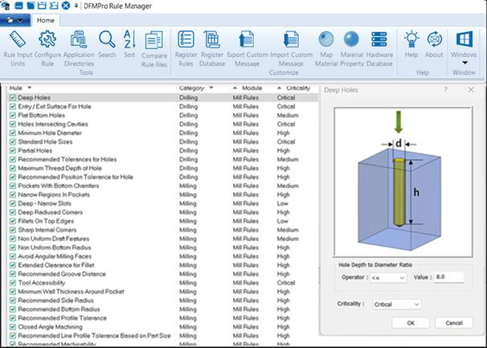
</div>

<div style="text-align: center; color: blue; font-weight: bold;">
Rule Manager ウィンドウ
</div>


3. **DFMPro では、必要に応じてルールの仕様を変更することができます。**

> リストから目的のルールを ダブルクリックすると仕様を変更できます。
> 変更後、[OK] ボタンをクリックして保存します。

> または

> リストからルールを選択し、[Configure Rule] ボタンをクリックして
> ルール設定ダイアログを開き、変更を適用することもできます。

4. **ルールの選択または変更を行った後、[Save] ボタンをクリックしてルールファイルを保存します。**


<!--Page.8-->
                

<!--Page.9--> 

<!--
<br>
<hr style="border: none; border-top: 1px solid #800020;">
<p style="color:#800020;">Note: If the Samples rule file is empty when launched, it means the ConfigModule.ini file 
is empty, which is available at the following location.</p> 

<p style="color:#800020;">```C:\ProgramData\GeometricLtd\DFMPro\wildfire\Settings\ConfigModule.ini``` </p>

<p style="color:#800020;">To retain the file contents, users must relaunch the Rule Manager. Users must 
have the necessary reading and writing permissions to save the status module 
loading and modify the file. If the user lacks write permissions, the administrator 
can assist by replacing the correct file. </p>
<hr style="border: none; border-top: 1px solid #800020;">
<br>
-->


<div style="page-break-after: always;"></div>

<br>
<hr style="border: none; border-top: 1px solid #800020;">

<p style="color:#800020;">
注意：起動時に Samples ルールファイルが空の場合、ConfigModule.ini ファイルが空であることを意味します。
このファイルは以下の場所にあります。
</p>

<p style="color:#800020;">
```C:\ProgramData\GeometricLtd\DFMPro\wildfire\Settings\ConfigModule.ini```
</p>

<p style="color:#800020;">
ファイルの内容を保持するには、Rule Manager を再起動する必要があります。
また、モジュールの読み込み状態を保存しファイルを変更するには、ユーザーに読み取りおよび書き込みの権限が必要です。
ユーザーに書き込み権限がない場合は、管理者が正しいファイルに置き換えることで対応できます。
</p>

<hr style="border: none; border-top: 1px solid #800020;">
<br>

 
<!--### The following commands are available on the Rule Manager window: -->

### Rule Manager ウィンドウで使用できるコマンド：


<table border="1" style="border-collapse: collapse; width:100%;">
<thead>
<tr>
<th>アイコン</th>
<th>コマンド名</th>
<th>説明</th>
</tr>
</thead>
<tbody>

<tr>
<td></td>
<td>New</td>
<td>既存のルールファイルに新しいルールを追加します。</td>
</tr>

<tr>
<td></td>
<td>Open</td>
<td>ルールファイルが最後に保存された既定の場所を開きます。</td>
</tr>

<tr>
<td></td>
<td>Save</td>
<td>ルールファイルの変更内容を保存します。</td>
</tr>

<tr>
<td></td>
<td>Save As</td>
<td>ルールファイルを別の場所または別名で保存します。</td>
</tr>

<tr>
<td></td>
<td>Rule Input Units</td>
<td>ルール編集時に使用する入力長さおよび角度の単位を設定するダイアログを開きます。</td>
</tr>

<tr>
<td></td>
<td>Configure Rule</td>
<td>変更を適用するための特定のルールファイル設定ダイアログを開きます。</td>
</tr>

<tr>
<td></td>
<td>Application Directories</td>
<td>データベースを変更するために使用されます。</td>
</tr>

<tr>
<td></td>
<td>Search</td>
<td>リストから特定のルールを検索するために使用されます。</td>
</tr>

<tr>
<td></td>
<td>Sort</td>
<td>列をアルファベット順に並べ替え、上下矢印を使用して優先順位を設定します。</td>
</tr>

<tr>
<td></td>
<td>Compare Rule Files</td>
<td>2つの異なるルールファイルを比較し、それらの違いを確認します。</td>
</tr>

<tr>
<td></td>
<td>Register Rules</td>
<td>解析で使用するルールの種類をカスタマイズするために使用されます。</td>
</tr>

<tr>
<td></td>
<td>Register Database</td>
<td>既存の登録済みデータベースモジュールを削除し、現在のデータベースまたは新しいデータベースを読み込みます。</td>
</tr>

<tr>
<td></td>
<td>Map Material</td>
<td>材料と製造プロセスの対応付けを行う「Map Material to Manufacturing Process」ダイアログを開き、データベースの更新を支援します。</td>
</tr>

<tr>
<td></td>
<td>Material Property</td>
<td>材料密度や被削性などの材料特性を表示するダイアログを開きます。</td>
</tr>

<tr>
<td></td>
<td>Export Custom Message</td>
<td>Help_ID、ルール名、ルールカテゴリ、カスタムメッセージ列などの情報を含むExcelファイルをエクスポートします。</td>
</tr>

<tr>
<td></td>
<td>Import Custom Message</td>
<td>Help_ID、ルール名、ルールカテゴリ、カスタムメッセージ列などの情報を含むExcelファイルをインポートします。</td>
</tr>

<tr>
<td></td>
<td>Hardware Database</td>
<td>締結部品データベースを追加・編集・削除できるHardware Databaseダイアログを開きます。</td>
</tr>

<tr>
<td></td>
<td>Cutter Database</td>
<td>カッターデータを追加・編集・インポート・エクスポートできるCutter Databaseダイアログを開きます。</td>
</tr>

<tr>
<td></td>
<td>Help</td>
<td>コンテキストベースのヘルプファイルを表示します。</td>
</tr>

<tr>
<td></td>
<td>About</td>
<td>Rule Manager に関する情報を表示します。</td>
</tr>

<tr>
<td></td>
<td>Windows</td>
<td>利用可能な一覧から表示するルールファイルウィンドウを選択します。</td>
</tr>

</tbody>
</table>


<!--


<table border="1" style="border-collapse: collapse; width:100%;">
<thead>
<tr>
<th>Icon</th>
<th>Command name</th>
<th>Description</th>
</tr>
</thead>
<tbody>

<tr>
<td></td>
<td>New</td>
<td>To add a new rule to existing rule files.</td>
</tr>

<tr>
<td></td>
<td>Open</td>
<td>To open the last default saved location of the rule file.</td>
</tr>

<tr>
<td></td>
<td>Save</td>
<td>To save changes in rule files.</td>
</tr>

<tr>
<td></td>
<td>Save As</td>
<td>To save changes of rule files at different locations or with another name.</td>
</tr>

<tr>
<td></td>
<td>Rule Input Units</td>
<td>This dialog box allows units to be set for input length and angular values when editing rules is desired.</td>
</tr>

<tr>
<td></td>
<td>Configure Rule</td>
<td>It opens a specific rule file dialog box to apply changes.</td>
</tr>

<tr>
<td></td>
<td>Application Directories</td>
<td>It is used to modify the database.</td>
</tr>

<tr>
<td></td>
<td>Search</td>
<td>It is used to search for specific rules from the list.</td>
</tr>

<tr>
<td></td>
<td>Sort</td>
<td>It is used to sort the columns alphabetically and set priority by using the Up and Down arrows.</td>
</tr>

<tr>
<td></td>
<td>Compare Rule Files</td>
<td>It is used to compare the two separate rule files and identify the difference between them.</td>
</tr>

<tr>
<td></td>
<td>Register Rules</td>
<td>It is used to customize the types of rules used for analysis.</td>
</tr>

<tr>
<td></td>
<td>Register Database</td>
<td>It removes an existing registered database module, loads a current one, and loads a new one.</td>
</tr>

<tr>
<td></td>
<td>Map Material</td>
<td>It is used to open the Map Material to Manufacturing Process dialog box, which helps update the database.</td>
</tr>

<tr>
<td></td>
<td>Material Property</td>
<td>It is used to open the Material property, e.g., Material Density, Machinability.</td>
</tr>

<tr>
<td></td>
<td>Export Custom Message</td>
<td>It is used to export an Excel file containing details like Help_ID, Rule Name, Rule Category, and Custom Message Column.</td>
</tr>

<tr>
<td></td>
<td>Import Custom Message</td>
<td>It is used to import an Excel file containing details like Help_ID, Rule Name, Rule Category, and Custom Message Column.</td>
</tr>

<tr>
<td></td>
<td>Hardware Database</td>
<td>It is used to open the Hardware Database dialog box, where the fastener database can be modified, added, and deleted.</td>
</tr>

<tr>
<td></td>
<td>Cutter Database</td>
<td>It is used to open the Cutter Database dialog box, where the cutter data can be added, edited, imported, and exported.</td>
</tr>

<tr>
<td></td>
<td>Help</td>
<td>It is used to display a context-based Help file.</td>
</tr>

<tr>
<td></td>
<td>About</td>
<td>Information about Rule Manager.</td>
</tr>

<tr>
<td></td>
<td>Windows</td>
<td>It selects the required rule file window from the available list.</td>
</tr>

</tbody>
</table>


-->


<!--Page.10-->

<!--Page.10-->

<div style="page-break-after: always;"></div>

<!--## Sort Order --> 

## 並び順

<!--
Click on the Sort button in the Rule Manager window will display the Sort Order dialog box. The 
dialog allows to sort the columns alphabetically and set priority by using the Up and Down arrows 
for Rule, Category, Module, Criticality, and Custom Message. 
-->

Rule Manager ウィンドウで [Sort] ボタンをクリックすると、[Sort Order] ダイアログボックスが表示されます。
このダイアログでは、各列をアルファベット順に並び替えることができます。また、**上矢印（Up）および下矢印（Down）**を使用して、Rule（ルール）、Category（カテゴリ）、Module（モジュール）
、Criticality（重要度）、Custom Message（カスタムメッセージ）項目の優先順位を設定することが可能です。

<div style="text-align: center;">
  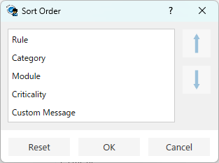
</div>


<!--## Follow the steps to sort the column: 
1. In the opened Rule Manager, select the rule file to view the list of rules. 
2. Click on the Sort button in the Rule Manager window will display the Sort Order dialog box. 
3. Click on the Header name to sort the column alphabetically (A-Z). 
4. Clicking the same Header name will reverse the sorting order (Z-A). 
5. Click the other Header name to arrange it alphabetically. Click on the same button will 
reverse the order. 

"Picture"
6. Users can also define the sequence of columns for sorting (prioritized) by clicking the Up and 
Down arrow. 
-->


### 列を並び替える手順：

1. **Rule Manager を開いた状態で、ルール一覧を表示するためにルールファイルを選択します。**

2. **Rule Manager ウィンドウの [Sort] ボタンをクリックすると、[Sort Order] ダイアログボックスが表示されます。**

3. **ヘッダー名をクリックすると、その列をアルファベット順（A-Z）で並び替えることができます。**

4. **同じヘッダー名をもう一度クリックすると、並び順が逆（Z-A）になります。**

5. **別のヘッダー名をクリックすると、その列をアルファベット順に並び替えることができます。**同じヘッダー名を再度クリックすると、並び順が逆になります。


<div style="text-align: center;">
  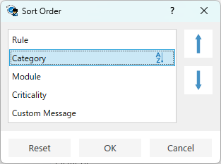
</div>

6. **また、Up（上）および Down（下）の矢印をクリックすることで、並び替えに使用する列の優先順位（ソート順序）を設定することもできます。**


<!--Page.11 -->

<!--
7. Click the Up and Down arrow to move the Header name as required. As per the defined 
sequence, DFMPro will sort the list of the rules. 
8. Once all required sorting options are defined, click the OK button to close the dialog box and 
apply the sorting to the rule file.  
9. DFMPro will arrange the list of rules as per the sort option (A-Z/Z-A) and, defined priority in 
the Sort Order dialog box. 

"Picture"

10. When the sort option is defined A-Z for the Custom Message column in the Sort Order dialog 
box, then the Comment will be sorted and displayed in the following mentioned order: 
-->

<div style="page-break-after: always;"></div>

7. **Up（上）および Down（下）の矢印をクリックして、必要に応じてヘッダー名の順序を変更します。**設定された順序に基づいて、DFMPro はルールの一覧を並び替えます。

<div style="text-align: center;">
  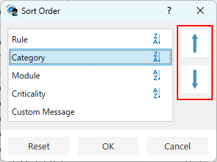
</div>

8. **必要な並び替えオプションをすべて設定したら、[OK] ボタンをクリックしてダイアログボックスを閉じ、ルールファイルに並び替えを適用します。**

9. **DFMPro は、Sort Order ダイアログボックスで指定した並び替えオプション（A-Z / Z-A）および優先順位に基づいて、ルールの一覧を並び替えます。**


<div style="text-align: center;">
  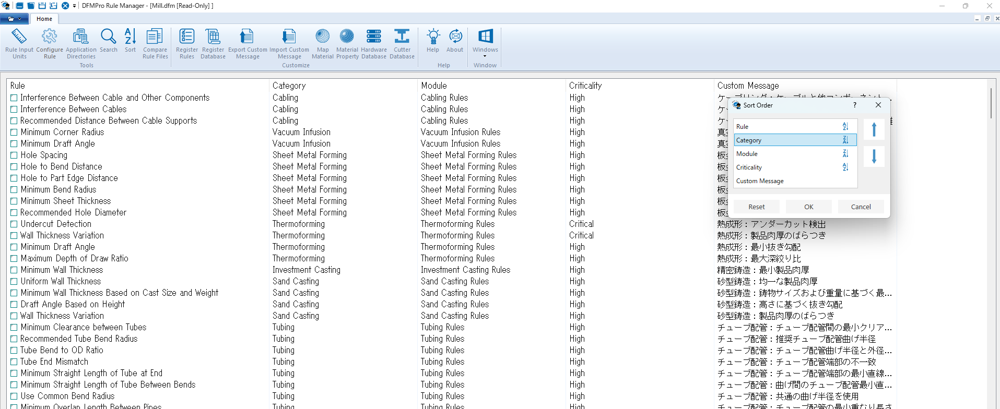
</div>

10. **Sort Order ダイアログボックスで Custom Message 列に A-Z の並び替えが設定されている場合、コメントは次の順序で並び替えられて表示されます。**


<!--
a. Blank fields if no comments are added. 
b. Comments begin with Special Characters ($, *, +, #, etc.). 
c. Comments begin with Numbers. 
d. Comments begin with an Uppercase word. 
e. Comments begin with Lowercase words. 
-->

<ol><ol><ol type="a">
<li><p>コメントが追加されていない場合は、空欄のフィールド。</p></li>
<li><p>特殊文字（$, *, +, # など）で始まるコメント。</p></li>
<li><p>数字で始まるコメント。</p></li>
<li><p>大文字で始まる単語のコメント。</p></li>
<li><p>小文字で始まる単語のコメント。</p>
<p>同じヘッダー名を **Sort Order ダイアログボックス**でクリックすると、並び替え順が逆（Z-A）になります。</p></li>
</ol></ol></ol>


<!--Page.12-->

<!--
Clicking the same Header name in the Sort Order dialog box will reverse the sorting order (Z
A). 

11. Click the Cancel button to close the dialog box without applying the sorting option. 

<hr>
Note: Once sorting is applied to the rule file, that sorting order will be remembered for 
the same session of the Rule Manager. In case the user opens, creates, or switches 
the rule file, the active rule file will be sorted as defined. 
<hr>

12. Click the Reset button to reset to the initial state. 

13. After a successful sorting, the Sort Order dialog box opens again when the user clicks on the 
Sort button again, showing the previously defined sorting order. 

14. Users can edit the previously sorted order and click the OK button to sort again. 
-->


<div style="text-align: center;">
  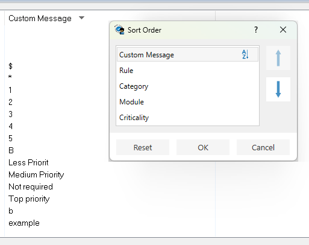
</div>

11. **[Cancel] ボタン**をクリックすると、並び替えオプションを適用せずにダイアログボックスを閉じます。


<br>
<hr style="border: none; border-top: 1px solid #800020;">
<p style="color:#800020;">注記:ルールファイルに並び替えが適用されると、その並び替え順は 同じ Rule Manager セッション中に記憶されます。ユーザーがルールファイルを開く、作成する、または切り替えた場合でも、アクティブなルールファイルは定義された並び替え順に従って表示されます。</p>
<hr style="border: none; border-top: 1px solid #800020;">
<br>


12. **[Reset] ボタン**をクリックすると、初期状態にリセットされます。

13. 並び替えが正常に適用された後、ユーザーが再度 **[Sort] ボタン**をクリックすると、Sort Order ダイアログボックスが再び表示され、以前に設定された並び替え順が表示されます。

14. ユーザーは、以前に設定された並び替え順を編集し、**[OK] ボタン**をクリックすることで再度並び替えを実行できます。


<!--Page.13-->

<div style="page-break-after: always;"></div>

<!--# Compare Rule Files --> 
<!--
# ルールファイルの比較

Clicking on the Compare Rule Files button in the Rule Manager window will display the Compare 
Rule Files dialog box. This dialog box allows to compare the two separate rule files and identify 
the difference between them as follows: 

- Difference in selected rules in the files 
- Difference between configured values 
- Difference between Rule criticality 
- Difference between Comment message text and description 

Follow the steps to select rule files and compare them: 
1. In the opened Rule Manager window, select the rule file. 
2. Click on the Compare Rule Files button will display the Compare Rule Files dialog box. 
3. Users can select the required files from the dropdown menu for both the Original Rule File 
and Modified Rule File options.  
4. Users can also browse and select the required files by using the  Browse button. 
5. When a rule file is opened before clicking the Compare Rule Files button, that file will be 
loaded as the Original rule file in the Compare Rule Files dialog box. Users can select another 
rule file from the dropdown menu to compare. 

<hr>
Note: The recently opened 10 rule files will be available in the dropdown menu to select. 
<hr>
-->


## ルールファイルの比較

Rule Manager ウィンドウで **[Compare Rule Files] ボタン**をクリックすると、**Compare Rule Files ダイアログボックス**が表示されます。このダイアログボックスでは、2つの異なるルールファイルを比較し、次のような差異を確認することができます。

* ファイル内で選択されているルールの違い

* 設定された値の違い

* ルールの重要度（Criticality）の違い

* コメントメッセージのテキストおよび説明の違い


### ルールファイルを選択して比較する手順：

1. **Rule Manager ウィンドウを開き、ルールファイルを選択します。**

2. **[Compare Rule Files] ボタンをクリックすると、Compare Rule Files ダイアログボックスが表示されます。**

3. **Original Rule File** および **Modified Rule File** の各オプションで、ドロップダウンメニューから比較するルールファイルを選択できます。

4. **[Browse] ボタン**を使用して、必要なルールファイルを参照して選択することもできます。

5. **[Compare Rule Files] ボタンをクリックする前にルールファイルが開かれている場合、そのファイルは Compare Rule Files ダイアログボックス内の Original Rule File として自動的に読み込まれます。**その後、ドロップダウンメニューから別のルールファイルを選択して比較することができます。

> ---

> <p style="color:#800020;">注記: 最近開いた 最大10件のルールファイルが、ドロップダウンメニューから選択できるよう表示されます。</p>

> ---


<div style="text-align: center;">
  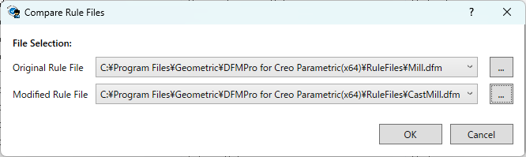
</div>

<!--Page.14-->


<!--
6. Once both rule files are selected, click on the OK button. 
7. On the top bar, Rule Manager will display the names of the compared rule files. 
8. The following changes will be displayed in the Rule Manager to identify the difference 

between the selected rule files: 

• The rule selection checkbox will be highlighted. 
• Rule name, Rule criticality, and Custom message will be highlighted in yellow. 
• In the Description field, the count of selected rule file differences will be displayed. 
-->

<div style="page-break-after: always;"></div>


6. **両方のルールファイルを選択した後、[OK] ボタンをクリックします。**

7. **Rule Manager の上部バーに、比較対象となるルールファイルの名前が表示されます。**

8. **選択したルールファイル間の差異を識別するため、Rule Manager には次の変更が表示されます。**

* ルール選択のチェックボックスが強調表示されます。

* ルール名、ルールの重要度（Rule criticality）、およびカスタムメッセージが黄色で強調表示されます。

* Description フィールドには、選択されたルールファイル間の差異の件数が表示されます。


<div style="text-align: center;">
  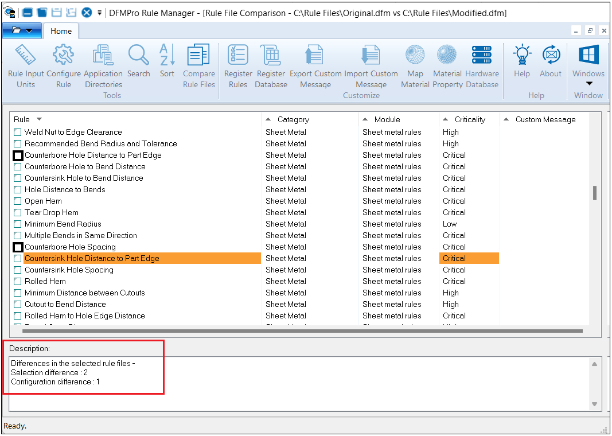
</div>


<!--Page.15-->

<div style="page-break-after: always;"></div>

<!--# Register Rules--> 

## ルールの登録

<!--
When users click on the Register Rules Module button, the Register Rule Module dialog box will 
be displayed. This dialog box allows customization of rule types that users desire to analyze. The 
rules are categorized and saved in the different module files.  

For example, other modules can be removed by analyzing only mill parts. 

The following Rule Modules will be available with DFMPro: 

• Additive Manufacturing 
• Assembly 
• Casting 
• Die Casting 
• Investment Casting 
• Mill 
• Sand Casting 
• Sheet Metal 
• Sheet Metal Forming 
• Thermoforming 
• Tolerance 
• Tubing 
• Turn 
• Vacuum Infusion 
• Welding 
-->


ユーザーが **[Register Rules Module] ボタン**をクリックすると、**Register Rule Module ダイアログボックス**が表示されます。
このダイアログボックスでは、ユーザーが解析したいルールタイプをカスタマイズすることができます。
ルールはカテゴリごとに分類され、それぞれ異なるモジュールファイルとして保存されます。

例えば、**ミル加工（Mill）のパーツのみを解析する場合、他のモジュールを除外することが可能です。**

DFMPro では、次のルールモジュールが利用可能です。

* Additive Manufacturing（積層造形）

* Assembly（組立）

* Casting（鋳造）

* Die Casting（ダイカスト）

* Investment Casting（インベストメント鋳造）

* Mill（ミル加工）

* Sand Casting（砂型鋳造）

* Sheet Metal（板金）

* Sheet Metal Forming（板金成形）

* Thermoforming（熱成形）

* Tolerance（公差）

* Tubing（チューブ加工）

* Turn（旋盤加工）

* Vacuum Infusion（真空含浸成形）

* Welding（溶接）


<!--Page.16-->

<!--
## Add/remove modules: 

• To load a custom module file, click the  Browse button to browse to the file location. Select the desired module file, and then click the Load button. 
• To load all modules from the unloaded module list, click on the  
• If users want to load a single module from unloaded modules, click the  
or double-click on the module to load. 
• To remove all modules, click on the  Remove All button. 
Load All button. 
Load button 
• If users want to remove a single module from loaded modules, double-click on the module in loaded modules or click on the  Remove button. 

-->

<div style="page-break-after: always;"></div>

### <u>モジュールの追加／削除：</u>

* カスタムモジュールファイルを読み込むには、**[Browse] ボタン**をクリックしてファイルの場所を参照します。目的のモジュールファイルを選択し、**[Load] ボタン**をクリックします。

* 未読み込みモジュール一覧にあるすべてのモジュールを読み込むには、**[Load All] ボタン**をクリックします。

* 未読み込みモジュールの中から **1つのモジュールのみを読み込む場合**は、**[Load] ボタン**をクリックするか、モジュールをダブルクリックして読み込みます。

* すべてのモジュールを削除するには、**[Remove All] ボタン**をクリックします。

* 読み込み済みモジュールから **1つのモジュールのみを削除する場合**は、読み込み済みモジュール一覧で該当モジュールをダブルクリックするか、**[Remove] ボタン**をクリックします。


<div style="text-align: center;">
  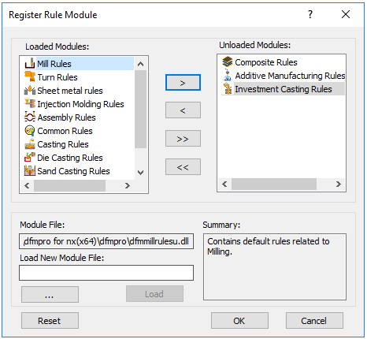
</div>

<!--Page.17-->

<!--
## Register Database 

DFMPro shipped a database with default hole sizes, which are commonly used. However, this 
database can be modified, including the hole sizes used in the user's machining environments. 

However, some organizations may have a proprietary database with a different schema and 
format (e.g., an Access database). 

Instead of copying information from the user's database to the default database, users can direct 
it to an application to access the users' database. 

### Registering the Connector Program: 
After the connector program is written and compiled as a DLL, register the DLL in DFMPro. 

1. Click on the Rule Manager button from the DFMPro menu. 
2. Click the Register Database button in the Rule Manager window. 
3. This dialog box allows to: 
• Remove an existing registered database module 
• Load a current database module 
• Load a new database module 
4. Click the  Browse button, select the module file (*.DLL), and click the Load button. 
-->

<div style="page-break-after: always;"></div>

## データベースの登録

DFMPro には、一般的に使用される **標準的な穴径（Hole Size）** を含むデフォルトのデータベースが付属しています。
ただし、このデータベースは、ユーザーの加工環境で使用されている穴径などに合わせて変更することが可能です。

また、組織によっては、異なるスキーマや形式（例：**Access データベース**）を持つ独自のデータベースを使用している場合があります。

このような場合、ユーザーのデータベースの情報をデフォルトのデータベースにコピーする代わりに、ユーザーのデータベースへアクセスするアプリケーションを指定することができます。


### <u>コネクタプログラムの登録：</u>

コネクタプログラムを作成し、**DLL としてコンパイル**した後、その DLL を DFMPro に登録します。

1. **DFMPro メニューから [Rule Manager] ボタンをクリックします。**

2. **Rule Manager ウィンドウで [Register Database] ボタンをクリックします。**

3. このダイアログボックスでは、次の操作を行うことができます。

> * 既に登録されているデータベースモジュールの削除

> * 現在のデータベースモジュールの読み込み

> * 新しいデータベースモジュールの読み込み

4. **[Browse] ボタン**をクリックし、モジュールファイル（*.DLL）を選択して、**[Load] ボタン**をクリックします。


<!--Page.18-->

<!--
## Map Material  

The Map Material to Manufacturing Process dialog box will display when the user clicks 
the Map Material button. This dialog box helps update the database.  

From DFMPro for Creo Parametric 6.1 version, the new Map Material button will be 
available in the Rule Manager window. Map Material to Manufacturing process dialog box 
will display a list of Processes relevant to Material and Grades. 

### Conditions to access the Map Material button: 

"Picture"
**A warning message is displayed during the installation** 
During DFMPro for Creo Parametric installation, when the user selects the Yes button to 
overwrite existing database files, the new Map Material button will be displayed in the 
Rule Manager window to access the database.  

Select desired processes for Material and Grades in this dialog box and vice versa. The 
same selection of Materials and Grades will be reflected in the DFMPro User Interface for 
the chosen process. Users with write access can add/delete/edit columns per requirement 
and then click on the Update button to save changes in a database. Mouse-hover on 
columns to view and select the desired checkbox and update it. 

-->

<div style="page-break-after: always;"></div>

## 材料のマッピング

ユーザーが **[Map Material] ボタン**をクリックすると、**Map Material to Manufacturing Process ダイアログボックス**が表示されます。
このダイアログボックスは、データベースを更新するために使用されます。

**DFMPro for Creo Parametric 6.1** 以降では、Rule Manager ウィンドウに新しい **[Map Material] ボタン**が追加されています。
Map Material to Manufacturing Process ダイアログボックスには、**材料（Material）およびグレード（Grade）に対応する製造プロセス（Process）の一覧**が表示されます。


### <u>Map Material ボタンを使用するための条件：</u>

<div style="text-align: center;">
  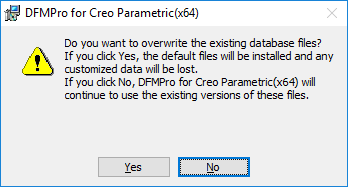
</div>


<p style="text-align:center; color:blue; font-weight:bold;">
  インストール時の警告メッセージの表示
</p>


DFMPro for Creo Parametric のインストール中に、既存のデータベースファイルを上書きするかどうか確認するメッセージが表示されます。
このとき **[Yes] ボタン**を選択して既存のデータベースファイルを上書きすると、Rule Manager ウィンドウに **[Map Material] ボタン**が表示され、データベースへアクセスできるようになります。

<div style="text-align: center;">
  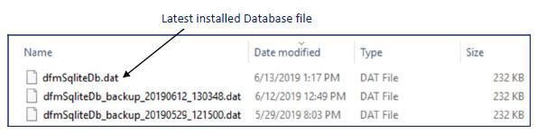
</div>

このダイアログボックスでは、**材料およびグレードに対して対応する製造プロセスを選択することができます（またはその逆の設定も可能です）。**
ここで選択した材料およびグレードの設定は、**選択した製造プロセスに対して DFMPro ユーザーインターフェースにも反映されます。**
書き込み権限を持つユーザーは、必要に応じて **列の追加・削除・編集**を行うことができます。
変更後、**[Update] ボタン**をクリックすると、データベースに変更内容が保存されます。また、列の上にマウスカーソルを合わせると、該当するチェックボックスを表示して選択することができ、更新を行うことができます。


<!--Page.19-->
<!--
Select a row and click the Delete button to delete the unwanted row. A row will convert 
into a RED color. Click on the Update button to finalize the deletion process. 

"Picture"

<hr>
Note: Users with write access can only customize the database. Without write access, 
users can view it. 
<hr>

During the DFMPro for Creo Parametric installation process, when the user selects No, this 
will avoid overwriting the database process and only using an existing database.

The Map Material button in the Rule Manager window will be grayed out in this condition. 
It will display a tip on mouse-hover, i.e., Either DFMPro database is not updated or opened 
in some other application. 

Note: This warning message does not apply to first-time users, and they will receive 
access to all features. 
When No is selected to cancel the overwrite process by existing users, update 
the database through the Edit Material Mapping option of the Cost 
Administration Vault application. For more details, refer to the Cost 
Administration Vault User Guide. 
-->

<div style="page-break-after: always;"></div>


選択した行を削除するには、該当する行を選択して **Delete ボタン**をクリックします。削除対象の行は **赤色（RED）** に変わります。削除処理を確定するには **Update ボタン**をクリックします。

<div style="text-align: center;">
  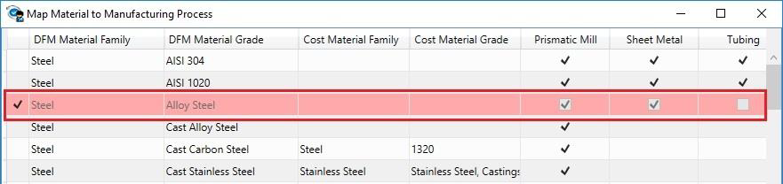
</div>

---

**注記:**
データベースをカスタマイズできるのは **書き込み権限を持つユーザーのみ**です。
書き込み権限がないユーザーは **閲覧のみ可能**です。

---

DFMPro for Creo Parametric のインストール時に **No** を選択すると、
既存のデータベースを上書きせず、そのまま既存のデータベースを使用します。

この場合、Rule Manager ウィンドウの **Map Material ボタン**は
**グレーアウト（無効状態）**になります。
また、マウスカーソルを合わせると次のメッセージが表示されます。
> Either DFMPro database is not updated or opened in some other application.
> （DFMPro データベースが更新されていないか、別のアプリケーションで開かれています。）

---

**注記:**
この警告メッセージは **初めて使用するユーザーには適用されません**。
初回ユーザーはすべての機能を利用できます。

既存ユーザーが **No** を選択してデータベースの上書きをキャンセルした場合は、
**Cost Administration Vault アプリケーション**の **Edit Material Mapping** オプションを使用して
データベースを更新してください。詳細については **Cost Administration Vault User Guide** を参照してください。

---


<!--Page.20-->

<!--
## Material Property  


When the user clicks on the Material Property button, the Material Property dialog box 
will be displayed. This dialog box helps view the Material Density and Material 
Machinability. 

Follow the steps to add new material and machinability values or edit existing ones. 

1. Open the Rule Manager window and click the  Map Material button.  
2. Click the Export button that exports all materials and their property in an excel sheet. 

"Picture"

3. Add new material and its machinability values as shown in the below table and save it. 

"Picture"

4. Click on the Import button to import the Excel sheet. 

Ensure that the material added in the material property table is also present in the Map 
Material to Manufacturing Process dialog box. 
-->

<div style="page-break-after: always;"></div>


## Material Property（材料特性）

ユーザーが **Material Property ボタン**をクリックすると、**Material Property ダイアログボックス**が表示されます。
このダイアログでは、**Material Density（材料密度）**、**Material Machinability（被削性）**の情報を確認できます

<div style="text-align: center;">
  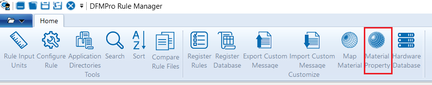
</div>


<div style="text-align: center;">
  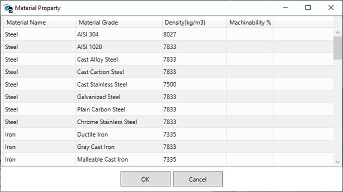
</div>

新しい材料および被削性の値を追加する、または既存の値を編集するには、次の手順に従ってください。


1. **Rule Manager ウィンドウ**を開き、**Map Material ボタン**をクリックします。

2. **Export ボタン**をクリックすると、すべての材料とその特性が **Excel シートとしてエクスポート**されます。

<div style="page-break-after: always;"></div>

<div style="text-align: center;">
  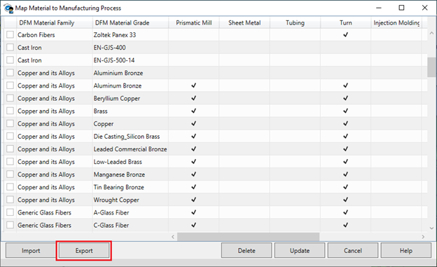
</div>

3. 以下の表のように **新しい材料および被削性の値を追加**し、Excel ファイルを保存します。

<div style="text-align: center;">
  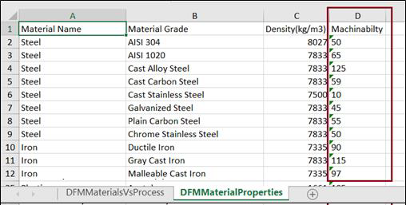
</div>

4. **Import ボタン**をクリックして、作成した **Excel シートをインポート**します。

> Material Property Table に追加された材料が、「Map Material to Manufacturing Process」ダイアログボックスにも登録されていることを確認してください。

<div style="page-break-after: always;"></div>


<div style="text-align: center;">
  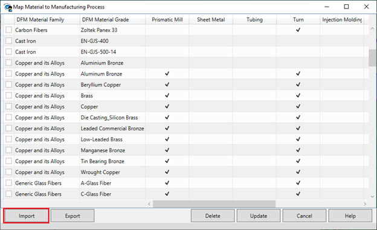
</div>

<!--Page.21-->


<!--Page.22-->

<!--Page.23-->

<!--
### Hardware Database  

When a user clicks on the Hardware Database button in the Rule Manager window, the 
Hardware Database dialog box will be displayed. This dialog box allows adding, removing, or 
editing fastener(s) in the database. 

Adding new Fasteners in the Database: 

1. Open the Rule Manager window. 
2. Click on the Hardware Database button to view the Hardware Database dialog box. 
3. Manually type Fastener names in the Hardware Name field.  
4. Once all fasteners and their parameters (such as Size, Unit, Diameter, Length, etc.) are 
configured in the database, the configured hardware will automatically become available for 
assembly rule configuration. 
5.
 Click on the Search button or use the Ctrl+F command to quickly search for a Hardware type 
in the Hardware Database dialog box. When the Search dialog box is displaced, the Update, 
Import, and Export buttons will be disabled. 

"Picture"

6. Click on the OK button will update the database file available at the following location: 
Drive C:\ProgramData\GeometricLtd\DFMPro\DFMDataBase 
When a new fastener is added, this database file will be updated. 

-->

<div style="page-break-after: always;"></div>

## Hardware Database（ハードウェアデータベース）

ユーザーが **Rule Manager ウィンドウ**の **Hardware Database ボタン**をクリックすると、**Hardware Database ダイアログボックス**が表示されます。このダイアログでは、データベース内の **ファスナー（締結部品）**を**追加・削除・編集**することができます。


### データベースに新しいファスナーを追加する手順：

1. **Rule Manager ウィンドウ**を開きます。

2. **Hardware Database ボタン**をクリックすると、**Hardware Database ダイアログボックス**が表示されます。

3. **Hardware Name フィールド**に、ファスナー名を手動で入力します。

4. データベース内でSize（サイズ）、Unit（単位）、Diameter（直径）、Length（長さ）、その他のパラメータのような留め具のパラメータをすべて設定すると、そのハードウェアは **アセンブリルール設定で自動的に利用可能**になります。


5. **Search ボタン**をクリックするか、**Ctrl + F** を使用すると、Hardware Database ダイアログボックス内で **特定のハードウェアタイプを素早く検索**できます。
Search ダイアログが表示されている間は、Update、Import、Exportの３つのボタンは **無効になります**。


<div style="text-align: center;">
  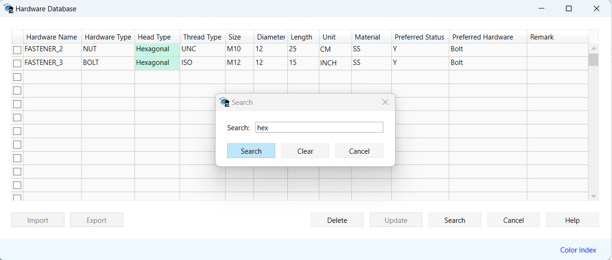
</div>

6. **OK ボタン**をクリックすると、次の場所にある **データベースファイルが更新**されます。

> ```C:\ProgramData\GeometricLtd\DFMPro\DFMDataBase```

> 新しい留め具を追加すると、この **データベースファイルが更新されます**。

<div style="text-align: center;">
  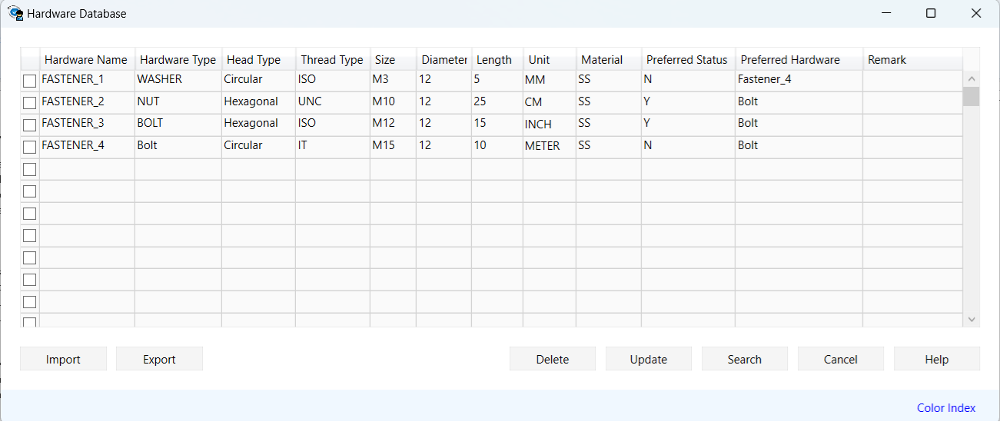
</div>

<!--Page.24 -->

<!--
### Import and Export Database 

Users can add, edit, import, and export hardware databases as required. Users can directly 
import the hardware database from the Excel file in the Hardware Database dialog box. Users 
can also export the database in an Excel file. 

1. Click the Export button in the Hardware database dialog box and select the location to save 
the Excel File. This command will export hardware data to an Excel file and save it. 

"Picture"

Before exporting, if there are any duplicate entries available, then DFMPro will display the 
message and ask for confirmation before proceeding. Users need to take the required 
action to save the database. 

"Picture"


2. Click the Import button in the Hardware database dialog box and browse the Excel file. Click 
the Open button to import all database entries from the Excel file. Before importing, DFMPro 
will display the message to select either the Add or Overwrite option.  

-->


### データベースのインポートとエクスポート

ユーザーは必要に応じて、**Hardware Database（ハードウェアデータベース）**の追加、編集、インポート、エクスポートを行うことができます。
また、Hardware Databaseダイアログボックスから、**Excelファイルを直接インポート**することも可能です。さらに、データベースを**Excelファイルとしてエクスポート**することもできます。


1. エクスポート：Hardware Databaseダイアログボックスで **Export ボタン**をクリックし、Excelファイルを保存する場所を選択します。このコマンドを実行すると、ハードウェアデータが **Excelファイルにエクスポートされて保存**されます。

<div style="text-align: center;">
  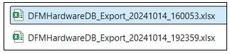
</div>

> エクスポート前に**重複エントリ（duplicate entries）**が存在する場合、DFMProはメッセージを表示し、処理を続行するかどうかの確認を求めます。
> ユーザーはデータベースを保存するために、必要な対応を行う必要があります。

<div style="text-align: center;">
  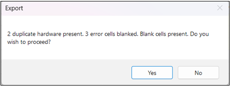
</div>


2. インポート：Hardware Databaseダイアログボックスで **Import ボタン**をクリックし、Excelファイルを参照します。その後 **Open ボタン**をクリックすると、Excelファイルに含まれるすべてのデータベースエントリがインポートされます。インポートを実行する前に、DFMProはメッセージを表示し、**Add（追加）**または **Overwrite（上書き）**のどちらを使用するか選択するよう求めます。

<div style="text-align: center;">
  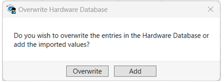
</div>


<!--Page.25-->

<!--

"Picture"

a. Add button: When the users select the Add button, DFMPro will add the new entries after 
the existing database. If the duplicate database is available, DFMPro will display the 
message asking to remove the duplicate entries. Users can select either option to 
continue. 

"Picture"

• When Yes is selected, the duplicate rows will be deleted.  
• When No is selected, then after importing, DFMPro will highlight the duplicate cells 
in Purple color and empty cells in Yellow color. Users need to take the required action 
and edit the database as required. 

-->


<ol><ol><ol type="a">
<li><p>Add ボタン：ユーザーが **Add ボタン**を選択すると、DFMPro は既存のデータベースの後に新しいエントリを追加します。
もし **重複するデータベースエントリ**が存在する場合、DFMPro は重複エントリを削除するかどうかを確認するメッセージを表示します。ユーザーはどちらのオプションを選択しても処理を続行できます。</p></li>
</ol></ol></ol>

<div style="text-align: center;">
  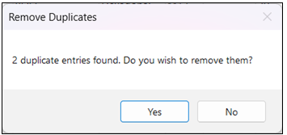
</div>

>>> * **Yes を選択した場合** 重複している行は削除されます。

>>> * **No を選択した場合** インポート後、DFMPro は**重複セルを紫色（Purple）**、**空白セルを黄色（Yellow）**でハイライト表示します。ユーザーは必要に応じて対応を行い、データベースを編集する必要があります。


<!--Page.26-->

<!--
"Picture"

b. Overwrite button: When the users select the Overwrite button, the existing database 
entries will be replaced with new ones. DFMPro will create a backup copy of the existing 
database at the same location from where the Excel file is selected. 

"Picture"

3. After editing the database entries as required, users can update them by clicking on the 
Update button. If users try to update the database without editing and removing the 
highlighted cells, DFMPro will display the following message. 

"Picture"

-->

<div style="text-align: center;">
  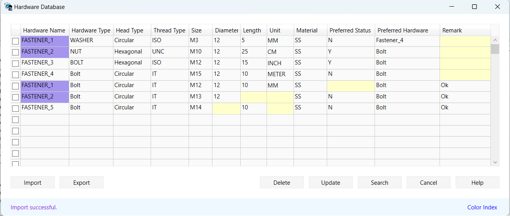
</div>


<ol><ol><ol type="a" start="2">
<li><p>Overwrite ボタン：　ユーザーが **Overwrite ボタン**を選択すると、既存のデータベースエントリは新しいエントリで置き換えられます。DFMPro は、Excel ファイルを選択した場所と同じ場所に、既存データベースの **バックアップコピー**を作成します。</p></li>
</ol></ol></ol>

<div style="text-align: center;">
  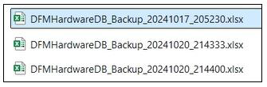
</div>

3. 必要に応じてデータベースエントリを編集した後、ユーザーは **Update ボタン**をクリックして更新することができます。
もしユーザーが、ハイライト表示されたセルを編集・削除せずにデータベースを更新しようとした場合、DFMPro は次のメッセージを表示します。

<div style="text-align: center;">
  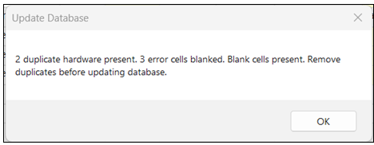
</div>


<!--27-->

<!--

### Delete row(s) from the Database 

Users can delete a single or multiple hardware types simultaneously with the Delete button or 
Shift and Ctrl commands on the keyboard. 

1. Delete Single Hardware Type:  

a. Select the checkbox next to the desired hardware type, and click on the Delete button.  

Users can also select the Delete command from the keyboard to delete it. 

b. The row will turn RED, and a confirmation message will be displayed at the bottom of 
the Hardware Database dialog box. 

c. In the displayed warning message, select Update or OK as required to complete the 
deletion process. 

"Picture"

"Picture"


d. If users do not want to delete it, click the OK button to close the warning message. Users 
can again select or deselect any row before deleting. 

e. If users want to delete the selected hardware type, then click on the Update button. The 
selected hardware type will be deleted from the hardware database list. 

2. Delete Multiple Hardware Types: 

a. To select the few random hardware types from the list, click the Ctrl command on the 
keyboard and select the checkbox next to the required hardware types in the table. 

b. To select the multiple hardware types, click on the Shift command on the keyboard and 
select the checkbox next to the first and last hardware type to select all available entries 
between them. 

-->

### データベースから行を削除する（Delete row(s) from the Database）

ユーザーは **Delete ボタン**、またはキーボードの **Shift / Ctrl コマンド**を使用して、単一または複数のハードウェアタイプを同時に削除することができます。


1. 単一のハードウェアタイプを削除する

<ol><ol><ol type="a" start="1">
<li><p>削除したいハードウェアタイプの横にある **チェックボックス**を選択し、**Delete ボタン**をクリックします。
また、キーボードの **Delete キー**を使用して削除することもできます。</p></li>
<li><p>該当する行が **赤色（RED）**に変わり、**Hardware Database ダイアログボックスの下部**に確認メッセージが表示されます。</p></li>
<li><p>表示された警告メッセージで、削除処理を完了するために **Update** または **OK** を必要に応じて選択します。</p></li>
</ol></ol></ol>

<div style="text-align: center;">
  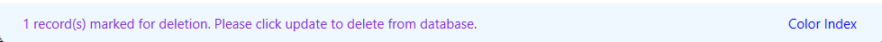
</div>

<div style="text-align: center;">
  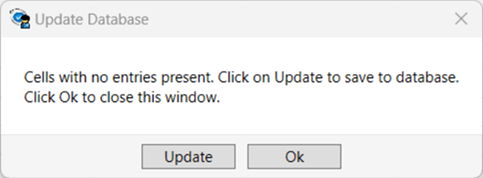
</div>


<ol><ol><ol type="a" start="4">
<li><p>削除を行いたくない場合は、**OK ボタン**をクリックして警告メッセージを閉じます。削除する前に、任意の行を再度 **選択／解除**することができます。</p></li>
<li><p>選択したハードウェアタイプを削除する場合は、**Update ボタン**をクリックします。すると、選択したハードウェアタイプが **ハードウェアデータベース一覧から削除**されます。</p></li>
</ol></ol></ol>


2. 複数のハードウェアタイプを削除する


<ol><ol><ol type="a" type="1">
<li><p>リスト内の任意のハードウェアタイプを個別に選択する場合は、キーボードの **Ctrl キー**を押しながら、テーブル内の該当するハードウェアタイプの **チェックボックス**を選択します。</li></p>
<li><p>連続した複数のハードウェアタイプを選択する場合は、キーボードの **Shift キー**を押しながら、最初と最後のハードウェアタイプの **チェックボックス**を選択すると、その間のすべてのエントリが選択されます。</p>

<p>例えば、10件のエントリのうち **1～5のみを削除したい場合**、キーボードの **Shift キー**を押しながら、**最初のハードウェアタイプと6番目のハードウェアタイプ**を選択します。
この操作により、それらの間にある **すべてのハードウェアタイプのエントリ**が選択されます。</p></li>
</ol></ol></ol>


<!--Page.28-->

<!--
For example, if required to delete only 1 to 5 out of 10 entries, click the Shift command 
and select the first and sixth hardware type. This action will select all remaining hardware 
type entries that are available between them. 

"Picture"

c. To select all entries, select the Ctrl+A command on the keyboard. 
d. Click on the Delete button. Users can also select the Delete command from the keyboard 
to delete it. 
e. The rows will turn RED, and a confirmation message will be displayed at the bottom of 
the Hardware Database dialog box. 
f. In the displayed warning message, select Update or OK as required to complete the 
deletion process. 
-->


<div style="text-align: center;">
  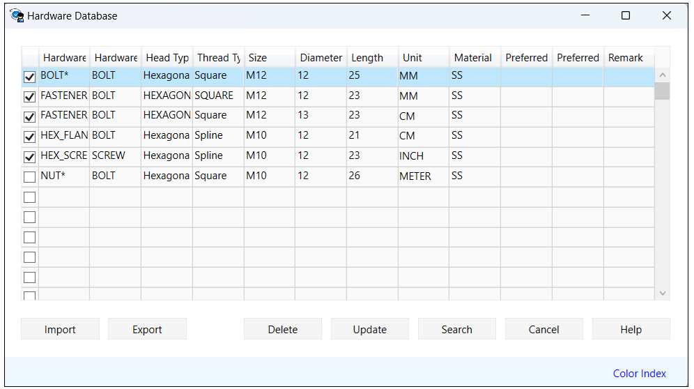
</div>

<ol><ol><ol type="a" start="3">
<li><p>**すべてのエントリを選択する場合**は、キーボードの **Ctrl + A** を使用します。</li></p>
<li><p>**Delete ボタン**をクリックします。また、キーボードの **Delete キー**を使用して削除することもできます。</li></p>
<li><p>該当する行が **赤色（RED）**に変わり、**Hardware Database ダイアログボックスの下部**に確認メッセージが表示されます。</li></p>
<li><p>表示された警告メッセージで、削除処理を完了するために **Update** または **OK** を必要に応じて選択します。</li></p>
</ol></ol></ol>


<!--Page.29-->

<!--
g. If users do not want to delete any hardware type from the selected list, then click the OK 
button to close the warning message. Users can again select or deselect any row before 
deleting. 

h. If users want to delete the selected hardware types, then click on the Update button. The 
selected hardware types will be deleted from the hardware database list. 

3. Users can also search for the required hardware type from the list. Click on the Search button 
or use the Ctrl+F command to quickly search for a Hardware type.  
-->


<div style="text-align: center;">
  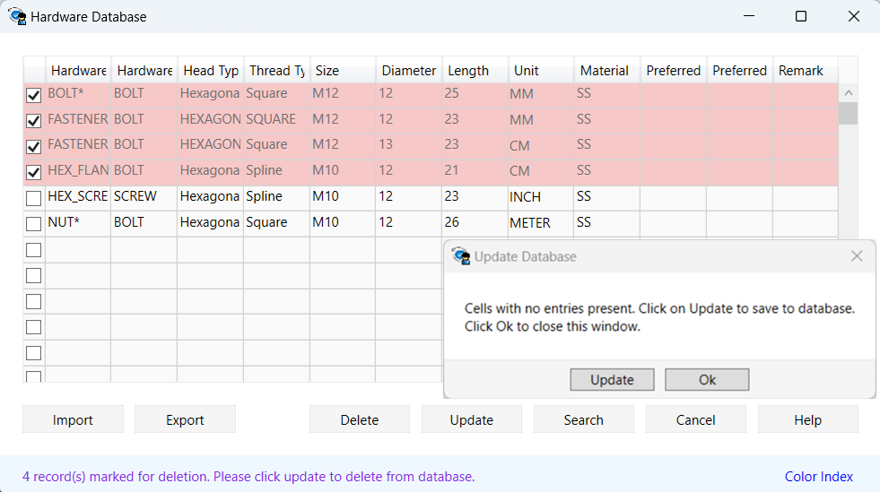
</div>

<ol><ol><ol type="a" start="7">
<li><p>選択したリストから **ハードウェアタイプを削除したくない場合**は、**OK ボタン**をクリックして警告メッセージを閉じます。
削除を実行する前に、ユーザーは任意の行を **再度選択または選択解除**することができます。</li></p>
<li><p>選択したハードウェアタイプを削除する場合は、**Update ボタン**をクリックします。
選択されたハードウェアタイプは **ハードウェアデータベースのリストから削除**されます。</li></p>
</ol></ol></ol>


3. ユーザーは、リストから必要なハードウェアタイプを検索することもできます。**Search ボタン**をクリックするか、**Ctrl + F** コマンドを使用することで、ハードウェアタイプをすばやく検索できます。


<!--Page.30-->

<!--
## Cutter Database  

Clicking on the Cutter Database button in the Rule Manager window will display the Cutter 
Database dialog box. This dialog box allows users to add, edit, import, and export cutter data 
from the database as required.  

Users can create a spreadsheet with the required cutter data and import it directly into the Cutter 
Database dialog box. Users can also export the cutter data in a spreadsheet.  

Note: Writing access is required to update the database. 


From DFMPro for Creo Parametric v13.0, the new Cutter Database button is introduced in 
the Rule Manager window. 

### Conditions to access the Cutter Database button: 

"Picture"

**A warning message is displayed during the installation **

During the DFMPro for Creo Parametric installation process, when the user selects the Yes 
button to overwrite existing database files, the new Cutter Database button will be 
displayed in the Rule Manager window to access the database.  

### Follow the steps to understand how to import and export all the required cutter data. 

1. In the Rule Manager window, click the Cutter Database tab to open the Cutter Database 
dialog box. 

2. Users can add, delete, or edit the data for the following different cutters. 

"Picture"
-->


## Cutter Database

**Rule Manager ウィンドウ**の **Cutter Database ボタン**をクリックすると、**Cutter Database ダイアログボックス**が表示されます。
このダイアログボックスでは、データベース内のカッターデータを **追加・編集・インポート・エクスポート**することができます。

ユーザーは、必要なカッターデータを含む **スプレッドシートを作成し、Cutter Database ダイアログボックスに直接インポート**することができます。
また、カッターデータを **スプレッドシート形式でエクスポート**することも可能です。

---

**注記：**データベースを更新するには **書き込み権限（Writing access）**が必要です。

---

**DFMPro for Creo Parametric v13.0 から**、Rule Manager ウィンドウに **新しい Cutter Database ボタン**が追加されました。


### <u>Cutter Database ボタンにアクセスする条件：</u>

<div style="text-align: center;">
  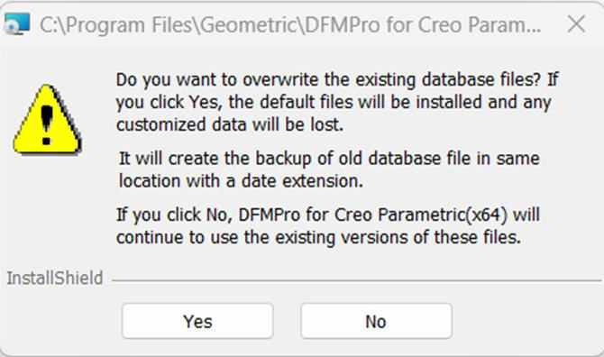
</div>


<p style="text-align:center; color:blue; font-weight:bold;"  Width="90%">
  インストール時に警告メッセージの表示
</p>


DFMPro for Creo Parametric のインストール中、ユーザーが **既存のデータベースファイルを上書きするために「Yes」ボタンを選択した場合**、Rule Manager ウィンドウに **新しい Cutter Database ボタン**が表示され、データベースへアクセスできるようになります。


### カッターデータのインポートおよびエクスポート手順：

以下の手順に従って、必要なカッターデータのインポートおよびエクスポート方法を確認してください。

1. **Rule Manager ウィンドウ**で **Cutter Database タブ**をクリックし、**Cutter Database ダイアログボックス**を開きます。

2. ユーザーは、以下の各種カッターに対して **データの追加・削除・編集**を行うことができます。

<div style="text-align: center;">
  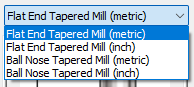
</div>


<!--Page.31-->

<!--
3. Select the required cutter type from the dropdown menu and modify the data as required. 

"Picture"

4. Users can delete the row(s) if required. Select the required row (s) and click on the Delete 
button. 

a. To delete the single row, select the checkbox next to the desired cutter type and click on 
the Delete button. Users can also select the Delete command from the keyboard to delete 
it. 

b. To delete multiple rows, users can use any one of the methods: 

• Select a few cutter types from the list, click the Ctrl command on the keyboard, and 
select the checkbox next to the required cutter types in the table. 

• Select the multiple hardware types, click on the Shift command on the keyboard, and 
select the checkbox next to the first and last cutter type to select all available entries 
between them. 
-->


3. ドロップダウンメニューから必要な **カッタータイプ（Cutter Type）** を選択し、必要に応じてデータを編集します。

<div style="text-align: center;">
  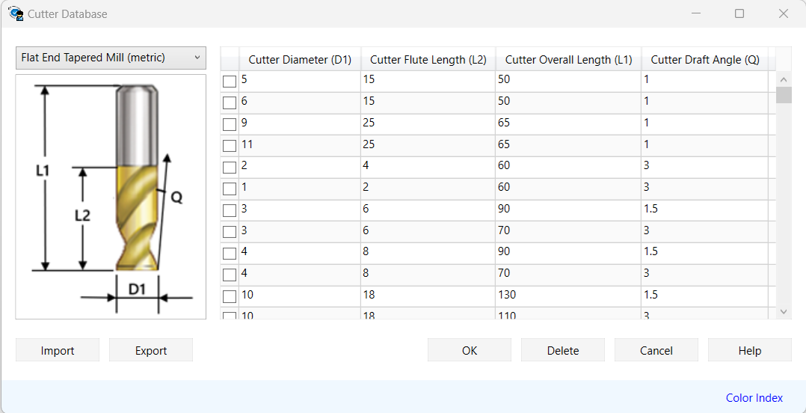
</div>


4. 必要に応じて行（row）を削除することもできます。削除する行を選択し、**Delete ボタン**をクリックします。

<ol><ol><ol type="a">
<li><p>単一の行を削除する場合：削除したいカッタータイプの横にある **チェックボックス**を選択し、**Delete ボタン**をクリックします。
また、キーボードの **Delete キー**を使用して削除することもできます。</p></li>
<li><p>複数の行を削除する場合：以下のいずれかの方法で複数行を選択できます。</p></li>
</ol></ol></ol>


>> * リストから任意のカッタータイプを選択する場合は、キーボードの **Ctrl キー**を押しながら、テーブル内の対象となるカッタータイプの **チェックボックス**を選択します。

>> * 連続した複数のカッタータイプを選択する場合は、キーボードの **Shift キー**を押しながら、最初と最後のカッタータイプの **チェックボックス**を選択すると、その間にあるすべてのエントリが選択されます。


<!--Page.32-->

<div style="text-align: center;">
  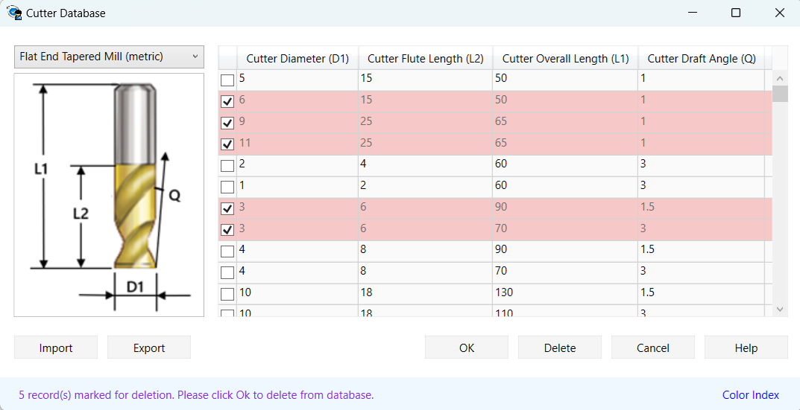
</div>

 
<!--Page.33-->
 
 <!--
5. Click the Export button in the Cutter Database dialog box and select the location to save the 
file. This command will export the cutter data and save it. 

"Picture"
 
Before exporting, if there are any duplicate entries available, then DFMPro will display a 
message and ask for confirmation before proceeding. Users need to take the required 
action to save the database. 

"Picture"

-->


5. Cutter Database ダイアログボックスで **Export ボタン**をクリックし、ファイルを保存する場所を選択します。
この操作により、カッターデータが **エクスポートされ、指定した場所に保存**されます。

<div style="text-align: center;">
  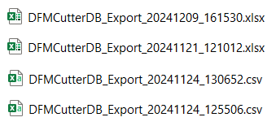
</div>

> エクスポートを実行する前に、**重複するエントリ（duplicate entries）**が存在する場合、
> DFMPro はメッセージを表示し、処理を続行するかどうかの **確認**を求めます。
> ユーザーは、データベースを保存するために **必要な対応を行う必要があります。**

<div style="text-align: center;">
  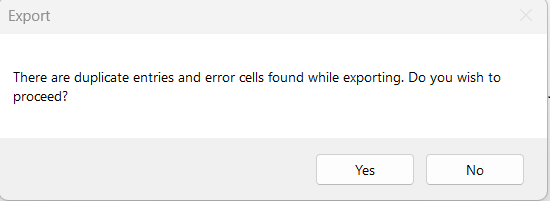
</div>


 
 
<!--Page.33-->

<!--

4. Click the Import button in the Cutter database dialog box and browse to the file. Click the 
Open button to import all database entries from the file. Before importing, DFMPro will 
display a message to select either the Add or Overwrite option.   

"Picture"

a. Add button: When the users select the Add button, DFMPro will add the new entries 
below the existing database. If the duplicate database is available, DFMPro will display a 
message asking to remove the duplicate entries. Users need to take the required action 
to update the database. 

"Picture"

b. Overwrite button: When users select the Overwrite button, the existing database entries 
will be replaced with new ones. DFMPro will create a backup copy of the existing database 
at the same location from which the Excel file is selected. 


"Picture"


-->

6. Cutter Database ダイアログボックスで **Import ボタン**をクリックし、読み込むファイルを参照します。
その後 **Open ボタン**をクリックすると、ファイル内のすべてのデータベースエントリがインポートされます。インポートを実行する前に、DFMPro は **Add** または **Overwrite** のいずれかを選択するようメッセージを表示します。

<div style="text-align: center;">
  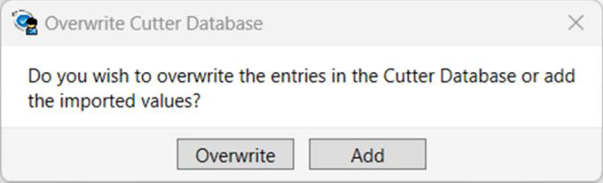
</div>


<ol><ol><ol type="a" start="1">
<li><p>Add ボタン：ユーザーが **Add ボタン**を選択すると、新しいエントリは **既存のデータベースの下に追加**されます。もし **重複するデータベースエントリ**が存在する場合、DFMPro は重複エントリを削除するかどうかを確認するメッセージを表示します。ユーザーは、データベースを更新するために **必要な対応を行う必要があります。**</p></li>
</ol></ol></ol>

<div style="text-align: center;">
  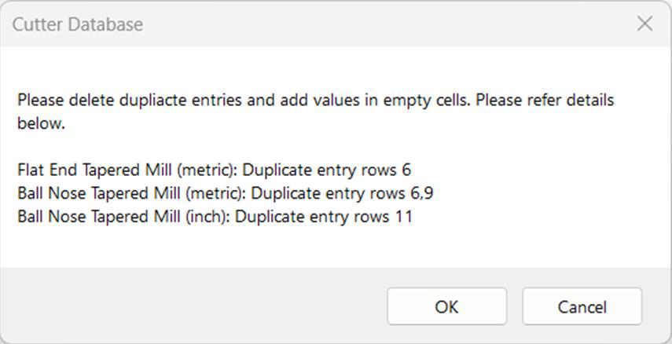
</div>

<ol><ol><ol type="a" start="2">
<li><p>Overwrite ボタン：ユーザーが **Overwrite ボタン**を選択すると、既存のデータベースエントリは **新しいエントリで置き換えられます。**また、DFMPro は **既存データベースのバックアップコピー**を、Excel ファイルを選択した場所と同じ場所に作成します。</p>

<div style="text-align: center;">
  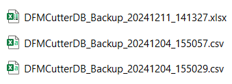
</div>


<p>インポート後、DFMPro は**重複しているセルを紫色（Purple）**、**エラーまたは空白のセルをオレンジ色／黄色（Orange / Yellow）**でハイライト表示します。ユーザーは必要に応じて対応を行い、**データベースを編集する必要があります。**</p></li>
</ol></ol></ol>


<!--Page.34-->

<!--
After importing, DFMPro will highlight the duplicate cells in Purple color and error/empty 
cells in Orange/Yellow color. Users need to take the required action and edit the database 
as required. 

"Picture"
-->


<div style="text-align: center;">
  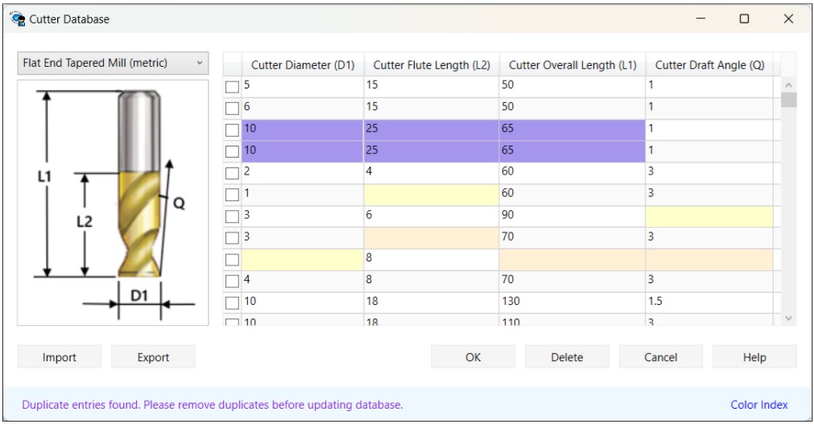
</div>


<!--Page.35-->

<div style="page-break-after: always;"></div>

<!--# DFMPro User Interface -->
<!--
# DFMPro ユーザーインターフェース

1. Click on the  Start DFMPro on the DFMPro menu to open the DFMPro User Interface.  
2. DFMPro Interface is divided into groups: 

• Inputs 
• DFX 
• Cost 
• DFX Server (displayed only when Assembly is selected as Manufacturing Process and DFX 
Server setting is enabled in DFMPro Settings dialog box) 

The functionality and fields displayed (and explained in the section below) in DFMPro User 
Interfaces are standard for all Manufacturing processes and materials. However, a few 
Manufacturing Processes and Materials types will require additional inputs to complete the 
Analysis. 
-->

# DFMPro ユーザーインターフェース

1. DFMPro メニューの **Start DFMPro** をクリックすると、**DFMPro ユーザーインターフェース**が表示されます。

2. DFMPro のインターフェースは、以下のグループに分かれています。

> * **Inputs**

> * **DFX**

> * **Cost**

> * **DFX Server**（製造プロセスとして **Assembly** が選択され、かつ **DFMPro Settings ダイアログボックスで DFX Server 設定が有効**になっている場合のみ表示されます）

DFMPro ユーザーインターフェースに表示される **機能および入力項目**（以下のセクションで説明）は、すべての **製造プロセスおよび材料**に対して基本的に共通です。ただし、一部の **製造プロセス**や**材料タイプ**では、解析を完了するために **追加の入力情報**が必要となる場合があります。


<!--Page.36-->

<div style="text-align: center;">
  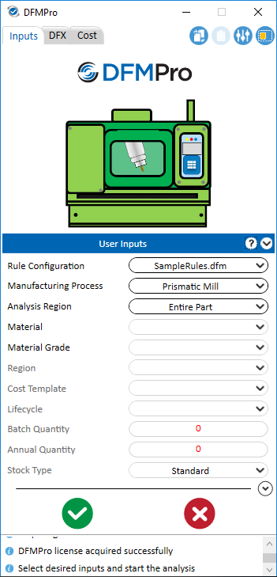
</div>

<!--Page.37-->

<div style="page-break-after: always;"></div>

<!--# DFMPro Profile Execution  -->

<!--
# DFMPro プロファイルの実行

DFMPro provides an option for organizations to run DFMPro analysis with a pre-configured 
organization-specific manufacturing process and rule file with a single-click button. With this 
settings and clicking on Enable Profile Execution, users can select the required profile 
configuration and avoid the wrong selection of rule files and manufacturing process. 

"Picture"

DFMPro will provide the default profile configuration for Milling, Sheet Metal, and Assembly. 
Users can also add multiple pre-configured manufacturing processes for different analyses in the 
same session. However, users can add single or multiple profile configurations other than default 
as required.  DFMProfile.config file is available at the following location: 

C:\ProgramData\GeometricLtd\DFMPro\wildfire\Profiles 

"Picture"

-->


# DFMPro プロファイルの実行

DFMPro には、**事前に設定された組織固有の製造プロセスおよびルールファイル**を使用して、**ワンクリックで DFMPro 解析を実行できる機能**が用意されています。この設定を行い **Enable Profile Execution** をクリックすると、ユーザーは必要な **プロファイル設定（Profile Configuration）**を選択できるようになります。
これにより、**誤ったルールファイルや製造プロセスを選択してしまうことを防ぐ**ことができます。

<div style="text-align: center;">
  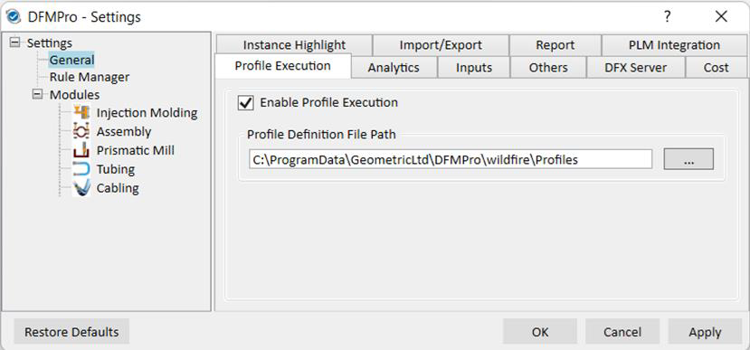
</div>

DFMPro では、**Milling、Sheet Metal、Assembly** 用の **デフォルトプロファイル設定**が提供されています。
また、同一セッション内で **異なる解析に対応した複数の事前設定済み製造プロセス**を追加することも可能です。
さらに、ユーザーは必要に応じて **デフォルト以外のプロファイル設定を単一または複数追加**することもできます。
**DFMProfile.config ファイル**は、以下の場所に保存されています。

```C:\ProgramData\GeometricLtd\DFMPro\wildfire\Profiles```

<div style="text-align: center;">
  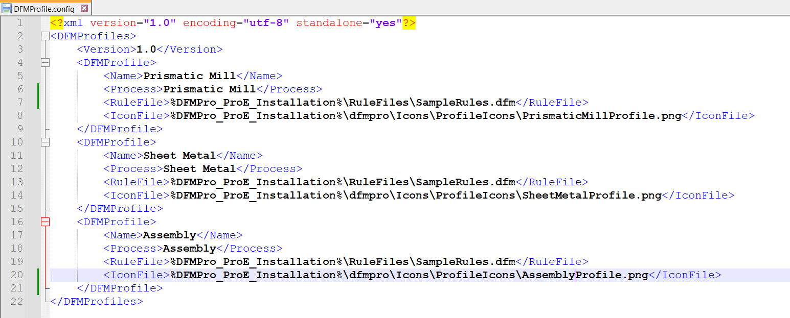
</div>


<!--Page.38-->

<!--
Default Profile Configuration 


"Picture"

Multiple Rule File Configuration 


Note: Users need to follow the standard configuration format to add a new profile under the 
Profile tab of the DFMPro User Interface (as shown in the above image). Users can 
configure multiple rule files if required for each profile. It is recommended to avoid 
mentioning the incorrect path or name in the config file to prevent errors. 

Profile tab 

1. When Enable Profile Execution is selected in the DFMPro Settings, the Profile tab will be 
displayed in the DFMPro User Interface. 

If it is unselected, the DFMPro will run normally (existing behavior). 

Note: By default, the Enable Profile Execution checkbox in the DFMPro Settings dialog box 
will be unselected. 

2. From the Profile tab, users can select the required profile to execute the DFMPro analysis.  
DFMPro Profile Execution                       


-->


<p style="text-align:center; color:blue; font-weight:bold;">
  デフォルトプロファイル設定（Default Profile Configuration）
</p>


<div style="text-align: center;">
  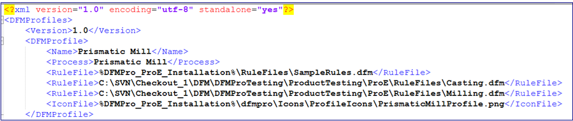
</div>


<p style="text-align:center; color:blue; font-weight:bold;">
  複数ルールファイル設定（Multiple Rule File Configuration）
</p>

--- 

**注記：**新しいプロファイルを追加する場合は、**DFMPro ユーザーインターフェースの Profile タブ**（上図参照）において、**標準の設定フォーマット**に従う必要があります。
各プロファイルに対して、必要に応じて **複数のルールファイルを設定することも可能**です。
設定ファイル内で **誤ったパスやファイル名を指定しないよう注意してください。**
誤った設定を行うと、エラーの原因となる可能性があります。

---


### Profile タブ

1. DFMPro Settings で **Enable Profile Execution** を選択すると、DFMPro ユーザーインターフェースに **Profile タブ**が表示されます。

> この設定が **選択されていない場合**、DFMPro は **従来通りの通常動作**で実行されます。

> 注記：初期状態では、DFMPro Settings ダイアログボックスの**Enable Profile Execution チェックボックスはオフ（未選択）**になっています。


2. Profile タブから、ユーザーは **実行したいプロファイル**を選択して**DFMPro 解析を実行**することができます。


<!--Page.39-->

<!--
"Picture"

Note: If the added path or name of the rule file is mismatched, a warning message will be 
displayed when the profile is selected, stating that the respective path or name is 
incorrect. For example: 
DFMPro Profile Execution                       

"Picture"

-->

<div style="text-align: center;">
  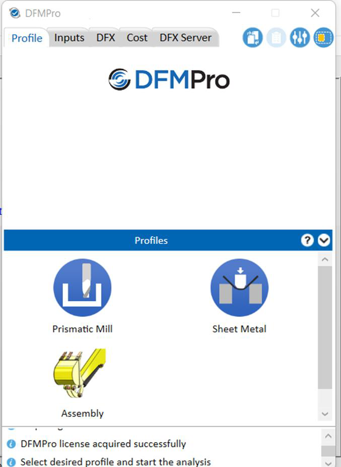
</div>

---

**注記：**
追加した **ルールファイルのパスまたは名前が一致していない場合**、
プロファイルを選択した際に **警告メッセージ**が表示され、該当するパスまたはファイル名が **正しくないこと**が通知されます。

**例：**

<div style="text-align: center;">
  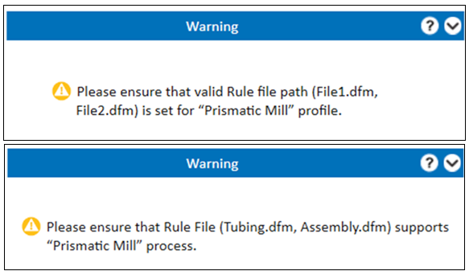
</div>

---


<!--Page.40-->

<!--
3. Based on the defined profile in the configuration file, the DFMPro User Interface shows them 
in the Profile tab (as shown in the above DFMPro UI image). 

• Default Profile Configuration:  

a. After selecting the profile in the Profile tab, the Entity Selection group box will be 
displayed to define the pulling direction.  
b. The User Inputs group box will be grayed out. Once the organization enables Profile 
Execution, then User Input dropdown options will be disabled. Users cannot run the 
analysis with the User Input group box. 
c. The manufacturing process and rule file will automatically be read from the profile 
configuration page.  
It 
helps organizations to configure only organization-specific manufacturing 
processes and their rule file. 

"Picture"
                       
-->


3. 設定ファイルで定義されたプロファイルに基づき、DFMPro ユーザーインターフェースの **Profile タブ**にプロファイルが表示されます（上記の DFMPro UI 画像を参照）。

* デフォルトプロファイル設定（Default Profile Configuration）

<ol><ol><ol type="a">
<li><p>**Profile タブ**でプロファイルを選択すると、**引き抜き方向（Pulling Direction）**を設定するための **Entity Selection グループボックス**が表示されます。</p></li>
<li><p>**User Inputs グループボックス**は **グレーアウト（無効状態）**になります。
組織で **Profile Execution** を有効にすると、**User Input のドロップダウンオプションは無効化**されます。
そのため、ユーザーは **User Input グループボックスから解析を実行することはできません。**</p></li>
<li><p>**製造プロセス（Manufacturing Process）**および **ルールファイル（Rule File）**は、**プロファイル設定ページから自動的に読み込まれます。**</p>
<p>これにより、組織は **自社専用の製造プロセスおよびルールファイルのみを設定して運用することが可能**になります。</p></li>
</ol></ol></ol>

<div style="text-align: center;">
  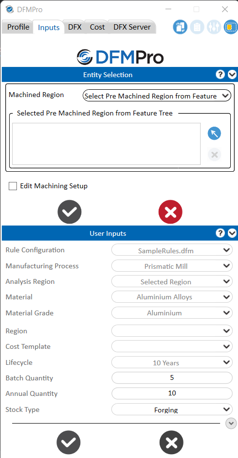
</div>


<!--Page.41-->

<!--
• Multiple Rule File Configuration:  
a. When multiple rule files are added, after selecting the profile from the Profile tab, 
the User Inputs group box will be displayed. This group box allows to select the 
required rule file from the Rule Configuration dropdown menu.  
b. If the select rule file contains the rule that supports the Material Database, then the 
Material and Material Grade options will be active to update the required material 
information. 
c. Once details are updated, clicking on the Analyze button will display the Entity 
Selection group box to define the pulling direction. The manufacturing process and 
rule file will automatically be read from the profile configuration page.  
d. It helps organizations to configure only organization-specific manufacturing 
processes and their rule file.  

"Picture"

Note:  
• When assembly, tubing, cabling, and welding rules are selected in the rule file, the Multi
process analysis with Assembly module workflow will be supported. 
• When the model contains a cast-machined region, Analysis with Multiple Processes is 
supported. 
         


-->


* 複数ルールファイル設定（Multiple Rule File Configuration）

<ol><ol><ol type="a" start="1">
<li><p>複数のルールファイルが追加されている場合、**Profile タブ**からプロファイルを選択すると**User Inputs グループボックス**が表示されます。
このグループボックスでは、**Rule Configuration ドロップダウンメニュー**から必要なルールファイルを選択できます。</p></li>
<li><p>選択したルールファイルに **Material Database に対応したルール**が含まれている場合、**Material** および **Material Grade** のオプションが有効になり、必要な材料情報を更新できるようになります。</p></li>
<li><p>必要な情報を入力した後、**Analyze ボタン**をクリックすると、**引き抜き方向（Pulling Direction）**を定義するための **Entity Selection グループボックス**が表示されます。
また、**製造プロセス（Manufacturing Process）**および **ルールファイル（Rule File）**は、**プロファイル設定ページから自動的に読み込まれます。**</p></li>
<li><p>これにより、組織は **自社専用の製造プロセスおよびルールファイルのみを設定して運用することが可能**になります。</p></li>
</ol></ol></ol>

<div style="text-align: center;">
  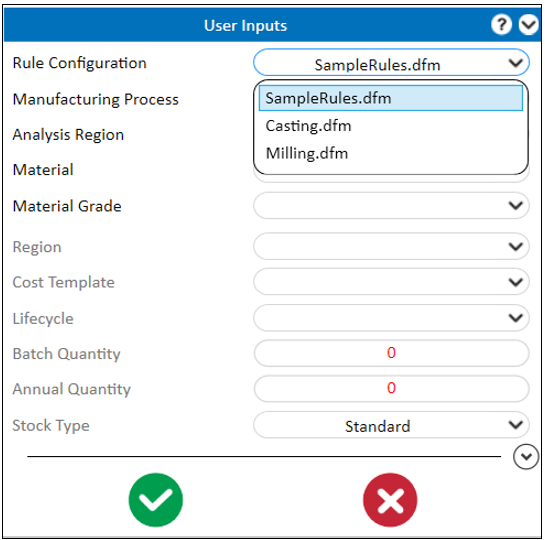
</div>

---

注記：

* ルールファイルで **Assembly、Tubing、Cabling、Welding** のルールが選択されている場合、**Assembly モジュールのワークフローによるマルチプロセス解析（Multi-process analysis）**がサポートされます。

* モデルに **鋳造＋機械加工（Cast-Machined）領域**が含まれている場合、**複数製造プロセスによる解析（Analysis with Multiple Processes）**がサポートされます。

---

<!--Page.42-->

<!--
## DFMPro Profile Execution - DFX Server Analysis 

Users can run the DFMPro analysis with profile execution on the DFX Server. When Allow server 
analysis and Assembly Preselection Option options are selected in the DFMPro Settings, DFMPro 
will display Server and Local options for analysis run. 

1. Open an assembly document and click on the DFMPro menu. 
2.  Click the Start DFMPro in the DFMPro menu to open the User Interface. 
3. From the Profile tab, select the Assembly to execute the DFMPro analysis.  

"Picture"

4. In the displayed User Inputs group box, DFMPro allows analysis execution on Local or 
Server as per the selection. 

• When the Local option is selected, the analysis will occur on the local machine. 
• When the Server option is selected, the analysis will occur on the DFX Server.             

-->

## DFMPro Profile Execution - DFX Server Analysis

ユーザーは、**DFX Server 上でプロファイル実行（Profile Execution）を使用して DFMPro 解析を実行**することができます。
**DFMPro Settings** で**Allow server analysis**、**Assembly Preselection Option**のオプションが有効になっている場合、DFMPro は解析実行時に **Server** と **Local** の選択肢を表示します。


### 手順

1. アセンブリドキュメントを開き、**DFMPro メニュー**をクリックします。

2. DFMPro メニューの **Start DFMPro** をクリックして、**ユーザーインターフェース**を開きます。

3. **Profile タブ**から **Assembly** を選択して、DFMPro 解析を実行します。

<div style="text-align: center;">
  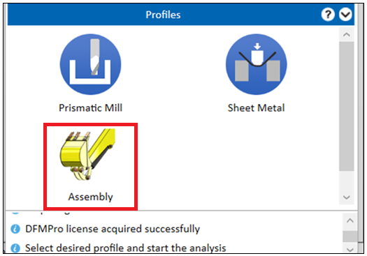
</div>

4. 表示された **User Inputs グループボックス**で、DFMPro は選択に応じて **Local** または **Server** で解析を実行できます。

> * **Local** を選択した場合 → 解析は **ローカルマシン**で実行されます。

> * **Server** を選択した場合 → 解析は **DFX Server** 上で実行されます。


<!--Page.43-->

<!--
"Picture"

5. Users can also select the  Entire Assembly or Pre-Selected Components analysis option. 

• When the Entire Assembly is selected, the analysis will execute on the whole assembly. 
• When Pre-Selected Components is selected, the analysis will execute on selected 

components/sub-assemblies. Click on the 
Analyze button will display the 
Component Selection group box to select the required components/sub-assemblies. 

6. When the Server is selected as Analysis Run Type with either Entire Assembly or Pre-Selected 
Components, the analysis will execute on the DFX Server. 


-->

<div style="text-align: center;">
  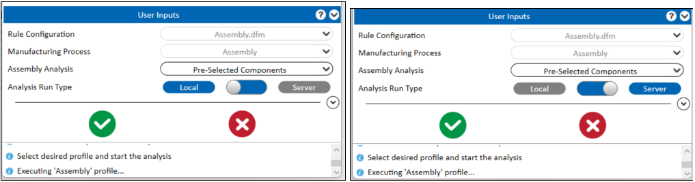
</div>

5. ユーザーは、**Entire Assembly** または **Pre-Selected Components** の解析オプションを選択することもできます。


* **Entire Assembly** を選択した場合 → 解析は **アセンブリ全体**に対して実行されます。

* **Pre-Selected Components** を選択した場合 → 解析は **選択したコンポーネント／サブアセンブリ**に対して実行されます。

> **Analyze ボタン**をクリックすると、必要なコンポーネントまたはサブアセンブリを選択するための**Component Selection グループボックス**が表示されます。

6. **Analysis Run Type** として **Server** を選択し、**Entire Assembly** または **Pre-Selected Components** のいずれかを指定した場合、解析は **DFX Server 上で実行**されます。

                

<!--Page.44-->

<div style="page-break-after: always;"></div>

<!--# Inputs tab -->
<!--
# 入力タブ

This section will describe commands available under the User Inputs group box.  

1. Click on the  Start DFMPro on the DFMPro menu to open the DFMPro User Interface. 
2. In the User Inputs group box, users can add/modify input values as per requirement. 

Note: The Inputs mentioned below Region are required for cost calculation. All these inputs 
are considered for computing the part cost. However, for DFMPro for Creo 
Parametric, only the Manufacturing Process and Material inputs are required for 
execution. 

3. Under the Inputs group, DFMPro for Creo Parametric allows browsing Rule Configuration 
(E.g., SampleRules_1.dfm). 
4. Click on the dropdown list next to the Manufacturing process and select an appropriate 
process. 
5. DFMPro will list required suggestions/actions for designers at the bottom of the User 
interface before proceeding to DFMPro execution. 

"Picture"

## User Inputs group box 

This group box allows users to define inputs as per requirement. 

-->

# 入力タブ（Inputs Tab）

このセクションでは、**User Inputs グループボックス**で利用できるコマンドについて説明します。

1. DFMPro メニューの **Start DFMPro** をクリックして、**DFMPro ユーザーインターフェース**を開きます。

2. **User Inputs グループボックス**では、ユーザーは必要に応じて **入力値の追加や変更**を行うことができます。

> ---

> 注記：以下で説明する **Region 以降の入力項目**は、**コスト計算のために必要な情報**です。
> これらの入力値はすべて **部品コストの計算に使用**されます。
> ただし、**DFMPro for Creo Parametric** の解析実行に必要なのは、**Manufacturing Process（製造プロセス）** と **Material（材料）** の入力のみです。

> ---

3. **Inputs グループ**では、DFMPro for Creo Parametric は **Rule Configuration** を参照することができます。（例：`SampleRules_1.dfm`）

4. **Manufacturing Process** の横にある **ドロップダウンリスト**をクリックし、適切な製造プロセスを選択します。

5. DFMPro を実行する前に、DFMPro は **設計者に必要な提案や対応事項**をユーザーインターフェースの **下部に表示**します。

<div style="text-align: center;">
  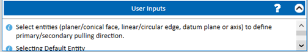
</div>


## User Inputs グループボックス

このグループボックスでは、ユーザーは **必要に応じて各種入力値を設定**することができます。


<!--Page.45-->

<!--

"Picture"

• Rule Configuration: Browse and configure the rule file from the dropdown list.  

"Picture"

• Manufacture Process: Select the appropriate Manufacturing process from the dropdown 
list. 

"Picture"       

-->

<div style="text-align: center;">
  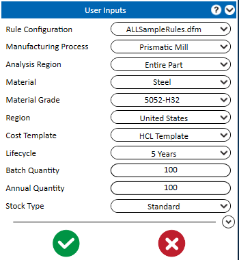
</div>

* Rule Configuration：ドロップダウンリストから **ルールファイルを参照して設定**します。

<div style="text-align: center;">
  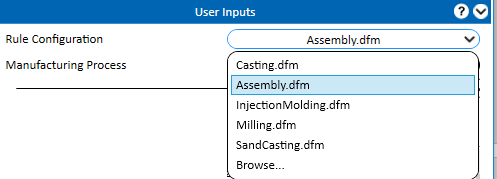
</div>

* Manufacturing Process：ドロップダウンリストから **適切な製造プロセス（Manufacturing Process）**を選択します。

<div style="text-align: center;">
  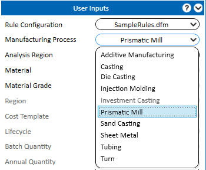
</div>


<!--Page.46-->

<!--
Note:  

• Based on the rules selected in the rule file, the corresponding manufacturing 
processes will be available for execution, and other manufacturing processes will 
be disabled.  
• If a general rule is/are selected in the rule file, all Manufacturing processes will be 
available for execution. 
• To learn more about the Manufacturing Process and its specific settings, refer to 
the Additional settings required for the Analysis section.  

• Analysis Region: 

o Entire Part: The selection of this option will execute the DFMPro rule on the entire 
part. 
o Selected Region: This option will execute the DFMPro rule on the selected regions of 
the part. 

Note:  The Analysis Region field will be displayed only when Prismatic Mill as a 
Manufacturing Process is selected.
              
-->

---

**注記：**

* ルールファイルで選択されているルールに基づき、対応する **製造プロセス（Manufacturing Process）**のみが実行可能となり、その他の製造プロセスは **無効（選択不可）**になります。

* ルールファイルで **General Rule（汎用ルール）**が選択されている場合は、**すべての製造プロセス**を実行することが可能になります。

* 製造プロセスおよびその詳細設定については、**「Additional settings required for the Analysis」セクション**を参照してください。

---


* Analysis Region（解析範囲）

> * **Entire Part**：このオプションを選択すると、DFMPro のルールチェックは **パーツ全体**に対して実行されます。

> * **Selected Region**：このオプションを選択すると、DFMPro のルールチェックは **パーツの選択された領域**に対して実行されます。


---

**注記：** **Analysis Region** フィールドは、**Manufacturing Process として「Prismatic Mill」**が選択された場合にのみ表示されます。

---


<!--Page.47-->


<!--
• Analysis Level: This option will be displayed when Assembly is selected as a 
Manufacturing Process, and the Execute Assembly Rules only on Top Level Assembly Parts 
checkbox is selected in DFMPro Settings. There are two types as follows: 

o Top-level: Selection of this option will execute analysis over the top-level components. 
o All-level: Selection of this option will execute analysis on the entire assembly. 

"Picture"

• Material: Select an appropriate Material from the dropdown list.  
• Material grade: Select an appropriate Material grade from the dropdown list.  
• Region: Select the location of a manufacturing facility from the dropdown list (supported 
regions are US, Europe, China, and India)  
• Cost Template: Select an appropriate template for a report from the dropdown list. 
DFMPro for Creo Parametric allows a selection of the desired template from the 
dropdown list. Users can also add or modify templates through Cost Administration Vault. 

Note: Cost templates will be displayed only if the cost license is available. Otherwise, this 
option will be disabled. 

• Lifecycle: Select the lifecycle (number of years) of the respective part used for cost 
evaluation from the dropdown list. 
• Number of Cavities: By default, it will display 1 value. Select the required number of 
cavities from the dropdown list.           

-->

* Analysis Level（解析レベル）：このオプションは、**Manufacturing Process として Assembly が選択されており、かつ DFMPro Settings で「Execute Assembly Rules only on Top Level Assembly Parts」チェックボックスが有効になっている場合**に表示されます。以下の 2 種類があります。

> * **Top-level**：このオプションを選択すると、**トップレベルのコンポーネント**に対して解析が実行されます。

> * **All-level**：このオプションを選択すると、**アセンブリ全体**に対して解析が実行されます。

<div style="text-align: center;">
  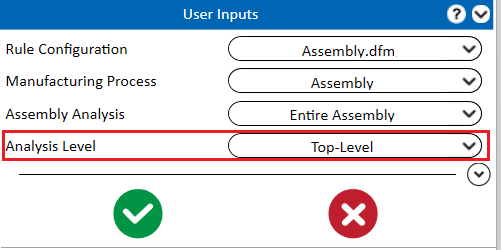
</div>


* Material（材料）：ドロップダウンリストから **適切な材料**を選択します。

* Material Grade（材料グレード）：ドロップダウンリストから **適切な材料グレード**を選択します。

* Region（地域）：製造施設の所在地をドロップダウンリストから選択します。対応地域はUS、Europe、China、India

* Cost Template（コストテンプレート）：レポート用の **適切なテンプレート**をドロップダウンリストから選択します。DFMPro for Creo Parametric では、ドロップダウンリストから **任意のテンプレートを選択**することができます。また、**Cost Administration Vault** を通じてテンプレートを **追加または変更**することも可能です。

> ---

> **注記：** コストライセンスがある場合のみ **Cost Template** が表示されます。ライセンスがない場合、このオプションは **無効（選択不可）**になります。

> ---

* Lifecycle（ライフサイクル）：コスト評価に使用する **対象パーツのライフサイクル（年数）**をドロップダウンリストから選択します。

* Number of Cavities（キャビティ数）：デフォルトでは **1** が表示されます。必要に応じて、ドロップダウンリストから **キャビティ数**を選択します。


<!--Page.48-->

<!--
• Tooling cost: 

o Automatic: Tooling cost will be calculated automatically according to inputs.  
o Manual: Users can manually provide tooling cost input.  

• Batch Quantity: Enter the quantity of parts manufactured for a batch.  
• Annual Quantity: Enter the quantity of parts manufactured throughout the year.  


Note:  The Inputs mentioned below Region are required for cost calculation. All these 
inputs are considered for computing the part cost. However, for DFMPro for Creo 
Parametric, only the Manufacturing Process and Material inputs are required for 
execution.   

• Stock Type: Select a given Stock type from the dropdown list or define the count of stocks. 
Standard will always be chosen as the default. Stock Type will be displayed only when 
Prismatic Mill as a Manufacturing Process is selected. 
Enter the required amount when a Custom option is selected from the dropdown list. 

Note:   

o The amount should not be exceeded by more than 12. If users try to add an extra 
amount, DFMPro will only consider 12 counts.  
o If users try to enter other variables instead of numerical, DFMPro will not analyze 
them. It will show variables in RED color. 

• Cutting process: This field is only displayed when the Manufacturing Process is selected 
as Sheet Metal. Other required inputs are the same as those of Prismatic Milling.  
There are four cutting processes: Default, Water Jet, Laser, and Plasma Cutting.  
By default, a Water jet is set for the Cutting process. Select a required Cutting process 
from the dropdown list.   

• Assembly Analysis:  

o Entire Assembly: The selection of this option will execute the DFMPro rule on the 
whole assembly. 
Inputs tab                       

-->

* Tooling Cost（工具コスト）

> * **Automatic**：入力された情報に基づき、**工具コストが自動計算**されます。

> * **Manual**：ユーザーが **工具コストを手動で入力**することができます。

* Batch Quantity（バッチ数量）：1バッチで **製造される部品の数量**を入力します。

* Annual Quantity（年間数量）：**年間で製造される部品の数量**を入力します。

---

**注記：** **Region 以降の入力項目**は、**コスト計算のために必要な入力値**です。
これらの入力はすべて **部品コストの計算に使用**されます。
ただし、**DFMPro for Creo Parametric の解析実行に必要なのは**
**Manufacturing Process** と **Material** の入力のみです。

---


* Stock Type（素材タイプ）：ドロップダウンリストから **Stock Type（素材タイプ）**を選択するか、素材数を指定することができます。デフォルトでは **Standard** が選択されています。
**Stock Type** は、**Manufacturing Process として「Prismatic Mill」**が選択されている場合のみ表示されます。

> ドロップダウンリストで **Custom** を選択した場合は、必要な数量を入力してください。

---

**注記：**

* 入力値は **12 を超えることはできません**。12 を超える値を入力した場合、DFMPro は **最大 12 として処理**します。

* 数値以外の値を入力した場合、DFMPro は解析を実行できません。その場合、入力された変数は **赤色（RED）**で表示されます。

---


* Cutting Process（切断プロセス）：このフィールドは、**Manufacturing Process として「Sheet Metal」**が選択された場合のみ表示されます。
> その他の入力項目は **Prismatic Milling** と同様です。

> Default、Water Jet、Laser、Plasma Cuttingの **4 種類の切断プロセス**があります。

> デフォルトでは **Water Jet** が設定されています。
> 必要な切断プロセスをドロップダウンリストから選択します。


* Assembly Analysis（アセンブリ解析）

> * **Entire Assembly** :このオプションを選択すると、DFMPro のルールチェックは **アセンブリ全体**に対して実行されます。

> * **Pre-Selected Components**：このオプションを選択すると、DFMPro のルールチェックは **選択されたコンポーネント**に対して実行されます。


<!--Page.49-->

<!--
o Pre-Selected Components: The selection of this option will execute DFMPro rules in 
the selected components. 

• Sub Process: This field only displays when the Manufacturing Process is selected as 
Additive Manufacturing. There are four types of sub-processes: Default, FDM (Fusion 
Deposition Modeling), SLS (Selective Laser Sintering), and SLA (Stereolithography). 
The Default option is set for Sub Process. Select a required Sub Process from the 
dropdown list. DFMPro will analyze the Additive Manufacturing and specific sub-process 
rules based on the selection. 
• : Click to proceed for DFMPro execution. 
• : Click to cancel DFMPro execution. 
Inputs tab                       

-->

* Sub Process（サブプロセス）：このフィールドは、**Manufacturing Process として「Additive Manufacturing」**が選択された場合にのみ表示されます。Default、**FDM（Fusion Deposition Modeling）**、**SLS（Selective Laser Sintering）**、**SLA（Stereolithography）**の4種類のサブプロセスがあります。

> **Sub Process** のデフォルト設定は **Default** です。
> 必要に応じて、ドロップダウンリストからサブプロセスを選択してください。
> DFMPro は、選択された内容に基づき **Additive Manufacturing および該当するサブプロセスのルール**を解析します。

* **Analyze ボタン** → DFMPro の解析を実行します。

* **Cancel ボタン** → DFMPro の解析をキャンセルします。


<!--Page.50-->

<div style="page-break-after: always;"></div>

<!--# Additional settings required for Analysis -->

<!--

# 解析に必要な追加設定

This section describes the types of manufacturing processes and the specific settings required to 
complete DFMPro execution. 
Analysis Region - Prismatic Mill 
1. For the Prismatic Mill manufacturing process, run the Analysis Region either as an Entire Part 
or a Selected Region. 

"Picture"

• Entire Part: Selecting this function from the dropdown list will execute DFMPro rules for 
the entire part. 
• Selected Region: Selecting this function from the dropdown list will execute the DFMPro 
rules in the selected region. 

2. When the  Analyze button is clicked after selecting the Selected Region option, the Entity 
Selection dialog box will be displayed.  
3. In this dialog box, under Machining Region, DFMPro will provide three options to select from 
the dropdown list: 

-->

# 解析に必要な追加設定

このセクションでは、**DFMPro の解析を実行するために必要な製造プロセスの種類と、それぞれの追加設定**について説明します。

## Analysis Region - Prismatic Mill

1. **Prismatic Mill（プリズマティック加工）**の製造プロセスでは、**Analysis Region（解析範囲）**を **Entire Part** または **Selected Region** のいずれかで指定して解析を実行します。

<div style="text-align: center;">
  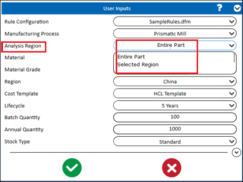
</div>

> * **Entire Part**：ドロップダウンリストからこのオプションを選択すると、**パーツ全体**に対して DFMPro ルールが実行されます。

> * **Selected Region**：ドロップダウンリストからこのオプションを選択すると、**選択された領域**に対して DFMPro ルールが実行されます。


2. **Selected Region** を選択した状態で **Analyze ボタン**をクリックすると、**Entity Selection ダイアログボックス**が表示されます。

3. このダイアログボックスでは、**Machining Region** の項目において、ドロップダウンリストから以下の **3つのオプション**を選択できます。


<!--Page.51-->

<!--
• Select Pre-Machined Region from Feature Tree 
• Select Machined Faces based on Color 
• Select Machined Features from Feature Tree 

"Picture"

### Select Pre-Machined Region from Feature Tree 

When the Select Pre-machined Region from Feature Tree is selected, DFMPro for Creo Parametric 
will choose a pre-machined region (last rough feature) from the Model Creo tree. Features added 
after previous rough features will be considered as machined features. 

DFMPro rule execution will take place only on machined features. 

"Picture"

-->

* **Select Pre-Machined Region from Feature Tree**

* **Select Machined Faces based on Color**

* **Select Machined Features from Feature Tree**

<div style="text-align: center;">
  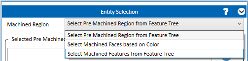
</div>


## Select Pre-Machined Region from Feature Tree

**Select Pre-Machined Region from Feature Tree** を選択すると、**DFMPro for Creo Parametric** は **Creo のモデルツリー**から **事前加工領域（Pre-Machined Region）**
（最後の粗加工フィーチャー：last rough feature）を自動的に選択します。以前の粗加工フィーチャーの後に追加されたフィーチャーは、**加工フィーチャー（Machined Features）**として扱われます。

DFMPro のルール実行は、**これらの加工フィーチャーに対してのみ**行われます。

<div style="text-align: center;">
  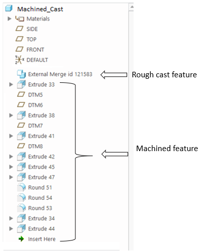
</div>


<!--Page.52-->

<!--
### Select Machined Faces based on Color 

If color-based machined features are added to the CAD file, pick the CAD part's faces based on 
organization standards. Then, DFMPro for Creo Parametric will automatically identify features 
associated with the selected color. These features will be validated for DFMPro analysis. 

"Picture"

As per the above image, all yellow colors are machined faces and the list of associated machined 
features for Machining.  

### Select Machined Features from Feature Tree 

When Select Machined Features from Feature Tree is selected, choose machined features from 
the Creo tree. These features will get validated for Milling rules.  

Note:  All Mill rules and the following mentioned Common rules are supported, except PMI-based 
rules: 
• Chamfered Hole Edges 
• Fillet Radius 
• Minimum Drill Breakout Wall Thickness 
• Recommended Countersink Hole Parameters 
• Thread Relief for Hole 

-->

## Select Machined Faces based on Color

CAD ファイルに **色によって区別された加工面（Machined Faces）**が設定されている場合、組織の標準に基づいて **CAD パーツの面を色で指定**します。
その後、**DFMPro for Creo Parametric** は **選択された色に関連するフィーチャーを自動的に識別**します。
これらのフィーチャーは **DFMPro 解析の対象として検証**されます。

<div style="text-align: center;">
  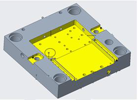
</div>

上図の例では、**黄色の面がすべて加工面（Machined Faces）**として定義されており、それに関連する **加工フィーチャーの一覧**が表示されています。


## Select Machined Features from Feature Tree

**Select Machined Features from Feature Tree** を選択すると、**Creo のフィーチャーツリー**から加工フィーチャーを選択できます。
選択されたフィーチャーは、**Milling ルールに基づいて検証**されます。

---

**注記：**
PMI ベースのルールを除き、**すべての Milling ルール**および
以下の **Common ルール**がサポートされています。

* Chamfered Hole Edges（面取りされた穴エッジ）
* Fillet Radius（フィレット半径）
* Minimum Drill Breakout Wall Thickness（最小ドリル抜け壁厚）
* Recommended Countersink Hole Parameters（推奨皿穴パラメータ）
* Thread Relief for Hole（穴のねじ逃げ）

---

<!--Page.53-->

<!--
## Stock Type – Prismatic Mill 

1. Select a given Stock type from the dropdown list or define the count of stocks. 
2. Click on the dropdown list of Stock Type and observe that there are five types. For first-time 
users, Standard will always be selected as default.  
If another option is set for Stock type, the selected option will be set as default and used for 
analysis. 
3. Select another Stock type as per the requirement to get the DFMPro analysis result. 
4. Enter the required amount when a Custom option is selected from the dropdown list. 

Note: The amount should not exceed 12. If users try to add the extra amount, DFMPro will 
only consider 12 counts. 
Suppose users try to enter other variables instead of numerical ones. In that case, 
DFMPro will not complete it and will show variables in Red. 

"Picture"         

-->

## Stock Type – Prismatic Mill

1. ドロップダウンリストから **Stock Type（素材タイプ）**を選択するか、素材数（Stock の数）を指定します。

2. **Stock Type** のドロップダウンリストをクリックすると、5種類の Stock Type** が表示されます。

> 初めて使用する場合は、**Standard** が **デフォルト設定**として選択されています。
> 別の Stock Type を設定した場合、その選択内容が **新しいデフォルトとして設定され、解析に使用**されます。

3. 必要に応じて別の **Stock Type** を選択し、DFMPro 解析を実行します。

4. ドロップダウンリストから **Custom** を選択した場合は、必要な数量を入力します。


---

**注記：**：入力できる数量は **最大 12** までです。12 を超える値を入力した場合、DFMPro は **12 として処理**します。数値以外の値を入力した場合、DFMPro は解析を実行できません。その場合、入力された変数は **赤色（Red）**で表示されます。

---

<div style="text-align: center;">
  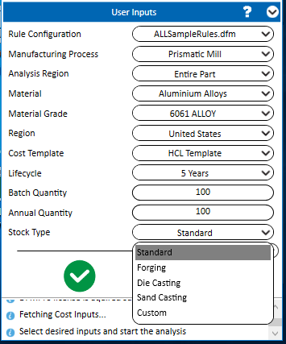
</div>


<!--Page.54-->

<!--

## DFMPro Parting Plane - Sand Casting 

For the Sand Casting Manufacturing Process, provide part pulling direction and selection of 
parting plane. 

1. After adding all required inputs for Sand casting, click the  Analyze button to proceed 
with DFMPro execution.  
Now, define the part Pull direction in the Entity Selection dialog box. 

2. Click on Please select parting plane normal to part pull direction button. 
Additional settings required for Analysis                       

-->

## DFMPro Parting Plane – Sand Casting

**Sand Casting（砂型鋳造）**の製造プロセスでは、**パーツの引き抜き方向（Pull Direction）**と**パーティング面（Parting Plane）**を指定する必要があります。


<div style="text-align: center;">
  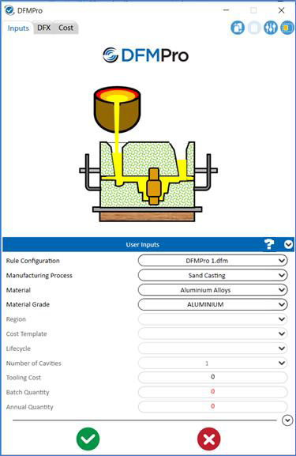
</div>

1. Sand Casting に必要な入力項目をすべて設定した後、**Analyze ボタン**をクリックして DFMPro の解析を開始します。

> その後、**Entity Selection ダイアログボックス**で**パーツの引き抜き方向（Pull Direction）**を定義します。

2. **Please select parting plane normal to part pull direction** ボタンをクリックすると、

> Parting Plane ダイアログボックスの表示されます。

<!--Page.55-->

<!--

### The Parting Plane dialog box will be displayed. 

"Picture"

3. In this dialog box, click the Select Entity button and select the required parting plane/face 
from the Creo Parametric graphics tree. 

"Picture"

Select parting face/plane from the Creo Parametric graphics area 

4. DFMPro for Creo Parametric will classify part faces into Cope, Drag, and Others (undercuts) 
faces based on part pull direction and selected parting plane. 

Based on the classification of faces, validation of the DFMPro for Creo Parametric rule is 
required. 

-->


<div style="text-align: center;">
  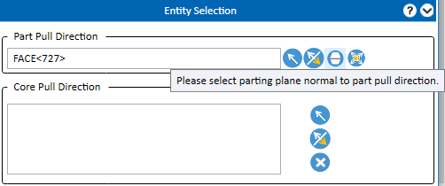
</div>

3. このダイアログボックスで **Select Entity ボタン**をクリックし、**Creo Parametric のグラフィックス画面**から必要な **パーティング面（Parting Plane / Face）**を選択します。

<div style="text-align: center;">
  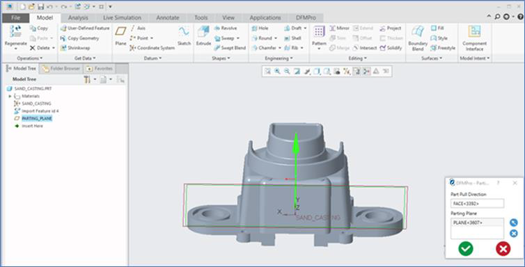
</div>


<p style="text-align:center; color:blue; font-weight:bold;">
  Creo Parametric のグラフィックスエリアからパーティング面／平面を選択
</p>


4. DFMPro for Creo Parametric は、**パーツの引き抜き方向（Pull Direction）**と **選択したパーティング面**に基づいて、
パーツの面を**Cope（上型側の面）**、**Drag（下型側の面）**、**Others（アンダーカット面）**の 3 種類に分類します。

> この面の分類に基づき、**DFMPro for Creo Parametric のルール検証**が行われます。

                 

<!--Page.56-->
<!--

## Assembly Analysis - Assembly 

For Assembly, DFMPro allows analysis execution analysis on the Entire Assembly or Pre-Selected 
Components/Sub-assemblies.  

The Pre-Selected Components option will only display in the dropdown list when the Assembly 
Preselection Option is selected in the DFMPro Settings. Otherwise, only the Entire Assembly 
option will be available. 

Either select Assembly Analysis as Entire Assembly or Pre-Selected Components and click on the 
Analyze button to execute the analysis. 

"Picture"

• Entire Assembly: Select this function from the dropdown list to execute analysis on the 
whole Assembly. 
• Pre-Selected Components: Select this function from the dropdown list and click the 
Analyze button. DFMPro will display the Component Selection group box to select the 
required components/sub-assemblies. 

### Different ways to select components/sub-assemblies 

Select single or multiple components/sub-assemblies from the Components Selection group box 
to run an analysis. 

### Method 1: Through the Component Selection dialog box 

DFMPro will generate a list of components with respect to the Creo Model Tree. Select the 
required components from the list displayed in the Component Selection group box. Selected 
components will be highlighted in the Creo Graphical area.                

-->


## Assembly Analysis – Assembly

**Assembly（アセンブリ）**では、DFMPro により、**アセンブリ全体**または **選択したコンポーネント／サブアセンブリ**に対して解析を実行できます。

**Pre-Selected Components** オプションは、**DFMPro Settings で「Assembly Preselection Option」**が有効になっている場合のみ、ドロップダウンリストに表示されます。
この設定が無効の場合は、**Entire Assembly** のみが選択可能になります。

**Assembly Analysis** を **Entire Assembly** または **Pre-Selected Components** のいずれかに設定し、**Analyze ボタン**をクリックすると解析が実行されます。

<div style="text-align: center;">
  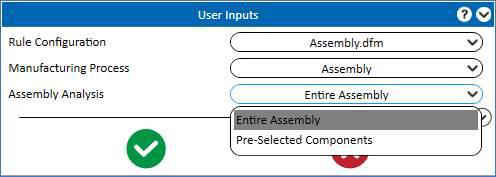
</div>


* **Entire Assembly**：ドロップダウンリストからこのオプションを選択すると、**アセンブリ全体**に対して解析が実行されます。

* **Pre-Selected Components**：ドロップダウンリストからこのオプションを選択し、**Analyze ボタン**をクリックすると、**Component Selection グループボックス**が表示され、解析対象となるコンポーネント／サブアセンブリを選択できます。


### コンポーネント／サブアセンブリの選択方法

解析を実行するために、**Component Selection グループボックス**から**単一または複数のコンポーネント／サブアセンブリ**を選択できます。


### 方法 1：Component Selection ダイアログボックスから選択

DFMPro は **Creo Model Tree** に基づいてコンポーネントの一覧を生成します。
**Component Selection グループボックス**に表示されるリストから必要なコンポーネントを選択してください。
選択されたコンポーネントは、**Creo のグラフィックス画面でハイライト表示**されます。
選択した **コンポーネント／サブアセンブリ**の解析を実行するには、**Analyze ボタン**をクリックします。

<!--Page.57-->

<!--

Click on the Analyze button to execute the analysis of selected components/sub-assemblies. 

"Picture"

### Method 2: Through Graphics area/Model Tree 

Click on  Select Components from Graphics or Model Tree button to activate Graphical and 
Model Tree selection modes. 

Select single or multiple components from the Graphics area as per requirement. DFMPro also 
allows the selection of various components by window selection from the graphics area. 

OR 

Select the required components from the Model tree.  

After selecting the required components, click the OK button in the Select dialog box or the 
mouse's middle button to exit selection mode and finalize the selection. Then, click on the 
Analyze button to execute the analysis of selected components/sub-assemblies. 

"Picture"              


-->


<div style="text-align: center;">
  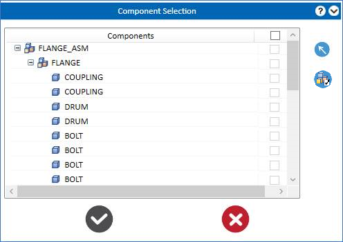
</div>


### 方法 2：Graphics エリア / Model Tree から選択

**Select Components from Graphics or Model Tree** ボタンをクリックすると、**グラフィックスエリア**および **Model Tree**での選択モードが有効になります。

必要に応じて、**グラフィックスエリア**から単一または複数のコンポーネントを選択します。
また、グラフィックスエリアで **ウィンドウ選択**を使用して複数のコンポーネントを選択することも可能です。

または

**Model Tree**から必要なコンポーネントを選択します。

必要なコンポーネントを選択した後、**Select ダイアログボックスの OK ボタン**、または **マウスの中ボタン**をクリックして選択モードを終了し、選択内容を確定します。
その後、**Analyze ボタン**をクリックすると、選択した **コンポーネント／サブアセンブリ**に対して解析が実行されます。

<div style="text-align: center;">
  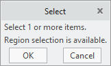
</div>


<!--Page.58-->

<!--

View all selected components: When the  Show All Selected Components button is 
selected, all selected components will be highlighted in the Graphics area for viewing and 
verifying. 

### Cost Result 

Under the Components Cost View group box of the Cost tab, DFMPro will display Quantity and 
Unit Cost for selected components only on which analysis is executed.  

### Rerun Analysis 

DFMPro allows rerunning analysis of saved Assembly without repeating steps to select required 
components in the same session. 

### Excel Report 
DFMPro analysis report will display a selected option for Assembly Analysis. 

"Picture"


-->

**View all selected components：** **Show All Selected Components** ボタンをクリックすると、選択されたすべてのコンポーネントが **グラフィックスエリアでハイライト表示**され、確認および検証ができます。


### Cost Result（コスト結果）

**Cost タブ**の **Components Cost View グループボックス**では、DFMPro は **解析が実行された選択コンポーネントのみ**について、**Quantity（数量）**、**Unit Cost（単価）**の情報を表示します。


### Rerun Analysis（解析の再実行）

DFMPro では、**同一セッション内で保存されたアセンブリ**に対して、再度コンポーネントを選択する手順を繰り返すことなく、**解析を再実行**することができます。


### Excel Report（Excel レポート）

DFMPro の解析レポートでは、**Assembly Analysis の選択内容**が表示されます。

<div style="text-align: center;">
  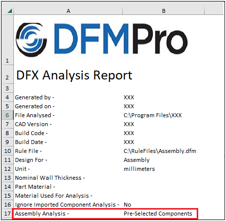
</div>


<!--Page.59-->

<!--
## Multi-process analysis with Assembly module 

Users can execute assembly-specific checks by selecting Manufacturing Process as Assembly. All 
assembly-specific rules will be executed for Assembly, Cabling, Welding, and Tubing modules.  

For example, the tubing module rule “Minimum Clearance Between Tubes” will be executed. 
Part-specific rules, e.g., Recommended Tube Bend Radius, will not be executed. 

Note: Part-specific rules cannot be executed with the above multi-process analysis. 

"Picture"                 


-->

## Assembly モジュールによるマルチプロセス解析（Multi-process analysis with Assembly module）

**Manufacturing Process として「Assembly」**を選択すると、**アセンブリ固有のチェック（Assembly-specific checks）**を実行できます。
この場合、Assembly、Cabling、Welding、Tubingのモジュールに関連する **アセンブリ用ルール**が実行されます。

例えば、**Tubing モジュールのルール**である**「Minimum Clearance Between Tubes（チューブ間の最小クリアランス）」**は実行されます。
一方で、パーツ固有のルール（例：**Recommended Tube Bend Radius（推奨チューブ曲げ半径）**）は実行されません。

<br>

---

**注記：**：上記の **マルチプロセス解析**では、**パーツ固有のルール（Part-specific rules）**は実行できません。

---

<div style="text-align: center;">
  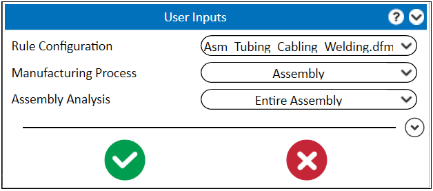
</div>


<!--Page.60-->
<!--

## Server/Local Analysis  Run Type – Assembly 

Designer workstations are loaded with running multiple software, including CAD, and it isn't easy 
to run very complex assemblies. Thoroughly analyzing large assemblies that run into Gigabytes 
takes hours of processing time. As a result, designers may have to wait for the current analysis 
to be completed to continue CAD design work. DFX Server Solution provides an option to execute 
the analysis on the server side as a new offering. It can be enabled through DFMPro Settings. 

It enables users to: 

• Free up resources on their system and use higher configuration server machines for analysis. 
• Close DFMPro and Creo Parametric sessions after running an analysis on the Server. 
• Review analysis status through the “DFX Server” tab in DFMPro for Creo Parametric.  
• Review the results within DFMPro for Creo Parametric after successfully completing an 
analysis on the Server (as if the analysis has been performed locally). 

When Assembly is selected as Manufacturing Process and the Allow server analysis option is 
enabled in the DFMPro Settings dialog box, DFMPro will display Server and Local options for 
Analysis Run Type. 

"Picture"

• When the Local option is selected, the analysis will occur on the local machine. 
• When the Server option is selected, the analysis will occur on the DFX Server. 

After a request is successfully submitted, a DFMPro analysis will be performed on the server. 
Users can view the submitted request status through the DFX Server tab.  

-->


## Server / Local Analysis Run Type – Assembly

設計者のワークステーションでは、CAD を含む複数のソフトウェアが同時に実行されていることが多く、**非常に複雑なアセンブリを解析することは容易ではありません。**
ギガバイト級の大規模アセンブリを詳細に解析する場合、**処理に数時間かかること**もあります。
そのため、設計者は **解析が完了するまで CAD 設計作業を続けられない**場合があります。
**DFX Server Solution** では、新しい機能として **サーバー側で解析を実行するオプション**が提供されています。
この機能は **DFMPro Settings** から有効化することができます。


### この機能により、ユーザーは以下のことが可能になります：

* 自身のシステムリソースを解放し、**高性能サーバーマシンで解析を実行**できる

* サーバーで解析を実行した後、**DFMPro および Creo Parametric セッションを終了**できる

* **DFMPro for Creo Parametric の「DFX Server」タブ**から解析の進行状況を確認できる

* サーバー解析完了後、**DFMPro for Creo Parametric 内で結果を確認**できる（ローカルで解析を実行した場合と同様に表示されます）


**Manufacturing Process として「Assembly」**が選択され、**DFMPro Settings ダイアログボックスで「Allow server analysis」オプションが有効**になっている場合、**Analysis Run Type** として **Server** と **Local** の選択肢が表示されます。

<div style="text-align: center;">
  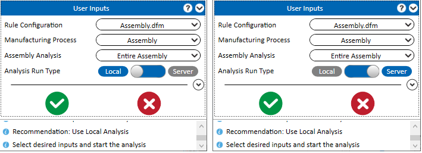
</div>

* **Local** を選択した場合 → 解析は **ローカルマシン**で実行されます。

* **Server** を選択した場合 → 解析は **DFX Server** 上で実行されます。


解析リクエストが正常に送信されると、**DFMPro の解析はサーバー上で実行**されます。
ユーザーは、**DFX Server タブ**から**送信した解析リクエストの状態（ステータス）**を確認できます。

           

<!--Page.61-->

<div style="page-break-after: always;"></div>

<!--# Entity Selection group box -->

<!--
# エンティティ選択グループボックス

1. After completing the DFMPro analysis, DFMPro will display the Entity Selection group box 
under the Inputs group. 

By default, DFMPro for Creo Parametric will define the default pulling direction from a part. 
However, users can modify the pulling direction as per requirement.  

2. After selecting the required direction, the selected pulling direction ID will be displayed in the 
Entity Selection group box. 

3. Users can provide secondary pulling directions based on part complexity to manufacture 
undercuts/side action. 

Note:  Depending upon the process selection in the Inputs tab, fields and layout of the Entity 
Selection group box will change accordingly. The following are a few examples. 

"Picture"

Entity Selection group box for the Thermoforming process                


-->

# エンティティ選択グループボックス（Entity Selection Group Box）

1. DFMPro の解析を開始すると、**Inputs グループ**の下に**Entity Selection グループボックス**が表示されます。

> デフォルトでは、**DFMPro for Creo Parametric** がパーツ形状から **引き抜き方向（Pulling Direction）**を自動的に設定します。
> ただし、ユーザーは必要に応じて **引き抜き方向を変更**することができます。


2. 必要な方向を選択すると、選択した **引き抜き方向の ID** が **Entity Selection グループボックス**に表示されます。


3. パーツ形状が複雑な場合、**アンダーカットやサイドアクションの製造**に対応するため、**二次引き抜き方向（Secondary Pulling Direction）**を設定することもできます。


> ---

> **注記：** **Inputs タブで選択された製造プロセス**に応じて、**Entity Selection グループボックスの項目やレイアウトは変更**されます。
以下はその一例です。

> ---


<div style="text-align: center;">
  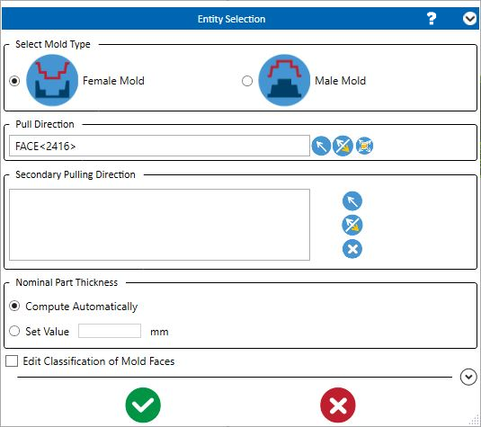
</div>

**Thermoforming プロセスにおける Entity Selection グループボックスの例**


<!--Page.62-->
                 

<!--Page.63-->

<!--
"Picture"


Entity Selection group box for Casting, Die Casting, and Injection Molding processes 
 
"Picture"

Entity Selection group box for the Vacuum Infusion process 


"Picture"

Entity Selection group box for Sand Casting process 

"Picture"

Entity Selection group box for Additive Manufacturing process                 
-->


<div style="text-align: center;">
  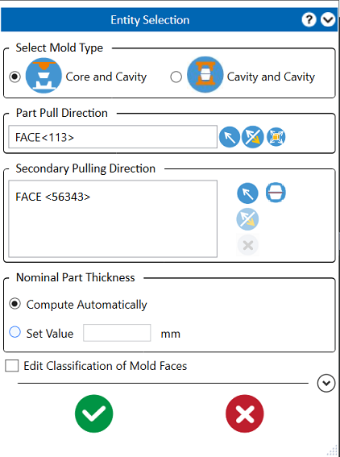
</div>

**Casting、Die Casting、Injection Molding プロセス用のEntity Selection グループボックス**


<div style="text-align: center;">
  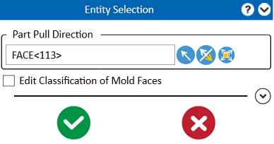
</div>

**Vacuum Infusion プロセス用のEntity Selection グループボックス**


<div style="text-align: center;">
  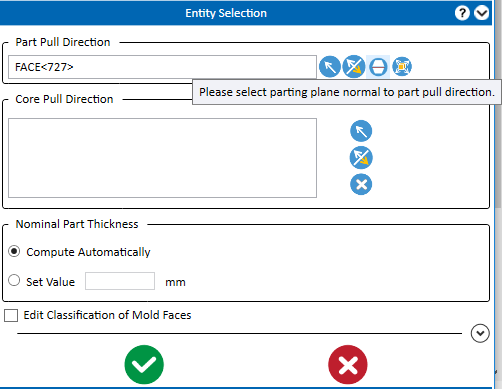
</div>

**Sand Casting プロセス用のEntity Selection グループボックス**


<div style="text-align: center;">
  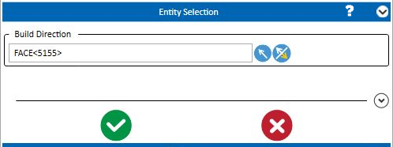
</div>

**Additive Manufacturing プロセス用のEntity Selection グループボックス**


<!--Page.64--> 

<!--
"Picture"

Entity Selection group box for Turn process 


Note:  Entity Selection dialog box is not applied to Investment Casting, Prismatic Mill, and 
Tubing processes. 
-->


<div style="text-align: center;">
  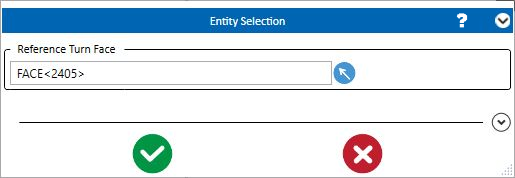
</div>

**Turn（旋削）プロセス用のEntity Selection グループボックス**

---

**注記：**
**Entity Selection ダイアログボックス**は、**Investment Casting**（精密鋳造）、**Prismatic Mill**（プリズマティック加工）、**Tubing**（チューブ加工）の製造プロセスには **適用されません。**

---

           

<!--Page.65-->

<!--
## Stock Type 

1. For the Prismatic Mill manufacturing process, when Stock Type is selected as Standard in the 
Users Inputs group box, click on the  Analyze button. 
The Entity Selection dialog box will be displayed. 

Note:  Entity Selection group box will be displayed to define Stock Shape and Direction only 
when the Stock Type is set as a Standard in the User Inputs group box and the Cost 
license is available.  

"Picture"

2. DFMPro will provide three possibilities for defining stock shape. 

• Automatic: Optimum Raw material Stock comparison between Rectangle and Round 
Stock. 
• Rectangle: Raw material stock is calculated considering Rectangle Stock. 
• Round: Raw material stock is calculated considering Round Stock. 

3. Select the face or edge from the graphics area to define Direction.  
-->


## Stock Type

1. **Prismatic Mill（プリズマティック加工）**の製造プロセスで、**User Inputs グループボックス**の **Stock Type** が **Standard** に設定されている場合、**Analyze ボタン**をクリックします。

> すると、**Entity Selection ダイアログボックス**が表示されます。

---

**注記：**：**User Inputs グループボックスで Stock Type が Standard に設定されており、かつ Cost ライセンスが有効な場合のみ**、**Stock Shape（素材形状）**および **Direction（方向）**を指定するための**Entity Selection グループボックス**が表示されます。

---

<div style="text-align: center;">
  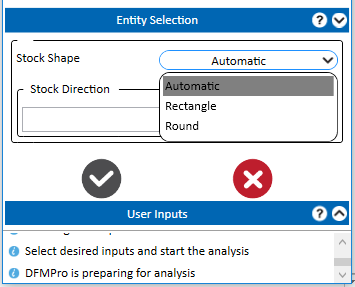
</div>


2. DFMPro では、**素材形状（Stock Shape）**を定義するために以下の **3つのオプション**が提供されています。

> * **Automatic**：**矩形素材（Rectangle）**と **丸材（Round）**を比較し、**最適な原材料素材形状**を自動的に選択します。

> * **Rectangle**：**矩形素材（Rectangle Stock）**を前提として、原材料サイズを計算します。

> * **Round**：**丸材（Round Stock）**を前提として、原材料サイズを計算します。


3. **Direction（方向）**を定義するため、グラフィックスエリアから **面（Face）またはエッジ（Edge）**を選択します。


<!--Page.66-->
<!--
"Picture"

4. After DFMPro analysis, the Raw Material Shape will be displayed under the Cost group box. 

"Picture"

5. Added Stock Shape will be displayed in the generated Cost report.       

-->

<div style="text-align: center;">
  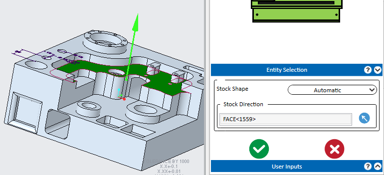
</div>

4. DFMPro 解析が完了すると、**Raw Material Shape（原材料形状）**が **Cost グループボックス**に表示されます。

<div style="text-align: center;">
  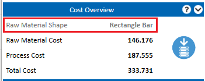
</div>

5. 追加された **Stock Shape（素材形状）**は、生成された **Cost レポート**にも表示されます。


<!--Page.67-->

<div style="page-break-after: always;"></div>

<!--# Edit Mold Wall Classification -->


<!--
# 金型壁の分類を編集

DFMPro will automatically classify all faces of a part under analysis into Core and Cavity, Cavity 
and Cavity, Side Action, and Others groups. 

In some typical cases, a few faces need to move from core to cavity, cavity to cavity, etc. Using 
the Edit Mold Wall Classification functionality, such faces can be moved from one group to 
another. 

## Define from DFMPro User Interface 

1. The primary pulling direction is selected by default. The model can be analyzed based on 
default mold (core/cavity/other) face classification. 

DFMPro allows defining Secondary pulling direction (side action) as per requirement. DFMPro 
will further check the definition of pulling direction information within layers. 

2. To view, analyze, and modify default mold faces classification. 

a. Run DFMPro for the Injection Molding/Die Casting/Casting/Sand Casting/Thermoforming/Vacuum Infusion. 

Note: The different processes are classified based on selected mold faces. For example, 
click on the respective process links above. 

b. In the Input Selection dialog box, select Plane or Planar face or Part Edge or Axis or Non
planar faces (conical and cylindrical faces) from the graphics area to define the Primary 
and Secondary pull directions. 

c. Select the Edit Classification of Mold Faces checkbox. 

"Picture"          

-->

# 金型壁の分類を編集（Edit Mold Wall Classification）

DFMPro は、解析対象のパーツのすべての面を自動的に**Core（コア側）**、**Cavity（キャビティ側）**、**Side Action（サイドアクション）**、**Others（その他）**のグループに分類します。

一部のケースでは、特定の面を **Core → Cavity** や **Cavity → Core** など、別のグループへ変更する必要があります。
**Edit Mold Wall Classification 機能**を使用すると、このような面を **別のグループへ移動して再分類**することができます。


## DFMPro ユーザーインターフェースから定義

1. デフォルトでは **Primary Pulling Direction（主引き抜き方向）**が設定されています。このデフォルトの金型面分類（Core / Cavity / Others）に基づいてモデルを解析できます。

> また、DFMPro では必要に応じて **Secondary Pulling Direction（サイドアクション）**を設定することもできます。DFMPro は、レイヤー内の **引き抜き方向の定義情報**も確認します。


2. デフォルトの金型面分類を **表示・解析・変更**するには、以下の手順を行います。

> a. **Injection Molding / Die Casting / Casting / Sand Casting / Thermoforming / Vacuum Infusion** のいずれかのプロセスで **DFMPro を実行**します。

> ---

> **注記：**：異なる製造プロセスは、選択された **金型面の分類**に基づいて判定されます。
> 例えば、上記の該当するプロセスリンクをクリックしてください。

> ---

> b. **Input Selection ダイアログボックス**で、要素（Plane Planar Face Part Edge Axis Non-planar Face（円錐面や円筒面など））をグラフィックスエリアから選択して**Primary Pull Direction** および **Secondary Pull Direction** を定義します。

> c. **Edit Classification of Mold Faces** チェックボックスを選択します。

<div style="text-align: center;">
  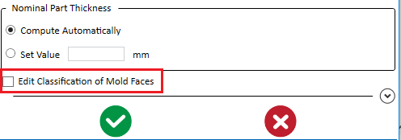
</div>

> d. **Start Analysis ボタン**をクリックします。

>> すると、**Edit Mold Wall Classification ダイアログボックス**が表示されます。


<!--Page.68-->
<!--
d. Click on the Start Analysis button. 
Edit Mold Wall Classification dialog box will be displayed. 

3. DFMPro will automatically classify all component faces into Core and Cavity, Cavity and 
Cavity, Side Actions (1, 2, 3…), and Others. 

Note: After analysis, the number of defined Secondary pulling directions will be classified into 
the same number of Side Actions (1, 2. 3…) in the Edit Mold Classification dialog box.  

4. After defining Primary and Secondary pulling directions, specific classification will be grayed 
if any face is unavailable for Core and Cavity, Cavity and Cavity, or Side Actions classification 
options. In addition, no group will form in the Edit Mold Classification dialog box. 

DFMPro allows defining or moving the faces from one group to another. 

"Picture"

5. Click the respective Core, Cavity, or Side Actions buttons to view the corresponding faces 
count under Groups.                      

-->


3. DFMPro は、すべてのコンポーネント面を自動的に **Core（コア）**、**Cavity（キャビティ）**、**Cavity and Cavity**、**Side Actions（1, 2, 3 …）**、**Others（その他）**のグループに分類します。

> ---

> **注記：**：解析後、定義された **Secondary Pulling Direction（副引き抜き方向）**の数に応じて、**Edit Mold Classification ダイアログボックス**では同じ数の **Side Actions（1, 2, 3 …）** が分類として表示されます。

> ---


4. **Primary Pulling Direction** および **Secondary Pulling Direction** を定義した後、特定の面が **Core / Cavity / Side Actions** の分類に該当しない場合、
その分類オプションは **グレーアウト（選択不可）**になります。また、その場合は **Edit Mold Classification ダイアログボックス**に該当するグループは表示されません。

> DFMPro では、面を **あるグループから別のグループへ移動して再分類**することが可能です。

<div style="text-align: center;">
  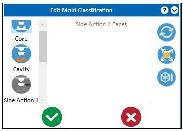
</div>


5. **Core、Cavity、または Side Actions** の各ボタンをクリックすると、**Groups** 内に表示される **対応する面の数**を確認できます。


<!--Page.69-->

<!--
"Picture"

Note: Click the  Reset button to revert the modification to the default classification. 
The Reset button will only update changes applied in the current session. 

6. Click on the Core, Cavity, Side Actions, etc., classification option to view the respective group 
of faces and pulling direction in the graphics area. 

7. DFMPro allows swapping available groups/faces between Core and Cavity or Cavity and 
Cavity options only. 

Right-click the Core or Cavity option and select the Swap Core / Cavity Groups button from 
the context menu. Click on the OK button in the displayed message dialog box. All available 
groups/faces will be swapped between the Core and Cavity options. 

"Picture"

-->

<div style="text-align: center;">
  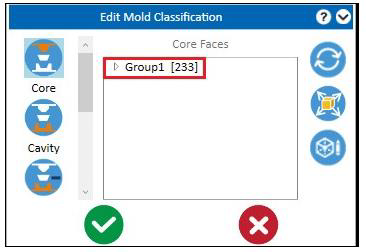
</div>

---

**注記：**：**Reset ボタン**をクリックすると、変更内容を **デフォルトの分類状態に戻す**ことができます。
ただし、**Reset ボタンで元に戻せるのは現在のセッション内で行った変更のみ**です。

---


6. **Core、Cavity、Side Actions** などの分類オプションをクリックすると、該当する **面のグループおよび引き抜き方向**が **グラフィックスエリア**に表示されます。


7. DFMPro では、**Core と Cavity**、または **Cavity と Cavity** の間でのみ、グループ／面の入れ替え（スワップ）を行うことができます。

> **Core** または **Cavity** のオプションを **右クリック**し、コンテキストメニューから **Swap Core / Cavity Groups** を選択します。 
> 表示されるメッセージダイアログで **OK ボタン**をクリックすると、**Core と Cavity の間で利用可能なすべてのグループ／面が入れ替え**られます。

<div style="text-align: center;">
  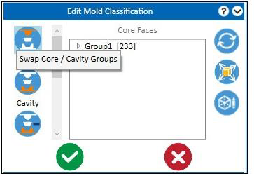
</div>


<!--Page.70-->

<!--
8.  The Add / Remove Faces through Graphical Selection option allows the user to select 
desired faces from the graphics area and move to a selected specific Group. 

"Picture"

a. Click on Add / Remove Faces through Graphical Selection option and select the desired 
Group option from the context menu. 
b. Select multiple faces from the graphical area using the Ctrl button and click on the 
middle button of a mouse to finalize a selection.  

This action will activate the OK button in the dialog box. 

c. Click on the OK button to move selected faces to the selected Group. 

9. DFMPro allows moving groups/faces from one classification option to another. Select the 
desired faces   
using the Ctrl button and drag and drop to the main group. 

10. Double-click on the desired sub-group to rename sub-groups or select the F2 keyboard 
button and then enter the name to replace the existing one. Press the Enter button on the 
keyboard to save the new name. 

-->


8. **Add / Remove Faces through Graphical Selection** オプションを使用すると、グラフィックスエリアから必要な面を選択し、指定した **グループ**へ移動することができます。

<div style="text-align: center;">
  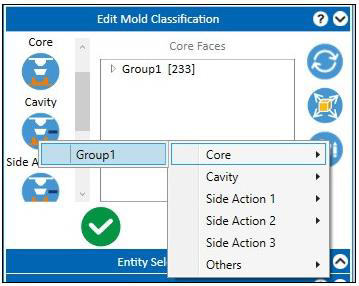
</div>

> a. **Add / Remove Faces through Graphical Selection** オプションをクリックし、コンテキストメニューから目的の **Group（グループ）**を選択します。

> b. **Ctrl キー**を押しながらグラフィックスエリアで複数の面を選択し、**マウスの中ボタン**をクリックして選択を確定します。この操作により、ダイアログボックス内の **OK ボタン**が有効になります。

> c. **OK ボタン**をクリックすると、選択した面が指定した **グループ**へ移動します。


9. DFMPro では、**グループ／面を別の分類グループへ移動**することもできます。**Ctrl キー**を押しながら目的の面を選択し、**ドラッグ＆ドロップ**で目的のメイングループへ移動します。


10. サブグループ名を変更するには、対象の **サブグループをダブルクリック**するか、キーボードの **F2 キー**を押して新しい名前を入力します。その後、**Enter キー**を押して新しい名前を保存します。

              

<!--Page.71-->
<!--
"Picture"

11. To view all pull directions in the graphics area, click the button. Show all pulling directions 
12. Click on the OK button to continue DFMPro analysis based on available classification. 
13. Mold Wall Classification is used in various rules related to: 
• Draft angles 
• Wall thickness 
• Surface area 
• Etc. 

### Select Mold Type 
• By default, Core and Cavity Mold Types are selected, and mold faces will classify as Core 
and Cavity. 
• In specific models, the mold faces belong to the only Cavity. For such models, the Cavity 
and Cavity options are provided where the mold faces are classified as Cavity 1 and 
Cavity 2. 
• In the Minimum Draft Angle rule, the recommended value of the cavity draft angle is 
applied when the Cavity and Cavity Mold Type is selected.                      
-->


<div style="text-align: center;">
  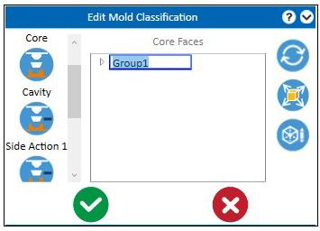
</div>

11. グラフィックスエリアで **すべての引き抜き方向（Pull Direction）**を表示するには、**Show All Pulling Directions** ボタンをクリックします。

12. 利用可能な分類に基づいて DFMPro の解析を続行するには、**OK ボタン**をクリックします。

13. **Mold Wall Classification（型壁分類）**は、次のようなルールで使用されます。

> * **Draft angles（抜き勾配）**

> * **Wall thickness（壁厚）**

> * **Surface area（表面積）**

> * など


### Mold Type の選択

* デフォルトでは **Core and Cavity** の **Mold Type** が選択され、金型面は **Core** と **Cavity** に分類されます。

* 特定のモデルでは、すべての金型面が **Cavity 側のみ**に属する場合があります。そのようなモデルでは **Cavity and Cavity** オプションが使用され、金型面は **Cavity 1** と **Cavity 2** に分類されます。

* **Minimum Draft Angle ルール**では、**Cavity and Cavity Mold Type** が選択されている場合、**キャビティ側の推奨抜き勾配値**が適用されます。


<!--Page.72-->

<!--
"Picture"

### Thermoforming process 

The Thermoforming process gets classified into Male Mold and Female Mold based on a 
selection of mold faces. 

"Picture"

### Vacuum Infusion Process 

Based on a selection of mold faces, the Vacuum Infusion process gets classified into Internal and 
External. 

-->

<div style="text-align: center;">
  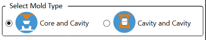
</div>

### Thermoforming プロセス

**Thermoforming（熱成形）プロセス**では、選択した **金型面（Mold Faces）**に基づいて、以下のように**Male Mold（オス型）**、**Female Mold（メス型）**分類されます。

<div style="text-align: center;">
  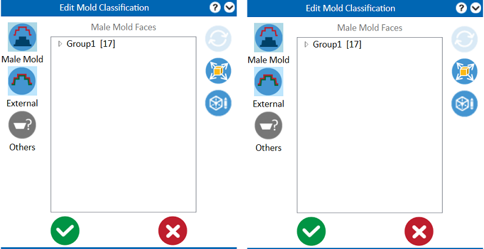
</div>


### Vacuum Infusion プロセス

**Vacuum Infusion（真空含浸成形）プロセス**では、選択した **金型面**に基づいて、以下のように**Internal（内側）**、**External（外側）**分類されます。


<!--Page.73-->
<!--
"Picture"

### Casting, Die Casting, and Injection Molding Processes 

Based on a selected Mold Type, the Casting, Die Casting, and Injection Molding processes get 
classified into Core and Cavity or Cavity and Cavity. 

"Picture"
-->


<div style="text-align: center;">
  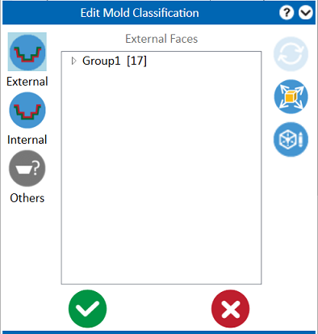
</div>

### Casting、Die Casting、Injection Molding プロセス

**Casting（鋳造）**、**Die Casting（ダイカスト）**、および **Injection Molding（射出成形）** の各プロセスでは、選択された **Mold Type（金型タイプ）**に基づいて、**Core and Cavity**
、**Cavity and Cavity**のいずれかに分類されます。


<div style="text-align: center;">
  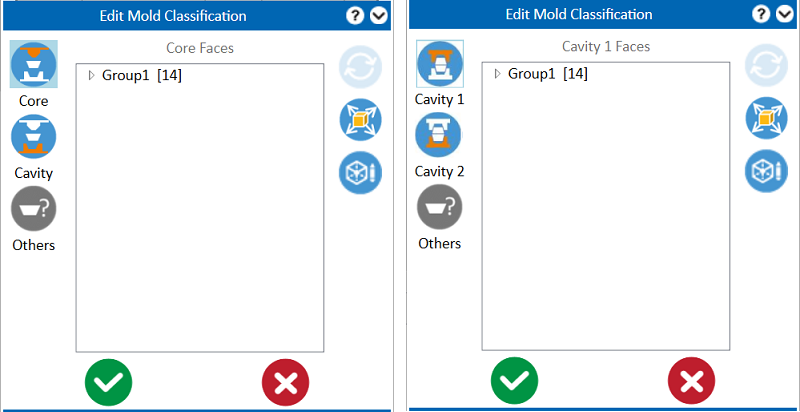
</div>


<!--Page.74-->

<!--
### Sand Casting Process 

The Sand Casting process gets classified into Cope and Drag based on a selection of mold faces. 

"Picture"                   

-->

### Sand Casting プロセス

**Sand Casting（砂型鋳造）**プロセスでは、選択された **金型面（Mold Faces）**に基づいて、**Cope（上型）**、**Drag（下型）**のように分類されます。


<div style="text-align: center;">
  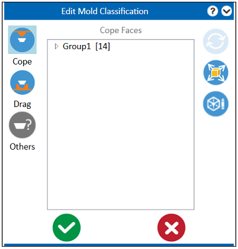
</div>


<!--Page.75-->

<!--
## Machining Setup – Prismatic Mill 

For Prismatic Mill, DFMPro provides an option to view and edit the machining setup. Click on the 
Display Machining Setup checkbox to check the machine setups in the DFMPro-Settings dialog 
box. The number of machining setups and feature lists will help the design engineer to 
understand the setups. Based on the setup information, the designer can optimize the features 
of the design. 

Note: Display Machining Setup option is available after upgrading DFMPro Settings from 
version 8.4.0 onwards. 

1. After selecting the Display Machining Setup option in the DFMPro-Settings dialog box, the 
user will view the setups. Then, select the Edit Machining Setup option from the Entity 
Selection group box to view the setup details.  

"Picture"

2. After selecting this check box and clicking on the   Analyze button, DFMPro will display a 
process of recognizing features and will classify them into machining setups. 

"Picture"
-->

### Machining Setup – Prismatic Mill

**Prismatic Mill（プリズマティック加工）**では、DFMPro は **加工セットアップ（Machining Setup）を表示および編集する機能**を提供しています。
**Display Machining Setup** チェックボックスをクリックすると、**DFMPro Settings ダイアログボックス**で設定された **マシニングセットアップ**を確認できます。
表示される **加工セットアップの数**や **フィーチャー一覧**は、設計者が加工工程を理解するのに役立ちます。
これらのセットアップ情報を基に、設計者は **設計フィーチャーを最適化**することができます。


---

**注記：**：**Display Machining Setup** オプションは、**DFMPro Settings をバージョン 8.4.0 以降にアップグレードした場合**に利用可能です。

---


1. **DFMPro Settings ダイアログボックス**で**Display Machining Setup** オプションを選択すると、ユーザーは加工セットアップを確認できるようになります。その後、**Entity Selection グループボックス**から**Edit Machining Setup** オプションを選択すると、セットアップの詳細を表示できます。

<div style="text-align: center;">
  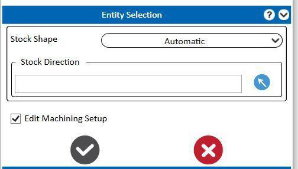
</div>


2. このチェックボックスを選択し、**Analyze ボタン**をクリックすると、DFMPro は **フィーチャー認識処理**を実行し、それらを **加工セットアップごとに分類**します。

<div style="text-align: center;">
  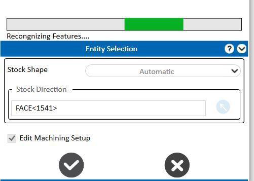
</div>

<!--Page.76-->


<!--
"Picture"

Machining features will be classified into setup 1, setup 2, setup 3, etc. Click on each setup to 
view the feature details. Users can also view its associated feature parameters by clicking on an 
individual feature. 

3. Click on Simple Hole-1 to view its detailed parameters listed in the below section of the group 
box.  E.g., Hole type, hole diameter, hole depth. 
4. Pocket feature parameters are – Pocket type, bottom radius, side radius, depth, and draft 
angle. 

"Picture"               

-->

<div style="text-align: center;">
  
</div>

加工フィーチャーは **Setup 1、Setup 2、Setup 3** などの **加工セットアップ**に分類されます。
各セットアップをクリックすると、**フィーチャーの詳細情報**を確認できます。また、個々のフィーチャーをクリックすると、**関連するフィーチャーパラメータ**を表示できます。


3. **Simple Hole-1** をクリックすると、グループボックス下部に **詳細パラメータ**が表示されます。（例：**Hole Type（穴タイプ）**、**Hole Diameter（穴径）**、**Hole Depth（穴深さ）**）


4. **Pocket フィーチャー**のパラメータには、**Pocket Type（ポケットタイプ）**、**Bottom Radius（底面R）**、**Side Radius（側面R）**、**Depth（深さ）**、**Draft Angle（抜き勾配）**が含まれます。


<div style="text-align: center;">
  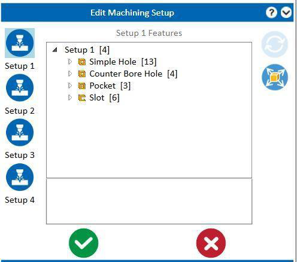
</div>


<!--Page.77-->
<!--
## Machining Direction – Prismatic Mill 

The Edit Setup icon will be available for features with multiple machining directions. This button 
will move the feature to the available setup.

1. Right-click on the feature to view the Edit Setup  
list of setups provided in the context menu.  

button. Click on the button to view a 
The below case shows a valid option to move the feature into Setup 3 or Setup 4. 

"Picture"

2. While changing the machining direction for a feature, DFMPro automatically creates a new 
setup for that direction if no setups are available. 
-->


## Machining Direction – Prismatic Mill

**複数の加工方向（Machining Direction）**を持つフィーチャーには、**Edit Setup アイコン**が表示されます。
このボタンを使用すると、フィーチャーを **利用可能な加工セットアップ**へ移動できます。


1. フィーチャーを **右クリック**すると、コンテキストメニューに **Edit Setup** ボタンが表示されます。このボタンをクリックすると、**利用可能なセットアップの一覧**が表示されます。

> 以下の例では、フィーチャーを **Setup 3** または **Setup 4** に移動できることを示しています。

<div style="text-align: center;">
  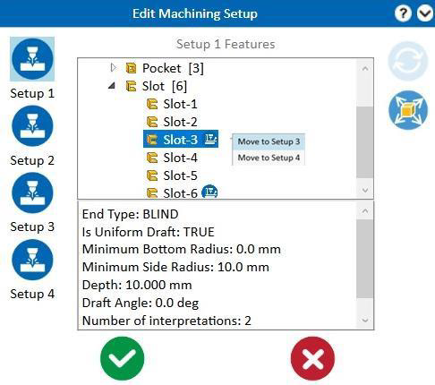
</div>


2. フィーチャーの **加工方向（Machining Direction）**を変更した際、その方向に対応するセットアップが存在しない場合、**DFMPro は自動的に新しいセットアップを作成**します。

          

<!--Page.78-->
<!--
"Picture"

3. Click the Reset  
button to restore all the shifted features to their original state. 

4. Click the Show all machining direction setups   button to view all setups and their 
machining directions.          
-->

<div style="text-align: center;">
  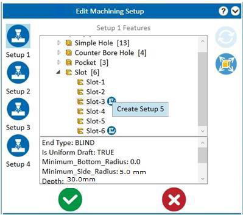
</div>

3. **Reset ボタン**をクリックすると、移動したすべてのフィーチャーを **元の状態（初期セットアップ）**に戻すことができます。

4. **Show all machining direction setups** ボタンをクリックすると、**すべての加工セットアップとその加工方向**を確認できます。


<!--Page.79-->

<!--
## DFMPro Parting Line 

Users can select a predefined parting line (close loop parting curve) available in the CAD model 
tree for Injection Molding, Casting, and Die Casting. Part pull direction and parting line will be 
used for mold wall classification. 

### Parting Line Selection 

1. Click on the Select parting line for secondary pulling direction button. 

"Picture"

2. Defined secondary pulling directions are available in the Part Pull Direction dropdown list. 
Users can select a parting line for each pulling direction. 

3. Click the  Select Entity button and select the required parting line from the CAD model 
tree.  
                    
-->

## DFMPro Parting Line（パーティングライン）

**Injection Molding（射出成形）**、**Casting（鋳造）**、**Die Casting（ダイカスト）**では、CAD モデルツリーに登録されている **定義済みのパーティングライン（閉じたループのパーティングカーブ）**を選択することができます。**パーツの引き抜き方向（Part Pull Direction）**と**パーティングライン**は、**金型壁の分類（Mold Wall Classification）**に使用されます。


### Parting Line の選択

1. **Select parting line for secondary pulling direction** ボタンをクリックします。

<div style="text-align: center;">
  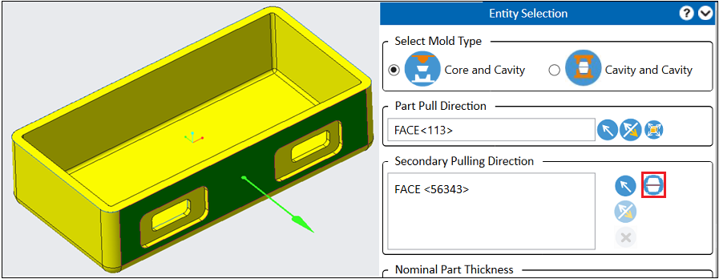
</div>

2. 定義された **Secondary Pulling Direction（副引き抜き方向）**は、**Part Pull Direction ドロップダウンリスト**に表示されます。ユーザーは **各引き抜き方向ごとにパーティングライン**を選択することができます。

3. **Select Entity ボタン**をクリックし、**CAD モデルツリー**から必要な **パーティングライン**を選択します。


<!--Page.80-->

<!--
"Picture"

4. Users can select one or multiple parting lines for one pulling direction using the  Select 
Entity button from the CAD Model tree. Click on the OK button after selection. 

"Picture"

Note:  

• The already selected parting line will not get selected for other pulling directions. 
DFMPro will pop-up an error message for the same. 
• Only closed parting line selection will be allowed. 
• If the selected parting line is open, DFMPro will show a pop-up error message. 
"Only closed-loop Parting Line curves are supported. Current selection contains some 
open-loop curves which are discarded." 


5. Based on part pulling direction and corresponding parting lines, DFMPro will classify the mold 
face classification. 

6. The selected part pull direction and corresponding parting lines' details will be saved in the 
DFMPro Results file (*.dfmr) and will automatically be available after importing the DFMPro 
results file. 

-->

<div style="text-align: center;">
  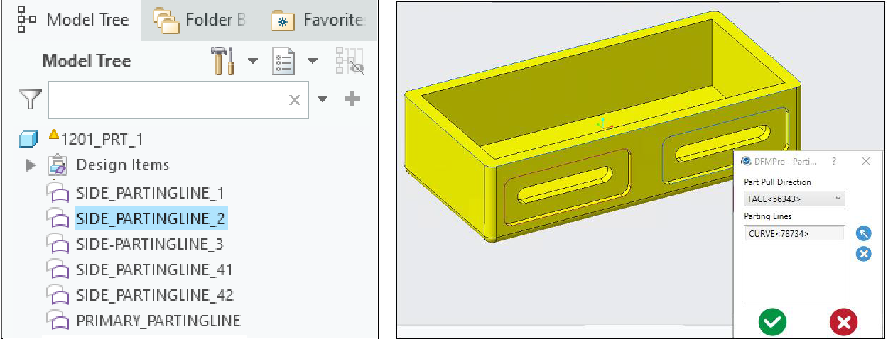
</div>

4. **Select Entity ボタン**を使用して、CAD モデルツリーから**1つの引き抜き方向に対して、1つまたは複数のパーティングライン**を選択できます。選択が完了したら **OK ボタン**をクリックします。

<div style="text-align: center;">
  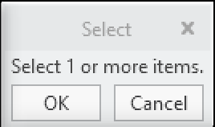
</div>

---

**注記：**

* すでに選択されているパーティングラインは、**他の引き抜き方向には選択できません。**その場合、DFMPro は **エラーメッセージ**を表示します。

* **閉じたパーティングライン（Closed Loop）**のみ選択可能です。

* 選択したパーティングラインが **開いた曲線（Open Loop）**の場合、DFMPro は次のエラーメッセージを表示します。

> **"Only closed-loop Parting Line curves are supported. Current selection contains some open-loop curves which are discarded."**

> （閉じたループのパーティングラインのみサポートされています。現在の選択には開いたループの曲線が含まれているため、それらは無視されます。）

---


5. **パーツの引き抜き方向**と **対応するパーティングライン**に基づいて、DFMPro は **金型面（Mold Face）の分類**を行います。

6. 選択した **引き抜き方向**と **対応するパーティングラインの情報**は、**DFMPro Results ファイル（*.dfmr）**に保存されます。そのため、DFMPro の結果ファイルを **再インポートした際にも自動的に適用**されます。

               

<!--Page.81-->

<div style="page-break-after: always;"></div>

<!--# DFMPro Results – DFX tab -->

<!--
# DFMPro の結果 – DFX タブ

After the execution of DFMPro, results will be displayed under the DFX group. This group is 
divided into three sections: 

• Instance Details: This shows the failure message and root node message. 
• Instances: This indicates the number of failure instance details.  
• Rules: Shows a specified number of failed rules. 

"Picture"                

-->

# DFMPro の結果 – DFX タブ

DFMPro の解析を実行すると、結果は **DFX グループ**に表示されます。このグループは、次の **3つのセクション**に分かれています。

* **Instance Details（インスタンス詳細）**：失敗メッセージおよびルートノードメッセージが表示されます。

* **Instances（インスタンス）**：失敗したインスタンスの数を表示します。

* **Rules（ルール）**：失敗したルールの数が表示されます。

<div style="text-align: center;">
  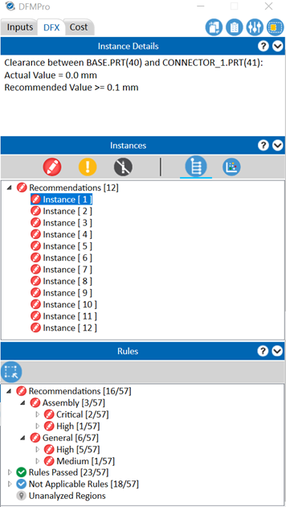
</div>


<!--Page.82-->
<!--
## Instances group box: 

This group box gives access to commands like Review Details, Ignore Instances, Ignore all similar 
Instances, Help, etc. To view these commands, click on the required Instance from the list. 

"Picture"

Instance group box 

Commands accessible on the Instances group box and their Hotkeys 

Zoom on Instance 
Zoom to Fit 
Crtl + Z 
Crtl + F 
Review Details 
Crtl + O 
Ignore Instance  
Crtl + I 
Ignore All Similar Instances 
Crtl + S 
Help 
Crtl + H 
Restore Instance 
Crtl + R 
Restore All Similar Instances 
Crtl + G          

-->


## Instances グループボックス

このグループボックスでは、**Review Details（詳細確認）**、**Ignore Instance（インスタンスを無視）**、**Ignore All Similar Instances（同様のインスタンスをすべて無視）**、**Help（ヘルプ）** のようなコマンドにアクセスできます。これらのコマンドを表示するには、リストから **対象の Instance** をクリックします。

<div style="text-align: center;">
  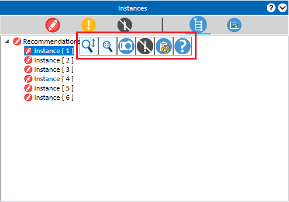
</div>


### Instances グループボックスで使用できるコマンドとショートカットキー

| コマンド                          | ショートカットキー |
| ----------------------------- | --------- |
| Zoom on Instance              | Ctrl + Z  |
| Zoom to Fit                   | Ctrl + F  |
| Review Details                | Ctrl + O  |
| Ignore Instance               | Ctrl + I  |
| Ignore All Similar Instances  | Ctrl + S  |
| Help                          | Ctrl + H  |
| Restore Instance              | Ctrl + R  |
| Restore All Similar Instances | Ctrl + G  |
| **推奨結果（Recommendation Results）を非表示にするために使用します。**| 無し  |
| **アラートインスタンス（Alert Instances）を非表示にするために使用します。**| 無し  |
| **無視されたインスタンス（Ignored Instances）を非表示にするために使用します。**| 無し  |
| **結果をツリービュー（Tree View）で表示するために使用します。**（Quick Visualization）| 無し  |
| **Scatter Plot（散布図）表示**（Quick Visualization）| 無し  |


<!--Page.83-->

<!--
It is used to hide recommendation 
results. -- 
It is used to hide alert instances. -- 
It is used to hide ignored instances. -- 
It is used to view results with Tree 
view (Quick Visualization) -- 
Scatter Plot  (Quick Visualization) 

### Zoom On Instance command

Zoom on command will be available only when the Zoom on Failed Instance Selection checkbox 
is selected in the DFMPro - Settings dialog box.  

1. On the DFMPro User Interface, click on  the Settings tab.  
2. In the DFMPro -Settings dialog box, select the Instance Highlights tab. 
3. Select Zoom on Failed Instance Selection checkbox. 
4. Click on the Apply button.                   
-->


## Zoom On Instance コマンド

**Zoom On Instance** コマンドは、**DFMPro – Settings ダイアログボックスで「Zoom on Failed Instance Selection」チェックボックスが有効になっている場合のみ使用可能**です。

### 設定手順

1. DFMPro ユーザーインターフェースで **Settings タブ**をクリックします。

2. **DFMPro – Settings ダイアログボックス**で **Instance Highlights タブ**を選択します。

3. **Zoom on Failed Instance Selection** チェックボックスを選択します。

4. **Apply ボタン**をクリックします。


<!--Page.84-->
<!--
# Review Details 

Review Details functionality in DFMPro allows a user to capture critical areas on parts in the form 
of images and automatically add them to the generated report. 

### Steps to capture images and review details: 

1. To review details of the desired instance, click on Instance and select the Review Details 
option.

The Review Details dialog box will be displayed. 

"Picture"

2. In the Review Details dialog box, click the  Capture Image icon to capture the image 
displayed in the graphics area. 

"Picture"
-->


## Review Details

DFMPro の **Review Details** 機能では、パーツの **重要な箇所（クリティカルエリア）**を **画像としてキャプチャ**し、生成される **レポートに自動的に追加**することができます。


### 画像をキャプチャして詳細を確認する手順：

1. 確認したい **Instance** をクリックし、**Review Details** オプションを選択します。

> すると、**Review Details ダイアログボックス**が表示されます。

<div style="text-align: center;">
  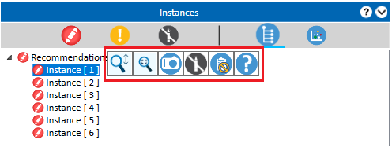
</div>

---

2. **Review Details ダイアログボックス**で**Capture Image アイコン**をクリックすると、グラフィックスエリアに表示されている画像を **キャプチャ**できます。

<div style="text-align: center;">
  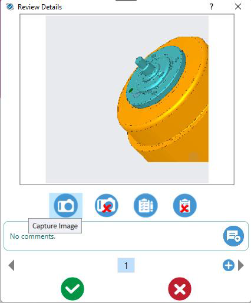
</div>


                

<!--Page.85-->
<!--
3. Users can zoom/pan/orient images as required in the graphics area and then recapture 
images using the  Capture Image icon. The previously captured image will be replaced 
by a newly oriented image. 

4. Use the Delete Instance Image icon to delete existing images and capture a new image. 

"Picture"

5. Users can configure predefined comments in a file. Click on  
View Comment displays the 
.dat file where users can add and save standard comments. Standard comments can be 
directly available if users try to type similar words in the comment section. 

"Picture"

"Picture"


6. Users can add/edit/delete a required message/comment in the Comments box. DFMPro also 
allows designers to reply to existing comments.  

-->

3. グラフィックスエリアで、必要に応じて **ズーム／パン／向きの変更**を行い、その後 **Capture Image アイコン**をクリックして画像を再キャプチャできます。この場合、**以前にキャプチャした画像は、新しい向きの画像に置き換えられます。**

4. **Delete Instance Image アイコン**を使用すると、既存の画像を削除して **新しい画像をキャプチャ**することができます。

<div style="text-align: center;">
  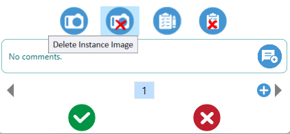
</div>


5. ユーザーは **事前定義コメント（Standard Comments）**をファイルに設定することができます。**View Comment** をクリックすると **.dat ファイル**が表示され、ユーザーはそこに **標準コメントを追加して保存**することができます。コメント入力欄で **似た単語を入力すると、標準コメントが候補として表示**されます。

<div style="text-align: center;">
  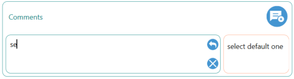
</div>

<div style="text-align: center;">
  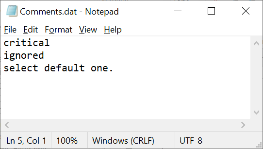
</div>


<!--Page.86-->

<!--
a. Clicking on  
Add Comment will display the box to add the comments.  

b. Add the comment and click on the  Send button.  


"Picture"

c. The added comment will be saved with the Designer's name and the time of the 
comments. 

"Picture"

d. DFMPro allows the designer to edit the comments they added. Click the  Edit button 
to activate the box to edit the existing comments. 

After editing, the time will update to the current date and time. 

"Picture"

e. Reviewers can also reply to the comments added by designers. 
DFMPro Results – DFX tab                       


-->

6. **Comments ボックス**では、必要な **メッセージ／コメントの追加・編集・削除**が可能です。また、DFMPro では **既存コメントへの返信**を行うこともできます。

> a. **Add Comment** をクリックすると、コメントを追加するための入力ボックスが表示されます。

> b. コメントを入力し、**Send ボタン**をクリックします。

<div style="text-align: center;">
  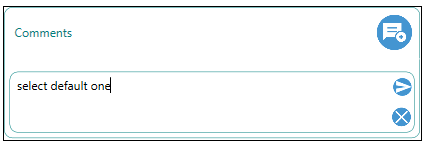
</div>

> c. 追加されたコメントは、**設計者の名前**と**コメントを投稿した日時**とともに保存されます。

<div style="text-align: center;">
  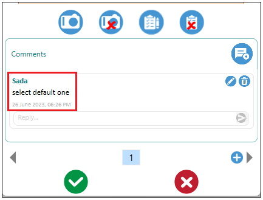
</div>

> d. DFMPro では、設計者が **自分で追加したコメントを編集**することもできます。**Edit ボタン**をクリックすると、既存コメントを編集するための入力ボックスが有効になります。

> 編集後は、**コメントの日時が現在の日時に更新**されます。

<div style="text-align: center;">
  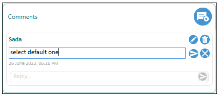
</div>

> e. **レビュー担当者（Reviewer）**も、設計者が追加したコメントに **返信**することができます。

<div style="text-align: center;">
  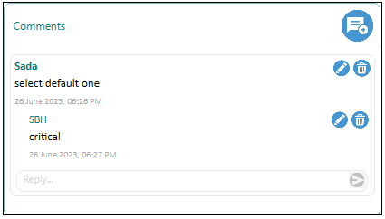
</div>

> f.コメントを入力したまま **Send（送信）せずに他の操作を行おうとした場合**、DFMPro は **コメントを投稿するように促すメッセージ**を表示します。

<div style="text-align: center;">
  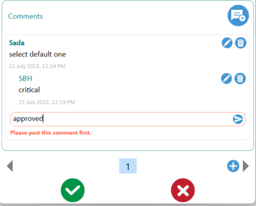
</div>


> g.必要に応じて **Delete アイコン**を使用すると、追加されたコメントを **削除**することができます。

<div style="text-align: center;">
  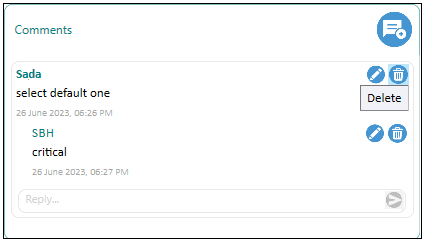
</div>


> h.**アイコン**をクリックすると、追加された **すべてのコメントを削除**することもできます。

> この場合、DFMPro は **確認のための警告メッセージ**を表示します。


<!--Page.87-->
<!--
"Picture"

f. 
If users add comments and miss sending them, DFMPro will prompt them to post the 
comment before doing other activities. 

"Picture"

g. If required, use the  Delete icon to delete added comments.  

"Picture"

h. Users can also delete all the added comments by clicking the  
icon. 

DFMPro will show a Warning message to confirm it. 
-->


              

<!--Page.88-->

<!--
7. To capture multiple images and add comments for the same failure instance, click the "+" 
button to add the next number tab. Then, capture multiple images and comments using the 
same steps for another failed instance.  

"Picture"

8. Right-click in the number tab, which is not required, and select the Delete option from the 
context menu to delete unwanted captured images and comments. 

"Picture"

9. If required to revisit a previously captured image for an earlier instance, click on the already 
selected rule instance. The captured/saved images will be displayed in the dialog box with 
added comments. 

10. Click the OK button to save captured images and close the Review Details dialog box. Icons 
will be displayed on the instances (see Instances 3 and 4 below) to highlight that images are 
captured for these instances. 

-->


7. 同じ **失敗インスタンス（Failure Instance）**に対して複数の画像をキャプチャしコメントを追加**する場合は、**「＋」ボタン**をクリックして次の番号タブを追加します。その後、別の失敗インスタンスに対しても同じ手順で**複数の画像とコメント**を追加できます。

<div style="text-align: center;">
  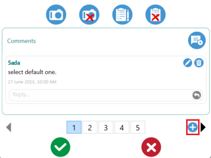
</div>


8. 不要な番号タブがある場合は、そのタブを **右クリック**し、コンテキストメニューから **Delete** を選択すると、不要な **キャプチャ画像およびコメント**を削除できます。

<div style="text-align: center;">
  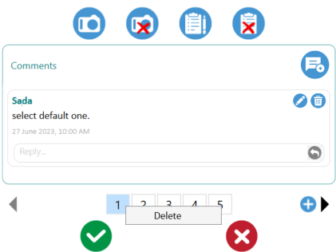
</div>


9. 以前にキャプチャした画像を再度確認したい場合は、対象の **ルールインスタンス**をクリックします。すると、保存された **画像と追加コメント**がダイアログボックスに表示されます。

10. **OK ボタン**をクリックすると、キャプチャした画像が保存され、**Review Details ダイアログボックス**が閉じます。画像を保存したインスタンスには **アイコン**が表示され、（下図の Instances 3 と 4 のように）**画像が登録されていること**が示されます。


<!--Page.89-->
<!--
"Picture"

11. For instance, the icon will disappear if the image, comment, or both are deleted. 

12. To close the Review Details dialog box, click on the OK or Close, or Cancel buttons during the 
validation.   

Click on the OK button to save the captured data. However, clicking the Close or Cancel 
button will show a WARNING message. 

"Picture"

### Steps to modify images in Review Details

Users can modify the capture images using Paint and any other similar application. 

1. Click on the  Capture Image icon to capture an image in the Review Details dialog box. 
Users will be able to view the confirmation message in the Status bar. 

"Picture"

2. Open the Paint or any other application. 
-->


<div style="text-align: center;">
  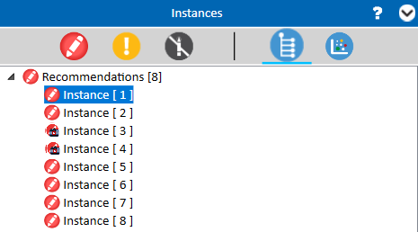
</div>

11. 保存されている **画像、コメント、またはその両方を削除した場合**、該当インスタンスに表示されている **アイコンは消えます。**

12. **Review Details ダイアログボックス**を閉じるには、**OK、Close、または Cancel** ボタンをクリックします。

> **OK ボタン** → キャプチャしたデータを **保存**します。**Close または Cancel ボタン** → **警告メッセージ**が表示されます。

<div style="text-align: center;">
  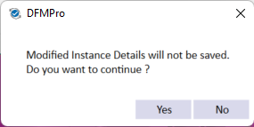
</div>


## Review Details で画像を編集する手順

ユーザーは、**Paint などの画像編集ソフト**を使用してキャプチャした画像を編集することができます。

1. **Review Details ダイアログボックス**で**Capture Image アイコン**をクリックして画像をキャプチャします。

> キャプチャが完了すると、**ステータスバーに確認メッセージ**が表示されます。

<div style="text-align: center;">
  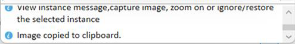
</div>

2. **Paint** またはその他の画像編集アプリケーションを開きます。


<!--90 -->
<!--
3. Paste the image with the Ctrl + V command and modify it as needed with different tools.  
4. Once the modification is done, copy (Ctrl + C) the image and paste (Ctrl + V) it again in the 
Review Details dialog box. 

Note: DFMPro only supports the .JPG and .PNG image formats. If try to add an image in a 
different format, DFMPro will display a warning message in the Status bar. 

"Picture"

5. After pasting, DFMPro will display a message stating to select the required command to 
overwrite or add the image. 

"Picture"

6. After selection, users will be able to view the confirmation message in the Status bar. 

"Picture"

## Scatter Plot Result View 

By using the scatter plot result view, users can quickly identify critical failure instances that 
deviate significantly from standard recommendations.  

In the image of maximum wall thickness, the top dots on the right-hand side show that wall 
thickness ranges from 10 mm to 12 mm. Users need to focus more on these results. Users can 
quickly check these instances by pressing the left mouse button and dragging a DFMPro pane 
around instances.                     
-->


3. **Ctrl + V** を使用して画像を貼り付け、必要に応じてさまざまなツールで編集します。

4. 編集が完了したら、画像を **コピー（Ctrl + C）**し、**Review Details ダイアログボックス**に **貼り付け（Ctrl + V）**ます。

> ---

> **注記：**：DFMPro がサポートしている画像形式は **.JPG** と **.PNG** のみです。

> それ以外の形式の画像を追加しようとすると、**ステータスバーに警告メッセージ**が表示されます。

<div style="text-align: center;">
  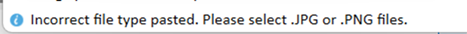
</div>

> ---


5. 画像を貼り付けると、**既存画像を上書きするか、新しい画像として追加するか**を選択するメッセージが表示されます。

<div style="text-align: center;">
  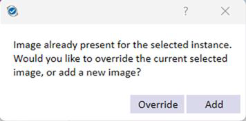
</div>


6. 選択後、**ステータスバーに確認メッセージ**が表示されます。

<div style="text-align: center;">
  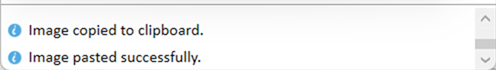
</div>


## Scatter Plot Result View

**Scatter Plot（散布図）表示**を使用すると、**標準推奨値から大きく逸脱している重要な不具合インスタンス**を素早く特定できます。

例えば、**最大壁厚（Maximum Wall Thickness）**のグラフでは、右側上部に表示されている点は **10 mm ～ 12 mm** の壁厚を示しています。
これらの結果は **特に注意して確認する必要があります。**
ユーザーは、**左マウスボタンを押したままドラッグしてDFMPro の表示範囲を囲むことで、対象インスタンスをすばやく確認**することができます。


<!--Page.91-->
                     

<!--Page.92-->

<!-- 
"Picture"

Scatter Plot view with Single Unit Instances 
 
Using a Scatter plot result view, users can quickly focus on critical failure instances far from 
standard recommendations.  

"Picture"
 
Scatter Plot view with Multiple Unit Instances 
 

## Failure Instance filter based on Parameter 

A Parameter dropdown will be available for those rules which are having parameters in the Rule 
Configuration dialog box. It is helpful to identify failed instances from the list to verify and correct 
results accordingly. 

### For Example: 

For Uniform Wall Thickness (Injection Molding module) based on the “Minimum Wall Thickness” 
and “Maximum Wall Thickness” parameters, the user can easily filter DFMPro instances and 
know the count. The user can select an option from the dropdown in the following example: 
Minimum and Maximum Wall Thickness. 

"Picture"

-->


<div style="text-align: center;">
  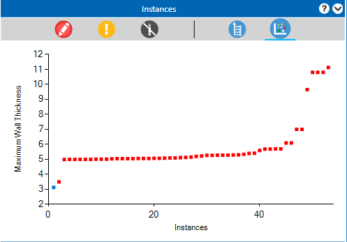
</div>


<p style="text-align:center; color:blue; font-weight:bold;">
  Scatter Plot 表示（単一単位インスタンス）
</p>

**Scatter Plot（散布図）表示**を使用すると、**標準推奨値から大きく逸脱している重要な不具合インスタンス**を迅速に特定することができます。


<div style="text-align: center;">
  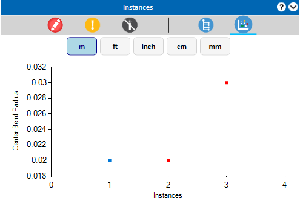
</div>


<p style="text-align:center; color:blue; font-weight:bold;">
  Scatter Plot 表示（複数単位インスタンス）
</p>


## パラメータに基づく Failure Instance フィルタ

**Rule Configuration ダイアログボックス**にパラメータが設定されているルールでは、**Parameter ドロップダウン**が利用できます。
この機能を使用すると、失敗インスタンスをリストから **フィルタリングして確認・修正**することが容易になります。

### 例：

**Uniform Wall Thickness（Injection Molding モジュール）**では、**Minimum Wall Thickness（最小壁厚）**、**Maximum Wall Thickness（最大壁厚）**のパラメータに基づいてインスタンスをフィルタリングできます。ユーザーはドロップダウンメニューから**Minimum Wall Thickness** または **Maximum Wall Thickness** を選択することで、該当する **DFMPro インスタンスを抽出し、その数を確認**することができます。

<div style="text-align: center;">
  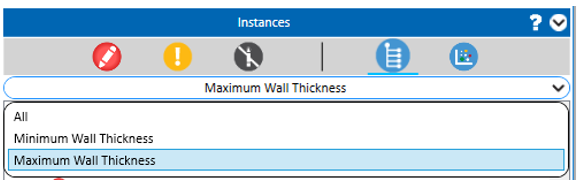
</div>


                 

<!--Page.93-->
<!--
## Rules group box 

The rules group box shows the exact number of failed rules.  

### Graphical Filter 

Graphical Filter command filters the number of failed rules in the Rules group box. The 
failed results will get filtered based on options selected in the Graphical Filter dialog box. The 
purpose of this is: 

• Easy to focus on a selected region of the 3D model and view relevant observations 
• A quick check of critical design features. 
• Quick critical area validation. 
• Quickly validation of the Assembly section. 

"Picture"

Note: For Interference Detection related failures, the Part Selection filter method is 
recommended. 

There are different filter methods: 
• Region-Based Filter 
• Face/Edge Entity Selection 
• Feature Selection 
• Part/Assembly Selection       
-->


## Rules グループボックス

**Rules グループボックス**では、**失敗したルール（Failed Rules）の数**が表示されます。

### Graphical Filter（グラフィカルフィルタ）

**Graphical Filter コマンド**を使用すると、**Rules グループボックスに表示される失敗ルールの数をフィルタリング**できます。
Graphical Filter ダイアログボックスで選択したオプションに基づいて、失敗結果が絞り込まれます。
この機能の目的は次のとおりです。

> * **3Dモデルの特定領域に焦点を当て、関連する指摘事項を確認する**

> * **重要な設計フィーチャーを素早くチェックする**

> * **重要領域の迅速な検証**

> * **アセンブリ部分の迅速な検証**

<div style="text-align: center;">
  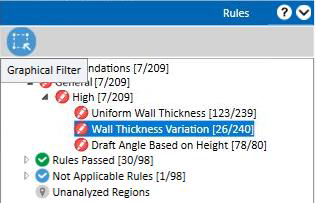
</div>

---

**注記：**：**干渉検出（Interference Detection）に関連する失敗**の場合は、**Part Selection フィルタ方法**を使用することが推奨されます。

---

## 利用可能なフィルタ方法

* **Region-Based Filter（領域ベースフィルタ）**

* **Face / Edge Entity Selection（面／エッジ選択）**

* **Feature Selection（フィーチャー選択）**

* **Part / Assembly Selection（パーツ／アセンブリ選択）**


<!--Page.94-->
<!--
### Region Base Filter  

Create a window with a mouse (as shown in the below image) and select multiple desired 
features from the graphics area. The window features will be displayed in the DFMPro – Graphical 
Filter dialog box. 

Based on window selection from the graphics area, corresponding results will display the list of 
the failed rules. 

Note: A maximum of 14,000 entities can be selected per selection. 


### Face/Edge Entity Selection   

1. For the  Face/Edge Entity Selection option, select multiple faces or edges from the 
graphical area using the Ctrl button. 
2. Click on the middle button of a mouse to finalize a selection.  
3. Click on the OK button after selection. 

"Picture"
-->

## Region Base Filter（領域ベースフィルタ）

マウスを使用して **ウィンドウ選択**（下図参照）を行い、グラフィックスエリアから **複数のフィーチャー**を選択します。
ウィンドウで選択されたフィーチャーは、**DFMPro – Graphical Filter ダイアログボックス**に表示されます。

グラフィックスエリアでのウィンドウ選択に基づき、**対応する失敗ルールの結果一覧**が表示されます。


<div style="text-align: center;">
  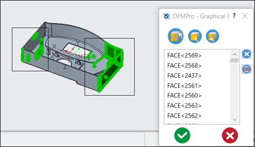
</div>


---

**注記：**：1回の選択で **最大 14,000 個のエンティティ**まで選択できます。

---

### Face / Edge Entity Selection（面／エッジ選択）

1. **Face / Edge Entity Selection** オプションでは、**Ctrl キー**を押しながらグラフィックスエリアで**複数の面またはエッジ**を選択します。

2. **マウスの中ボタン**をクリックして選択を確定します。

3. 選択後、**OK ボタン**をクリックします。

<div style="text-align: center;">
  
</div>


<!--Page.95-->
<!--
4. The selected faces or edges will be populated in the selection box.  
5. Based on the selections, corresponding results will display the list of the failed rules. 

"Picture"

### Feature Selection  
1. For the  Feature Selection option, select multiple features from the Model tree using the 
Ctrl button. 
2. Click on the middle button of a mouse to finalize a selection.  
3. Click on the OK button after selection. 

"Picture"

4. The selected features will be populated in the selection box.  
5. Based on the selections, corresponding results will display the list of the failed rules.          
-->

4. 選択した **面またはエッジ**は、**選択ボックス（Selection Box）**に表示されます。

5. 選択内容に基づき、対応する **失敗ルール（Failed Rules）**の一覧が表示されます。

<div style="text-align: center;">
  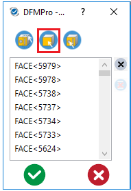
</div>


### Feature Selection（フィーチャー選択）

1. **Feature Selection** オプションでは、**Ctrl キー**を押しながら **Model Tree** から複数のフィーチャーを選択します。

2. **マウスの中ボタン**をクリックして選択を確定します。

3. 選択後、**OK ボタン**をクリックします。

<div style="text-align: center;">
  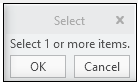
</div>


4. 選択した **フィーチャー**は、**選択ボックス（Selection Box）**に表示されます。

5. 選択内容に基づき、対応する **失敗ルールの結果一覧**が表示されます。


<!--Page.96-->
<!--
"Picture"

Note:  Users can even add edges and faces, and feature trees while filtering out a list of 
failure results.  

"Picture"

### Part/Assembly Selection  

1. For the  Part/Assembly Selection option, select the required parts or assembly from the 
Model tree or graphical area using the Ctrl button. 
2. Click on the middle button of a mouse to finalize a selection.  
-->

<div style="text-align: center;">
  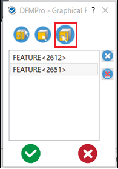
</div>

---

**注記：**失敗結果のリストをフィルタリングしている際でも、ユーザーは **エッジ、面、またはフィーチャーツリー**を追加選択することができます。

---

<div style="text-align: center;">
  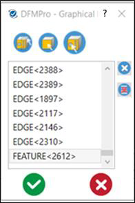
</div>


## Part / Assembly Selection（パーツ／アセンブリ選択）

1. **Part / Assembly Selection** オプションでは、**Ctrl キー**を押しながら **Model Tree** または **グラフィックスエリア**から必要な **パーツまたはアセンブリ**を選択します。

2. **マウスの中ボタン**をクリックして選択を確定します。


<!--Page.97-->

<!--
3. Click on the OK button after selection. 

"Picture"

4. The selected parts or assembly will be populated in the selection box.  
5. Based on the selections, corresponding results will display the list of the failed rules. 

"Picture"

### Commands available in the Graphical Filter dialog box 

It lists the results on the right side of the rule for failed 
pane. 
It is used to close the dialog box. 
It is used to remove/delete a selected entity. 
It is used to clear all selected entities. 
DFMPro Results – DFX tab              

-->

3. 選択後、**OK ボタン**をクリックします。

<div style="text-align: center;">
  
</div>


4. 選択した **パーツまたはアセンブリ**は、**選択ボックス（Selection Box）**に表示されます。

5. 選択内容に基づき、対応する **失敗ルール（Failed Rules）の結果一覧**が表示されます。

<div style="text-align: center;">
  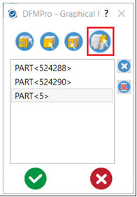
</div>


## Graphical Filter ダイアログボックスで使用できるコマンド

* **失敗したルールの結果を、ルールペインの右側に一覧表示します。**

* **ダイアログボックスを閉じるために使用します。**

* **選択されたエンティティを削除するために使用します。**

* **選択されたすべてのエンティティをクリアするために使用します。**

（DFMPro Results – DFX タブ）


<!--Page.98-->
<!--
## Group rules as per Components or Label 

Group by Components: This option displays the results based on the Component's name. 

Group by Label: This option is used to view the results based on Labels. Added labels will be 
available in the generated DFMPro reports. 

"Picture"　"Picture"

"Picture"
-->


## コンポーネントまたはラベルによるルールのグループ化

### Group by Components（コンポーネント別グループ化）：このオプションを選択すると、**コンポーネント名（Component Name）に基づいて結果が表示**されます。


### Group by Label（ラベル別グループ化）：このオプションを使用すると、**ラベル（Label）に基づいて結果を表示**することができます。追加した **ラベルは、生成される DFMPro レポートにも表示**されます。

<div style="text-align: center;">
  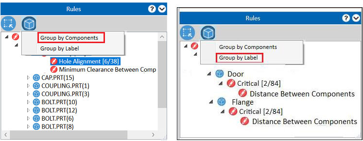
</div>

<div style="text-align: center;">
  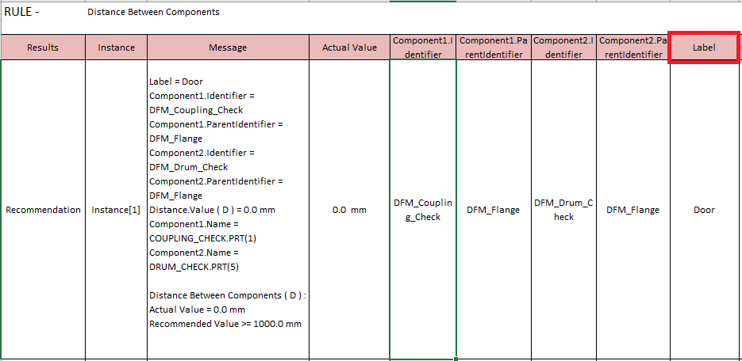
</div>


<!--Page.99-->
<!--
Note:  
• Group by Components command will be only available for Assembly, Welding, Sheet 
Metal, and Tubing rules. 
• Group by Label command will be only available for Assembly (E.g., Distance Between 
Components) rules. 

"Picture"
-->

---

**注記：**

* **Group by Components（コンポーネント別グループ化）**コマンドは、**Assembly、Welding、Sheet Metal、Tubing** のルールでのみ使用できます。

* **Group by Label（ラベル別グループ化）**コマンドは、**Assembly ルール（例：Distance Between Components）**でのみ使用できます。

---

<div style="text-align: center;">
  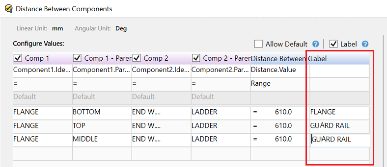
</div>


<!--Page.100-->

<div style="page-break-after: always;"></div>

<!--# Cost Result – Cost tab -->

<!--
# コスト結果 – Cost タブ

After the execution of DFMPro, a cost analysis will be displayed under the Cost group. This group 
is divided into two sections: Cost Overview and Cost View. 
Cost Overview and View options are different for Part and Assembly. 

Note:  
• Microsoft Excel is needed for the Cost Add-on. 
• DFMPro Cost users must have db_reader, db_writer, and Execute permissions.  

## Part - Cost Overview 

Cost Overview displays overview values for Raw Material Shape, Raw Material Cost, Process Cost, 
and Total Cost. Click on the  Save button to store cost results in the database. 

"Picture"

## Part - Cost View 

It is to view cost results in different formats and switch between View formats in the View group 
box. By default, the High Cost Feature view format will be displayed. 

There are four types of View formats:  

o High Cost Feature 
o Feature Graph  
o Operation Details 
o Contribution Chart           

-->

# コスト結果 – Cost タブ

DFMPro の解析実行後、**Cost グループ**に **コスト解析結果**が表示されます。
このグループは、**Cost Overview**、**Cost View**の **2つのセクション**に分かれています。

なお、**Part（部品）と Assembly（アセンブリ）では表示内容が異なります。**

---

**注記：**

* **Cost Add-on を使用するには Microsoft Excel が必要です。**

* **DFMPro Cost ユーザーには`db_reader`、`db_writer`、 `Execute`の権限が必要です。**

---

## Part – Cost Overview

**Cost Overview** では、コストの概要値（**Raw Material Shape（原材料形状）** **Raw Material Cost（原材料コスト）** **Process Cost（加工コスト）** **Total Cost（合計コスト）**）が表示されます。**Save ボタン**をクリックすると、コスト結果を **データベースに保存**できます。

<div style="text-align: center;">
  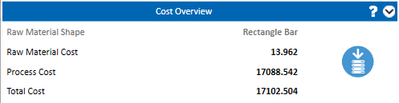
</div>


## Part – Cost View

**Cost View** では、コスト結果を **さまざまな形式で表示**できます。
表示形式は **View グループボックス**で切り替えることができます。
デフォルトでは **High Cost Feature 表示**が選択されています。


## ４種類の表示形式

* **High Cost Feature**

* **Feature Graph**

* **Operation Details**

* **Contribution Chart**


<!--Page.101-->
<!--
### High Cost Feature View format

High Cost Feature view format displays feature vise cost results.   

"Picture"

Click on any Feature from a list where a Potential Cost Saving comparison is available to view 
details on cost comparison and potential savings. 

"Picture"

The Potential Cost Saving view is only applicable to the following Rules: 
-->


### High Cost Feature 表示形式

**High Cost Feature 表示形式**では、**フィーチャーごとのコスト結果**が表示されます。

<div style="text-align: center;">
  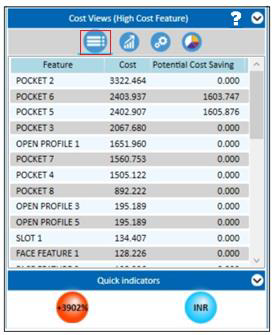
</div>

一覧から **Potential Cost Saving（コスト削減の可能性）**の比較が表示されている任意のフィーチャーをクリックすると、**コスト比較の詳細および潜在的なコスト削減額**を確認できます。

<div style="text-align: center;">
  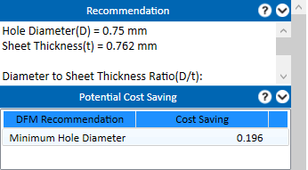
</div>


**Potential Cost Saving 表示**は、以下のルールに対してのみ適用されます。

### Milling（フライス加工）

* **Deep Radiused Corners**

* **Fillet On Top Edges**

* **Sharp Internal Corners（鋭い内コーナー）**

* **Recommended Tolerance for Holes（穴の推奨公差）**


<!--

### High Cost Feature View format

High Cost Feature view format displays feature vise cost results.   

"Picture"

Click on any Feature from a list where a Potential Cost Saving comparison is available to view 
details on cost comparison and potential savings. 

"Picture"

The Potential Cost Saving view is only applicable to the following Rules: 

### Milling 

• Deep Radiused Corners 
• Fillet On Top Edges 

-->


<!--Page.102-->

<!--
• Sharp Internal Corners 
• Recommended Tolerance for Holes 

### Sheet Metal 
• Minimum Hole Diameters 

### Feature Graph View format 

Feature Graph view format displays graphs of features in descending order of cost result.   

"Picture"

### Operation Details View format 

The Operation Details view format displays the number of operations required for part 
manufacturing and an approximate cost estimate in each phase. 
-->


### Sheet Metal（板金）

* **Minimum Hole Diameters（最小穴径）**


### Feature Graph 表示形式

**Feature Graph 表示形式**では、**コスト結果の高い順（降順）にフィーチャーのグラフ**が表示されます。

<div style="text-align: center;">
  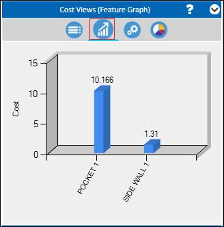
</div>


### Operation Details 表示形式

**Operation Details 表示形式**では、**部品製造に必要な加工工程の数**と、**各工程における概算コスト**が表示されます。


<!--Page.103-->
<!--
"Picture"

Add/delete any operation as per requirement. Right-click on the operation and select the Add 
operation or Delete command from the dropdown menu. 

"Picture"

When Operation is expanded by clicking on  sign, other details related to the operation will be 
displayed. Add/edit details for any operation as per requirement.  
-->

<div style="text-align: center;">
  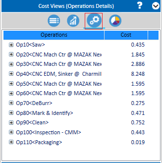
</div>

必要に応じて、**加工工程（Operation）を追加または削除**できます。
操作を追加・削除するには、対象の **Operation を右クリック**し、ドロップダウンメニューから **Add Operation（操作を追加）** または **Delete（削除）** を選択します。

<div style="text-align: center;">
  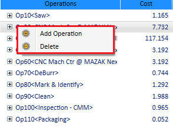
</div>


Operation の左側にある **「＋」アイコン**をクリックして展開すると、その **加工工程に関連する詳細情報**が表示されます。
必要に応じて、各工程の **詳細情報を追加または編集**することができます。


<!--Page.104-->

<!--
"Picture"

"Picture"

### Contribution Chart View format 

The Contribution Chart view format displays the Raw material Versus Process cost result. 

"Picture"

-->

<div style="text-align: center;">
  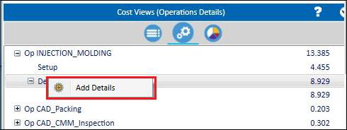
</div>

<div style="text-align: center;">
  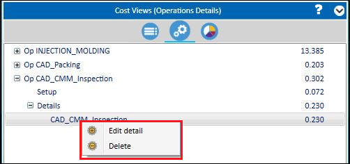
</div>

### Contribution Chart 表示形式

**Contribution Chart 表示形式**では、**原材料コスト（Raw Material）と加工コスト（Process Cost）**の比較結果が表示されます。

<div style="text-align: center;">
  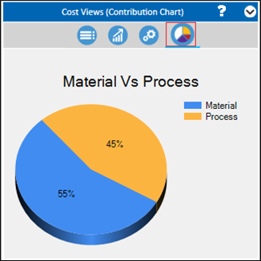
</div>


<!--Page.105-->

<!--
## Part - Cost Indicator 

"Picture"

There are three types of Cost indicators:  

"Picture"

### Target Cost Indicator 

: This symbol is used to check the actual deviation of cost against the target cost. Through 
the Cost Administration Vault (CAV) application, set the Target cost. Based on that, the 
percentage deviation is calculated. If the calculated cost is higher than the Target cost, the 
indicator will turn Red. If the calculated cost is lower, then the indicator will turn Green. 
Cost Result – Cost tab                       

-->

## Part – Cost Indicator（コスト指標）

<div style="text-align: center;">
  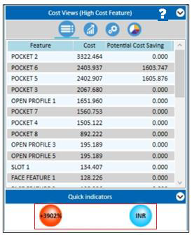
</div>

コスト指標には **3種類**あります。

<div style="text-align: center;">
  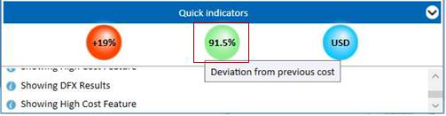
</div>


### Target Cost Indicator（ターゲットコスト指標）

このアイコンは、**実際のコストがターゲットコストからどの程度乖離しているか**を確認するために使用します。
**Cost Administration Vault（CAV）アプリケーション**を使用して、**ターゲットコスト（Target Cost）**を設定します。
設定されたターゲットコストを基準として、**コストの乖離率（パーセンテージ）**が計算されます。

> * 計算されたコストが **ターゲットコストより高い場合**  → **インジケーターは赤色（Red）**になります。

> * 計算されたコストが **ターゲットコストより低い場合** → **インジケーターは緑色（Green）**になります。（Cost Result – Cost タブ）


<!--Page.106-->
<!--
### Cost Trend Indicator  

: This symbol checks deviation from cost analysis with the previous set of inputs. If the 
newly calculated cost is less than the previous, it will be shown in green.  

### Currency 

: This symbol defines the currency type used to calculate the manufacturing cost. 

## Assembly - Cost Overview 

In the Cost Overview group box, the cost overview result of the Assembly rollup process will be 
displayed. It consists of Part Cost, Assembly Cost, and Total Cost for a rollup. 

## Assembly - Cost Views 

Switch between views in the Cost Views group box. There are three types of view formats: 

• Component Cost View 
• Assembly Tree View  
• Contribution Chart View 

### Component Cost View format 

By default, the Component Cost View format will be displayed. 

-->


### Cost Trend Indicator（コストトレンド指標）

このアイコンは、**前回の入力条件によるコスト解析結果との差異**を確認するために使用されます。
新しく計算されたコストが **前回のコストより低い場合**、**緑色（Green）で表示**されます。

### Currency（通貨）

このアイコンは、**製造コスト計算に使用されている通貨の種類**を示します。

## Assembly – Cost Overview

**Cost Overview グループボックス**では、**アセンブリのロールアップ処理によるコスト概要結果**が表示されます。
表示される内容は次のとおりです。

> * **Part Cost（部品コスト）**
> * **Assembly Cost（組立コスト）**
> * **Total Cost（合計コスト）**


<div style="text-align: center;">
  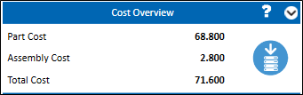
</div>


## Assembly – Cost Views

**Cost Views グループボックス**では、表示形式を切り替えることができます。

表示形式は **3種類**あります。

> * **Component Cost View**

> * **Assembly Tree View**

> * **Contribution Chart View**

### Component Cost View 表示形式

デフォルトでは、**Component Cost View 表示形式**が表示されます。


<!--Page.107-->
<!--
"Picture"

### Assembly Tree View format 

Click on Assembly Tree View format to display a separate dialog box. This dialog box will show a 
detailed tree view of the Assembly. Add/modify the cost of components through this GUI.  

Click the Store to Database button to save updated information to the Costing Database.  

The Refresh button will show the previous view and undo all updates. 

Note:  Part Cost for Make components can only be modified in the GUI.  
• Assembly Costs for any sub/main assembly can be modified at the root level. 
• Part Cost for Buy Components is not allowed to be modified through GUI. It can only 
be changed in the Database.  
-->


<div style="text-align: center;">
  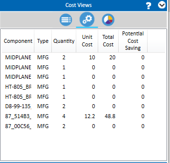
</div>

## Assembly Tree View 表示形式

**Assembly Tree View 表示形式**をクリックすると、**別のダイアログボックス**が表示されます。
このダイアログボックスでは、**アセンブリ構造の詳細なツリー表示**を確認することができます。
この GUI を使用して、**コンポーネントのコストを追加または変更**することが可能です。

**Store to Database ボタン**をクリックすると、更新された情報を **Costing Database（コストデータベース）**に保存できます。

**Refresh ボタン**をクリックすると、**以前の表示状態に戻り、行ったすべての更新が取り消されます。**

---

**注記：**

* **Make コンポーネント（自社製造部品）の Part Cost** は、**GUI からのみ変更可能**です。

* **サブアセンブリまたはメインアセンブリの Assembly Cost** は、**ルートレベルで変更**できます。

* **Buy コンポーネント（購入部品）の Part Cost** は、**GUI から変更できません。**変更する場合は **データベース上でのみ編集可能**です。

---


<!--Page.108-->

<!--
"Picture"

### Contribution Chart view format 

Click on the Contribution Chart view format to see the cost contribution of each component 
Versus the Assembling Cost for Assembly. 

"Picture"

-->

<div style="text-align: center;">
  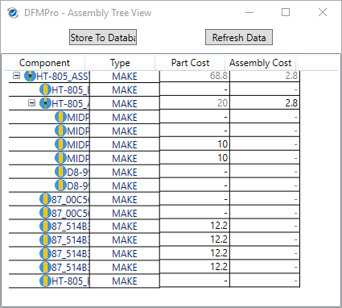
</div>

### Contribution Chart 表示形式

**Contribution Chart 表示形式**をクリックすると、**各コンポーネントのコスト寄与**と、**アセンブリの組立コスト（Assembly Cost）**との比較を確認できます。

<div style="text-align: center;">
  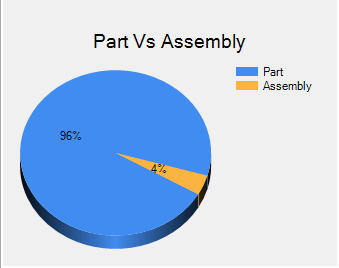
</div>


<!--Page.109-->

<div style="page-break-after: always;"></div>

<!--# DFX Server Solution -->

<!--
# DFX サーバーソリューション

When Assembly is selected as Manufacturing Process and the Allow server analysis option is 
enabled in the DFMPro Settings dialog box, DFMPro will display Server and Local options for 
Analysis Run Type. 

Note:  
• DFX Server prerequisites:  
o Installation of DFMPro for Creo Parametric 
o DFX Server setup 
o DFMPro for Creo Parametric license with batch capabilities 
• Server execution is supported only for the analysis of DFMPro rules. Cost estimation is 
currently not supported on the DFX Server. 
• DFX Server Solution is currently supported for the following modules: 
o Assembly  
o Tubing (for Assembly files only) 
o Cabling 
o Welding 

DFMPro shows a popup as a recommendation to notify which is the better option to select from 
either Server or Local. Users can select the Server/Local option depending on the complexity 
level. The analysis will be performed on a Local or Server machine based on the selection.  

After executing the analysis on the Server, all submitted request statuses will be displayed under 
the Analysis Request Status of the DFX Server tab.  

-->


# DFX サーバーソリューション

製造プロセスとして **Assembly** が選択され、**DFMPro Settings ダイアログボックスで「Allow server analysis」オプションが有効**になっている場合、DFMPro は **Analysis Run Type（解析実行方法）**として **Server** と **Local** の選択肢を表示します。

---

### 注記

* DFX Server の前提条件

> * **DFMPro for Creo Parametric のインストール**

> * **DFX Server のセットアップ**

> * **バッチ実行機能を含む DFMPro for Creo Parametric ライセンス**


### 制限事項：**サーバー実行は DFMPro ルールの解析のみ対応しています。**、**コスト見積り（Cost estimation）は現在 DFX Server ではサポートされていません。**


### 現在サポートされているモジュール：DFX Server Solution は、以下のモジュールでサポートされています。

* **Assembly**

* **Tubing（Assembly ファイルのみ）**

* **Cabling**

* **Welding**

---


DFMPro は、**Server または Local のどちらを選択するのが適切か**を推奨するポップアップメッセージを表示します。
ユーザーは **モデルの複雑さに応じて Server または Local を選択**できます。
選択に応じて、解析は **ローカルマシンまたはサーバーマシン**で実行されます。


サーバーで解析を実行した後、送信されたすべての解析リクエストのステータスは、**DFX Server タブの「Analysis Request Status」**に表示されます。


<!--Page.110-->

<!--
"Picture"

## Analysis Request Status group box 

This group box allows users to view the status of all submitted requests submitted by them for 
execution on the Server. The following details are available: 
-->

<div style="text-align: center;">
  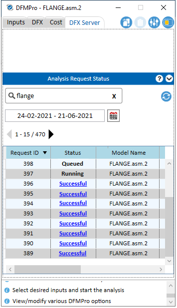
</div>

## Analysis Request Status グループボックス

このグループボックスでは、**ユーザーがサーバー実行のために送信したすべての解析リクエストのステータス**を確認することができます。
表示される主な情報は次のとおりです。


<!--Page.111-->

<!--
"Picture"

• Request ID: Specific number for submitted request for analysis. 
• Status: This column shows one of the following statuses for each executed analysis: 
o Queued: The execution process is in Queue. 
o Running: A server has been assigned, and execution is in progress. 
o Paused: The execution is paused. 
o Successful: Execution is completed. 
o Stopped: The execution process is stopped. 
o Failed: Execution was not complete due to some error on the Server. 
o Cancelled: Execution has been cancelled as per user or admin request. The status will 
change and reflect respectively (e.g., Cancelled (Admin) and Cancelled (User))  
o Restarted: The stopped execution process is restarted.  
• Model Name: Name the assembly for which the analysis request is submitted. 
• Rule File Name: Name of Rule file used for analysis. 
• Request Date: The date the request is submitted for execution and pushed on the Server. 
• Request Time: The time on which the request is submitted. 
-->


<div style="text-align: center;">
  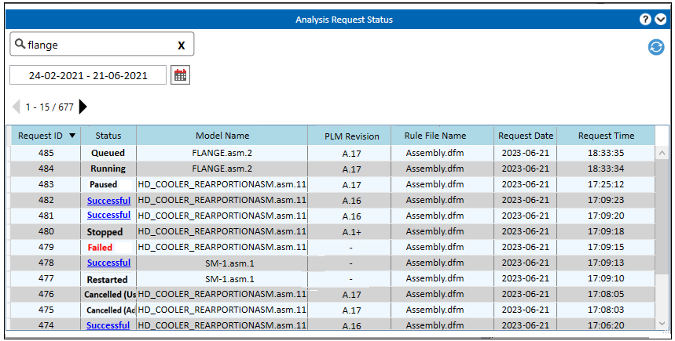
</div>

* **Request ID**：解析のために送信された **リクエストに割り当てられる固有番号**です。

* **Status（ステータス）**：各解析の実行状態が表示されます。表示されるステータスには次の種類があります。

> * **Queued**：実行処理がキュー（待機状態）にあります。

> * **Running**：サーバーが割り当てられ、解析が実行中です。

> * **Paused**：解析処理が一時停止されています。

> * **Successful**：解析が正常に完了しました。

> * **Stopped**：解析処理が停止されています。

> * **Failed**：サーバー上のエラーにより解析が完了しませんでした。

> * **Cancelled**：ユーザーまたは管理者の操作により解析がキャンセルされました。ステータスには **Cancelled (Admin)** または **Cancelled (User)** のように表示されます。

> * **Restarted**：停止していた解析処理が再開されました。

* **Model Name**：解析リクエストが送信された **アセンブリモデルの名称**です。

* **Rule File Name**：解析で使用された **ルールファイル名**です。

* **Request Date**：解析リクエストが送信され、サーバーへ登録された **日付**です。

* **Request Time**：解析リクエストが送信された **時刻**です。


               

<!--Page.112-->
<!--
### Notification Mail 

Users will receive notification mail with the status of the analysis execution. Only the admin can 
configure the requests for notification mail through the DFX Server Admin dashboard. 

### Cancel Analysis Request 

When the analysis request is in Queued or Running status, users can cancel the analysis request. 
Right-click on Queued/Running status and select the Cancel option from the context menu to 
cancel the analysis request. After cancellation, the status will be converted to Cancelled, and the 
same status will be reflected in the DFX Server Admin dashboard.  

### Date Range 

Set the date range from the Calendar to view the analysis status of the respective submitted 
request. 

"Picture"

### Search bar 

Specify any input like Model Name, Request ID, or Rule File Name to view the respective analysis 
results. 

"Picture"

Update Status button   

Use the Update Status button to update the analysis status of all submitted analysis requests. 

### Import Result 

Results can be imported from the DFX Server tab of the server's submitted requests. On clicking 
on the Successful status of a particular request, the dfmr will get imported for that specific run.

Users can cancel the import process if required. 

Note: The same assembly used to generate the results must be open for a successful import. 
-->


## Notification Mail（通知メール）

ユーザーは、**解析実行のステータスに関する通知メール**を受け取ることができます。
通知メールの設定は、**DFX Server Admin ダッシュボード**から**管理者のみが設定可能**です。


## Cancel Analysis Request（解析リクエストのキャンセル）

解析リクエストのステータスが **Queued（待機中）** または **Running（実行中）** の場合、ユーザーは解析リクエストを **キャンセル**することができます。

手順：

1. **Queued または Running のステータスを右クリック**します。

2. コンテキストメニューから **Cancel** を選択します。

キャンセル後、ステータスは **Cancelled** に変更され、同じステータスが **DFX Server Admin ダッシュボード**にも反映されます。


## Date Range（期間指定）

カレンダーから **日付範囲**を設定することで、その期間内に送信された **解析リクエストのステータス**を確認できます。

<div style="text-align: center;">
  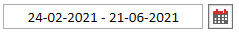
</div>


## Search bar（検索バー）

**Model Name、Request ID、Rule File Name** などのキーワードを入力すると、該当する **解析結果**を検索できます。

<div style="text-align: center;">
  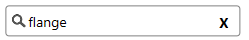
</div>


## Update Status ボタン

**Update Status ボタン**をクリックすると、送信されたすべての **解析リクエストのステータスを更新**できます。


## Import Result（結果のインポート）

解析結果は、**DFX Server タブのサーバー送信リクエスト一覧**からインポートすることができます。
特定のリクエストの **Successful ステータス**をクリックすると、その解析結果の **.dfmr ファイル**がインポートされます。

必要に応じて、ユーザーは **インポート処理をキャンセル**することも可能です。

---

**注記：**
結果を正常にインポートするには、**解析結果を生成したのと同じアセンブリモデルを開いている必要があります。**

---


<!--Page.113-->

<div style="page-break-after: always;"></div>

<!--# DFMPro and Cost Report  -->

<!--
# DFMPro とコストレポート


After the successful execution of DFMPro, generate a separate report for DFMPro and Cost. 

"Picture"

## DFMPro Report 

Clicking on the Report button in the DFMPro User Interface will display the DFMPro - Report 
Generate dialog box. Select the required report option to generate reports and results. The 
following are DFMPro report types: 

### Supported DFMPro Report Formats: 

• XML report (Viewing this report in web browsers is no longer supported. View using any 
XML file viewer or the PDF report, which has similar content as the XML report.) 
• Microsoft Excel-based report (requires Microsoft Excel installation) 
• PDF report (requires Adobe PDF Reader) 
• Advanced 3D report (view using an eDrawings Viewer) 

Note: DFMPro Excel Report will be generated even though Microsoft Excel has not been installed. 

### Supported Cost Report Format: 
• Microsoft Excel-based report (needs Microsoft Excel installation) 


Note: Microsoft Excel must be installed to generate the Cost report.  

-->


# DFMPro とコストレポート

DFMPro の解析が正常に完了すると、**DFMPro レポート**と **コストレポート**をそれぞれ **別々に生成**することができます。

<div style="text-align: center;">
  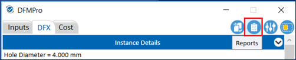
</div>


## DFMPro Report（DFMPro レポート）

DFMPro ユーザーインターフェースの **Report ボタン**をクリックすると、**DFMPro – Report Generate ダイアログボックス**が表示されます。
レポート生成に必要な **レポートオプション**を選択すると、解析結果のレポートを作成できます。


## 対応している DFMPro レポート形式

* **XML レポート**：（Webブラウザでの表示は現在サポートされていません。XMLビューア、または同様の内容を含む **PDFレポート**で閲覧してください。）

* **Microsoft Excel ベースのレポート**：（Microsoft Excel のインストールが必要）

* **PDF レポート**：（Adobe PDF Reader が必要）

* **Advanced 3D レポート**（**eDrawings Viewer** を使用して表示）

---

**注記：**： **Microsoft Excel がインストールされていない場合でも、DFMPro Excel レポートは生成されます。**

---


## 対応している Cost レポート形式

* **Microsoft Excel ベースのレポート**（Microsoft Excel のインストールが必要）

---

**注記：**：**Cost レポートを生成するには Microsoft Excel がインストールされている必要があります。**

---


               

<!--Page.114-->

<!--
"Picture"

## Sample Report Format 

DFMPro Excel Report 
-->


<div style="text-align: center;">
  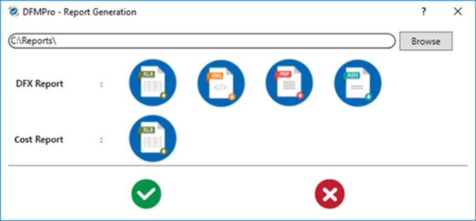
</div>

## サンプルレポート形式

### DFMPro Excel レポート

<div style="text-align: center;">
  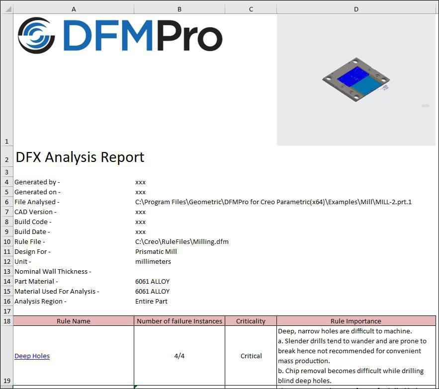
</div>

                

<!--Page.115-->

<!--
### Cost Excel Report 

"Picture"

### Part Cost Summary Report 

"Picture"
-->

### Cost Excel レポート

<div style="text-align: center;">
  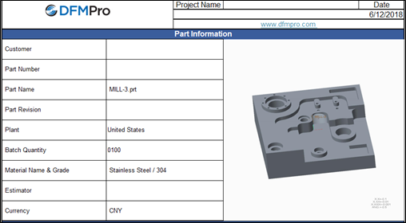
</div>


### Part Cost Summary レポート

<div style="text-align: center;">
  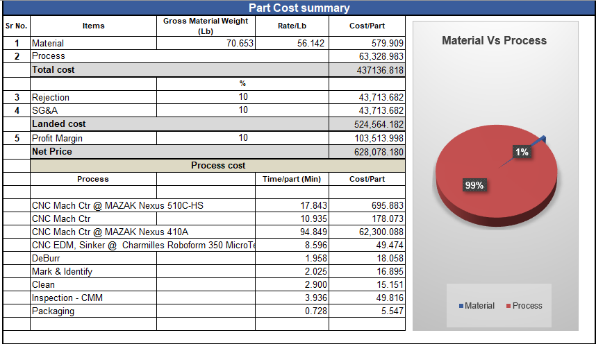
</div>


<!--Page.116-->

<!--
### Pareto Chart Report 

"Picture"

### Details Time and Cost Excel Report 

"Picture"                    

-->


### Pareto Chart レポート

<div style="text-align: center;">
  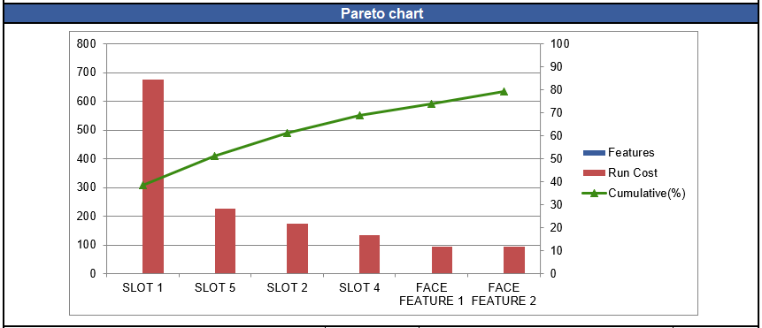
</div>


### Details Time and Cost Excel レポート

<div style="text-align: center;">
  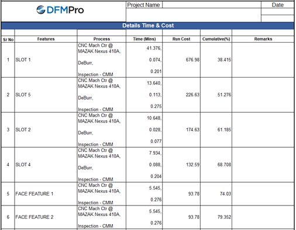
</div>


<!--Page.117-->

<div style="page-break-after: always;"></div>

<!--# Import/Export Command-->
<!--
# インポート／エクスポート コマンド

DFMPro allows the import/export of DFMPro results.  

Exporting results: Use the Export Results command  to save the current analysis result in a 
*.dfmr file format. Users can import this file into DFMPro to view the results. 

Importing results: Use the Import Result command  to load the *.dfmr file to view 
previously saved results. 

When users click the  Import/Export option on the DFMPro User Interface, the current 
analysis results will be imported or exported per the selected command. 

### There are three methods: 

"Picture"

• Import: Browse results to import. 
• Auto Import: The result automatically gets imported per details set in the DFMPro Setting 
dialog box (not required to browse the result file's location). 

Set the default folder directory in the DFMPro settings file to Auto Import result.  

• Export: Browse the location to export current analysis reports and save them in a .dfmr 
file format. This file can be imported into DFMPro for Creo Parametric to view results 
again. 
-->


# インポート／エクスポート コマンド

DFMPro では、**解析結果のインポートおよびエクスポート**を行うことができます。


### 結果のエクスポート：**Export Results コマンド**を使用すると、現在の解析結果を **.dfmr ファイル形式**で保存できます。保存したファイルは、後で **DFMPro にインポートして結果を確認**することができます。


### 結果のインポート：**Import Result コマンド**を使用すると、以前に保存した **.dfmr ファイル**を読み込み、解析結果を表示することができます。

ユーザーが **DFMPro ユーザーインターフェースの Import / Export オプション**をクリックすると、選択したコマンドに応じて **現在の解析結果をインポートまたはエクスポート**できます。


### 利用できる方法（3種類）

<div style="text-align: center;">
  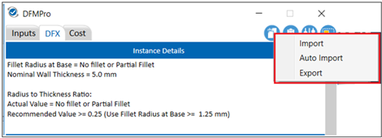
</div>

* Import（インポート）：インポートする **結果ファイルを参照して選択**します。

* Auto Import（自動インポート）：**DFMPro Settings ダイアログボックス**で設定された内容に基づき、結果が **自動的にインポート**されます。この場合、**結果ファイルの場所を手動で参照する必要はありません。**Auto Import を使用するには、**DFMPro Settings ファイルでデフォルトフォルダを設定**する必要があります。

* Export（エクスポート）：現在の解析結果を保存する **保存先フォルダを指定**します。結果は **.dfmr ファイル形式**で保存され、後で **DFMPro for Creo Parametric にインポートして再度結果を確認**することができます。


           

<!--Page.118-->
<!--
### Export Intermediate Inputs: 

In a complex part, DFMPro provides Intermediate inputs (Pulling direction and Mold 
classifications) and export functionality, where users can correct Mold classification and export 
it as a *.dfmr file. The modified classification can be used for the next run, where the provided 
part is not modified. 

### Follow the steps for the Intermediate input export functionality 

1. Open the Part and run Injection Molding. 
2. Provide part pulling directions and correct mold classification.  
3. Export the inputs as *.dfmr. 
4. Next time, open the part and configure the correct rule file. 
5. Import previously exported input results and then re-run the analysis. 


Note:  
• This Intermediate input results functionality is unavailable when DFMPro PLM integration 
is “ON” (the Export-Import DFMPro results in a PLM system checkbox is selected). 
• Before importing intermediate inputs (*.dfmr file), please ensure the configured rule file 
is the same one that is exported and saved. 
• The functions to Import, Export, and Save Reports are not integrated with the PLM system 
for Cost-Add-On. All report files must be handled manually between the local machine 
and the PLM system.         
-->


### Export Intermediate Inputs（中間入力のエクスポート）

複雑な部品の場合、DFMPro では **中間入力（Intermediate Inputs）**として、**プル方向（Pulling Direction）**や **金型分類（Mold Classification）**を扱う機能が提供されています。
ユーザーは **金型分類を修正した後、その結果を .dfmr ファイルとしてエクスポート**することができます。
この修正された分類は、**次回の解析実行時に再利用**することが可能です（対象の部品モデルが変更されていない場合）。


### Intermediate Input エクスポート機能の手順

1. 部品を開き、**Injection Molding（射出成形）解析**を実行します。

2. **部品の抜き方向（Part Pulling Direction）を指定し、金型分類を修正**します。

3. 入力情報を **.dfmr ファイルとしてエクスポート**します。

4. 次回、同じ部品を開き、**適切なルールファイルを設定**します。

5. 以前にエクスポートした **入力結果（.dfmr ファイル）をインポート**し、再度解析を実行します。

---

## 注記

* **DFMPro の PLM 連携が「ON」**（「Export-Import DFMPro results in a PLM system」チェックボックスが選択されている場合）、**Intermediate Input Results 機能は使用できません。**

* **中間入力（*.dfmr ファイル）をインポートする前に、設定されているルールファイルがエクスポート時と同じであることを確認してください。**

* **Cost Add-On に関しては、Import / Export / Report 保存機能は PLM システムと統合されていません。**
> すべてのレポートファイルは、**ローカルマシンと PLM システム間で手動で管理する必要があります。**

---

<!--Page.119-->

<div style="page-break-after: always;"></div>

<!--# DFMPro Settings  -->
<!--
# DFMPro 設定

Click on the Settings tab on the DFMPro User Interface will display the DFMPro – Settings dialog 
box. In this dialog box, a few settings are for users to modify as required; the remaining are for 
admin control only. Admin-controlled settings are always available in a disabled state, and users 
cannot change them.  

"Picture"

To access those settings, right-click on the DFXSettingApplication.exe file located at the 
installation location (as mentioned below) and select Run as Administrator from the context 
menu.  


E.g.: Drive C:\Program Files\Geometric\DFMPro for Creo Parametric(x64)\DFMPro 

"Picture"

The left side pane in the dialog box displays different sub-tabs under the main Settings tab. Click 
on any tab to display respective sub-tabs and set options to modify as required. The following 
tabs and sub-tabs are available under the main Settings tab: 
-->

# DFMPro 設定

DFMPro ユーザーインターフェースの **Settings タブ**をクリックすると、**DFMPro – Settings ダイアログボックス**が表示されます。
このダイアログボックスでは、**ユーザーが変更できる設定**と、**管理者のみが変更できる設定**があります。
管理者専用の設定は **常に無効（グレーアウト）状態で表示され、ユーザーは変更できません。**

<div style="text-align: center;">
  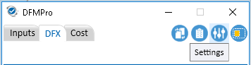
</div>

これらの管理者設定にアクセスするには、以下の場所にある **DFXSettingApplication.exe** ファイルを **右クリック**し、コンテキストメニューから **「Run as Administrator（管理者として実行）」**を選択します。

例：```C:\Program Files\Geometric\DFMPro for Creo Parametric (x64)\DFMPro```

<div style="text-align: center;">
  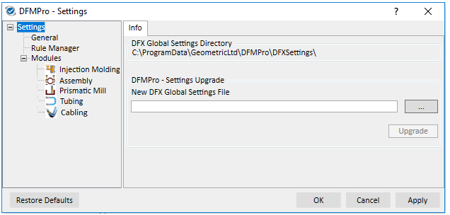
</div>

ダイアログボックスの **左側ペイン**には、**Settings タブの下にある各サブタブ**が表示されます。
任意のタブをクリックすると、対応するサブタブが表示され、必要に応じて設定を変更できます。
**Settings タブの下には、以下のタブおよびサブタブがあります。**


<!--Page.120-->
<!--
• General 
o Instance Highlight 
o Import/Export 
o Report 
o PLM Integration 
o Profile Execution 
o Analytics 
o Inputs 
o Others 
o DFX Server 
o Cost 
• Rule Manager 
• Modules 
o Injection Molding 
o Assembly 
o Prismatic Mill 
o Tubing 
o Cabling 

## Settings tab 

### Info 

Click the Settings tab to display the Info tab on the right-side pane. This section shows the default 
Directory location and allows to set the new location as per requirement. 

• Default location: DFX Global Settings file is available at the mentioned default location 
(DFXCreoSettings.xml).      
-->


### General（一般設定）

* **Instance Highlight**（インスタンス表示設定）

* **Import / Export**（インポート／エクスポート設定）

* **Report**（レポート設定）

* **PLM Integration**（PLM 連携）

* **Profile Execution**（プロファイル実行）

* **Analytics**（分析機能）

* **Inputs**（入力設定）

* **Others**（その他設定）

* **DFX Server**（DFX サーバー設定）

* **Cost**（コスト設定）


### Rule Manager（ルール管理）


### Modules（モジュール設定）

* **Injection Molding（射出成形）**

* **Assembly（アセンブリ）**

* **Prismatic Mill（プリズマティック加工）**

* **Tubing（チューブ設計）**

* **Cabling（ケーブル設計）**


## Settings タブ

### Info（情報）

**Settings タブ**をクリックすると、右側のペインに **Info タブ**が表示されます。
このセクションでは、**デフォルトのディレクトリ位置**が表示され、必要に応じて **新しい保存先に変更することが可能**です。

**Default location（デフォルト保存場所）**

DFX の **グローバル設定ファイル**は、次のデフォルト場所に保存されています。

```DFXCreoSettings.xml```


<!--Page.121-->
<!--
• DFMPro - Setting Upgrade: This setting allows upgrading the existing DFMPro Setting file to 
a new version of the Setting file. This setting is for the Administrator only. 

Click the Browse button to select the Settings file, and click on the Upgrade button. After 
upgrading, the following changes will take place: 

o Existing settings files will update with a new version and back up all previous Settings files. 
o Newly added settings will be added to the old existing settings file and made available to 
users. 
o Existing modified settings <user / global level> will remain. 
o Newly added settings will be available once the DFMPro add-in is launched.  
o After a successful upgrade, a log file will be generated at the settings Directory location 
to review the upgrade status quickly. 

## General tab 

Click on the General tab to display different tabs on the right-side pane. Each tab has its own 
settings sections. Click on the specific sub-tab and modify it as per requirement. 

### Instance Highlight                    
-->


## DFMPro – Setting Upgrade（設定アップグレード）

この設定では、**既存の DFMPro 設定ファイルを新しいバージョンの設定ファイルへアップグレード**することができます。

この機能は **管理者専用**です。

手順：

1. **Browse ボタン**をクリックして、設定ファイルを選択します。

2. **Upgrade ボタン**をクリックします。

アップグレード後、以下の変更が行われます。

> * 既存の設定ファイルは **新しいバージョンに更新され、以前の設定ファイルはバックアップ**されます。

> * **新しく追加された設定項目**が、既存の設定ファイルに追加され、ユーザーが利用できるようになります。

> * **既存のユーザー設定またはグローバル設定で変更されている内容**はそのまま維持されます。

> * 新しく追加された設定は、**DFMPro アドインを起動すると利用可能**になります。

> * アップグレードが成功すると、**設定ディレクトリにログファイルが生成され、アップグレード状況を確認**できます。


## General タブ

**General タブ**をクリックすると、右側ペインに **複数のサブタブ**が表示されます。

それぞれのタブには **独自の設定セクション**があります。

変更したい場合は、
該当する **サブタブをクリックして設定を変更**します。


### Instance Highlight（インスタンス表示設定）


<div style="text-align: center;">
  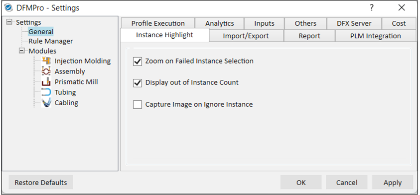
</div>

<!--Page.122-->

<!--
• Zoom on Failed Instance Selection: This setting is used to zoom in on failure instances. 
• Display out of Instance Count: This setting is used to hide/unhide counts of instances in the 
DFMPro result failure tree. 

E.g., If a checkbox is selected, it will show results as (2/10 or 10/10). If this checkbox is 
unchecked, it will show results as (2, 10). 

• Capture Image on Ignoring Instance: This setting launches the Review Details dialog box 
when users ignore the failure instances. 

### Import/Export 

• Default Folder Path for Export and Import Results: This setting sets the default folder path 
for the export and import of DFMPro results. 
• Add Folder/ Directories for Auto Import: This setting is used for the AutoImport feature. 

i. Set a local folder or network directory where the *.dfmr file is kept. 
ii. Click on the plus sign (+) and add several directories to import the *.dfmr file. 
iii. Select the directory and remove the same by clicking on the minus sign (-). 

-->


* **Zoom on Failed Instance Selection**：この設定を有効にすると、**失敗インスタンスを自動的にズーム表示**します。

* **Display out of Instance Count**：DFMPro の結果ツリーに表示される **インスタンス数の表示／非表示を切り替える設定**です。

> 例：チェックボックス **ON**：→ `(2/10)` または `(10/10)` のように表示されます。チェックボックス **OFF**：→ `(2, 10)` のように表示されます。

* **Capture Image on Ignoring Instance** ユーザーが **失敗インスタンスを Ignore（無視）したとき**に **Review Details ダイアログボックスを自動的に表示**します。


## Import / Export（インポート／エクスポート設定）


<div style="text-align: center;">
  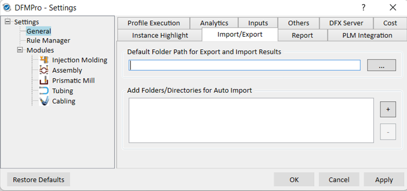
</div>

* **Default Folder Path for Export and Import Results** DFMPro の **解析結果のインポート／エクスポート時に使用するデフォルトフォルダ**を設定します。

* **Add Folder / Directories for Auto Import**：**Auto Import 機能で使用するフォルダを設定**します。

> 手順：

> 1. **.dfmr ファイルが保存されているローカルフォルダまたはネットワークディレクトリを指定**します。
> 2. **＋（プラス）ボタン**をクリックすると、複数のディレクトリを追加できます。
> 3. フォルダを選択して **－（マイナス）ボタン**をクリックすると、登録ディレクトリを削除できます。

                   

<!--Page.123-->
<!--
### Report 

• View Report on Save: Based on the selection, DFMPro reports will launch after generating a 
report. 

• Filter ignored instances: Based on the selection, DFMPro filters will ignore instances. 

• Maintain Instance Index Sequence in Report: This setting applies to eDrawings and Excel
based reports. After instances are ignored, sequences of instances will be maintained in the 
Report. 

For example, if a checkbox is selected, a sequence of failure instances in the eDrawings report 
is the same as the DFMPro result tree.       

-->

## Report（レポート設定）


<div style="text-align: center;">
  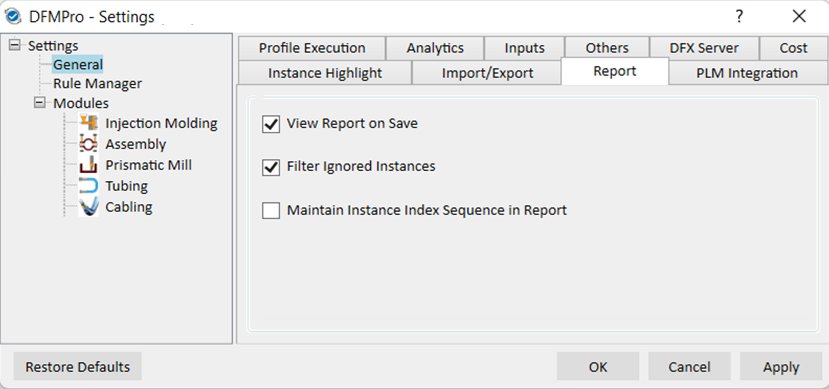
</div>

* **View Report on Save**：この設定を有効にすると、**レポート生成後に自動的にレポートが表示**されます。

* **Filter ignored instances**：この設定に基づき、**Ignore（無視）されたインスタンスをレポートから除外**します。

* **Maintain Instance Index Sequence in Report**：この設定は **eDrawings レポート**および **Excel ベースのレポート**に適用されます。インスタンスを **Ignore（無視）した場合でも、レポート内のインスタンス番号の順序を維持**します。

> 例：チェックボックスを **ON** にすると、**eDrawings レポート内の失敗インスタンスの順序**が**DFMPro の結果ツリーと同じ順序**で表示されます。


<!--Page.124-->
<!--
### PLM Integration 

An administrator can set PLM Integration ON/OFF. Based on DFMPro results selections, reports 
will be saved into a PLM system. By default, this setting is unselected. However, the Admin can 
only select/unselect it.  For a non-admin user, this setting will be disabled. 

• Export-Import Results to PLM: This setting is used to export-import DFMPro results in a PLM 
system. Results will be attached with part revision once a part is checked in. 
• Automatic: This setting automatically exports DFMPro results in the PLM system once a 
part is saved and checked in. For import, when the DFMPro is launched, it will import 
results for PLM if the results are already attached to the parts.  
• Add Report to PLM: This setting adds DFMPro reports to a PLM system. Excel, PDF, and 
eDrawings reports will be attached to the revision once a part is checked in. 
By checking the Automatic checkbox under the Add Reports to PLM section, the user can 
automatically attach the reports when the part is checked in. Similarly, the user can specify 
the type of reports to be automatically attached to the model. 
DFMPro Settings                       
-->


## PLM Integration（PLM 連携）

PLM 連携の **ON / OFF 設定は管理者のみが変更可能**です。

DFMPro の結果設定に基づいて、**レポートを PLM システムに保存**することができます。
この設定は **デフォルトでは無効（OFF）**になっています。
また、**一般ユーザーには無効（グレーアウト）表示され、変更できません。**


<div style="text-align: center;">
  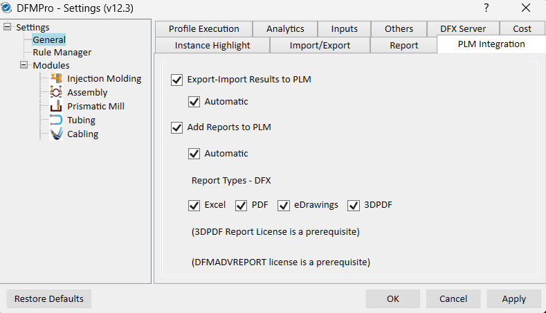
</div>

* Export / Import Results to PLM：この設定は、**DFMPro の解析結果を PLM システムにエクスポート／インポート**するために使用されます。部品が **チェックインされると、解析結果は部品リビジョンに添付**されます。

> * Automatic（自動）：この設定を有効にすると、部品を **保存してチェックインした際に、DFMPro 結果が自動的に PLM にエクスポート**されます。DFMPro を起動すると、**部品に結果がすでに添付されている場合、自動的に PLM から結果をインポート**します。

* Add Report to PLM：この設定では、**DFMPro レポートを PLM システムに追加**できます。以下のレポートが、**部品のチェックイン時にリビジョンへ添付**されます。

> * **Excel レポート**
> * **PDF レポート**
> * **eDrawings レポート**

**Add Reports to PLM セクションの「Automatic」チェックボックス**を有効にすると、部品のチェックイン時に **レポートが自動的に添付**されます。
また、**自動添付するレポートの種類を指定**することも可能です。


<!--Page.125-->
<!--
Profile Execution 
• Enable Profile Execution: Based on the selection, the Profile tab will be displayed in the 
DFMPro User Interface to select the profile configuration. Users can add their profile 
configuration as required. After enabling the check box, the Profile Definition File path will 
be displayed. 
By default, this check box is unselected, and DFMPro runs normally. 
Note: Users need to follow the standard configuration format to add a new profile under the 
Profile tab of the DFMPro User Interface.   
• Profile Definition File Path: By default, the DFMProfile.config file is available at the following 
location. Users can also keep the profile file on their network location. 
C:\ProgramData\GeometricLtd\DFMPro\wildfire\Profiles 
It is a global-level setting. However, the admin can only define it. For non-admin users, this 
setting will be disabled. 
DFMPro Settings                       
-->


### Profile Execution（プロファイル実行）


<div style="text-align: center;">
  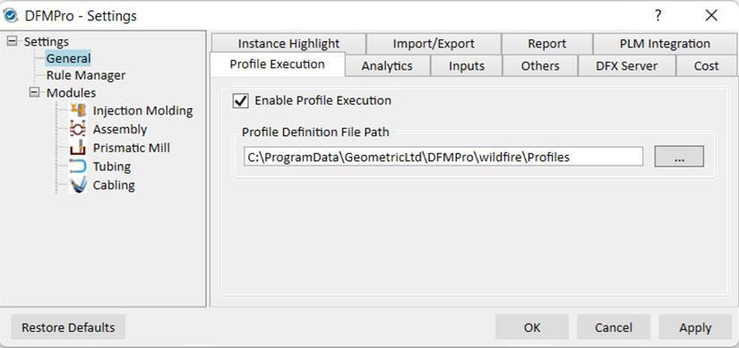
</div>


* **Enable Profile Execution**：この設定を有効にすると、**DFMPro ユーザーインターフェースに「Profile」タブが表示**され、ユーザーは **プロファイル設定を選択して解析を実行**できるようになります。ユーザーは必要に応じて **独自のプロファイル設定を追加**することも可能です。このチェックボックスを有効にすると、**Profile Definition File のパス**が表示されます。

デフォルトでは、このチェックボックスは **未選択（OFF）**であり、DFMPro は通常モードで実行されます。

---

**注記：**
新しいプロファイルを追加する場合は、
**DFMPro ユーザーインターフェースの Profile タブで定められた標準設定形式に従う必要があります。**

---

* **Profile Definition File Path**：デフォルトでは、**DFMProfile.config ファイル**は次の場所に保存されています。

```C:\ProgramData\GeometricLtd\DFMPro\wildfire\Profiles```

ユーザーは、**ネットワーク上の場所にプロファイルファイルを配置することも可能**です。
この設定は **グローバル設定（Global-level setting）**であり、**管理者のみが設定可能**です。
一般ユーザーの場合、この設定は **無効（グレーアウト）表示**され、変更できません。


<!--Page.126-->
 

<!--Page.127-->

<!--
DFX Analytics 
 
 
 
• Enable Analytics: DFX Analytics is a tool that captures essential data such as the number of 
users using a module, the number of times a part runs, and the number of failed instances. 
It is a global-level setting. However, only the admin can define it. For non-admin users, this 
setting will be disabled. 
User Interface Guide 
• Database Access: Users can select either the Direct or Server option. 
• Direct: This setting is used to directly communicate with the Analytic Database. Update the 
following details to access: 
o Server Name and Database Name: Enter the machine name on which the SQL Server 
is defined and the Database name to configure, and click the Validate button to verify 
it. Based on the selection, DFMPro will connect with DFX Analytics to post the 
captured data on the DFX Analytics server. 
o Authentication: This setting selects the required Authentication mode, i.e., Windows 
and SQL. 
➢ If Windows is selected for Authentication, the Login and Password fields will 
be grayed out. 
➢ If SQL is selected for Authentication, set Admin login credentials in the 
respective Login and Password fields. 
o Folder / Directory to save DFMPro Results: This setting defines a shared location 
where the DFMPro Results will be saved.   
• Server: This setting is used to communicate with the Analytic Database through DFX Analytics 
Webservice.  
o Server Connection Protocol: Users can select either the HTTP or HTTPS option as 
required for database access. 
o Server: Enter the Server Port Number and IP Address/Hostname in the following 
format and click on the Validate button to verify it and create a connection to the 
Server and Database.   
PortNumber@IPAddress/Hostname 
Note:  
• When a server and port are specified for Direct access, switching to the Server 
option will utilize the existing server details. 
• A location for saving DFMPro results (dfmr file) has been defined for Server 
Database Access. Users can download the file directly from the DFX Analytics 
dashboard. 
DFMPro Settings                       

-->

# DFX Analytics


<div style="text-align: center;">
  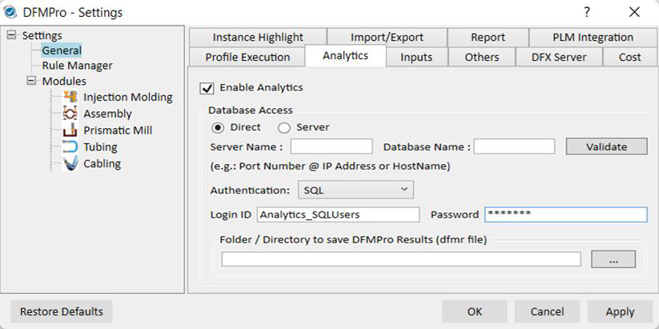
</div>


<div style="text-align: center;">
  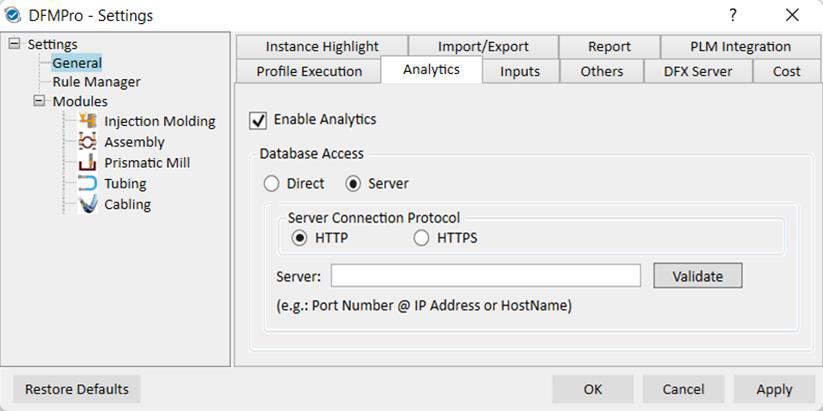
</div>

* Enable Analytics：**DFX Analytics** は、以下のような重要データを収集するツールです。

> * 各モジュールを使用している **ユーザー数**
> * **部品解析の実行回数**
> * **失敗インスタンス数**

> この設定は **グローバル設定**であり、**管理者のみが変更可能**です。一般ユーザーの場合、この設定は **無効（グレーアウト）表示**されます。


* Database Access（データベースアクセス）：ユーザーは **Direct** または **Server** のいずれかの方法を選択できます。


* Direct（直接接続）：この設定では、**DFX Analytics データベースに直接接続**します。アクセスするために、以下の情報を設定します。

> * Server Name / Database Name

>> * **SQL Server が動作しているマシン名**
>> * **データベース名**

>> を入力し、**Validate ボタン**をクリックして接続確認を行います。
>> 設定後、DFMPro は **DFX Analytics サーバーに接続し、収集したデータを送信**します。

> * Authentication（認証方式）：認証方法として**Windows Authentication** 、**SQL Authentication**次のいずれかを選択します。

>> * Windows 認証を選択した場合：**Login / Password フィールドは無効**になります。

>> * SQL 認証を選択した場合：**管理者ログイン情報（Login / Password）**を入力します。


> * Folder / Directory to Save DFMPro Results：DFMPro の解析結果を保存する **共有フォルダの場所**を設定します。


* Server（サーバー接続）：この設定では、**DFX Analytics Web Service を経由してデータベースに接続**します。


> * Server Connection Protocol：データベース接続用のプロトコルとして* **HTTP**、**HTTPS**のいずれかを選択します。

> * Server：以下の形式で **サーバーポート番号と IP アドレス／ホスト名**を入力します。入力後、**Validate ボタン**をクリックすると、サーバーおよびデータベースへの接続確認が行われます。

```PortNumber@IPAddress/Hostname```


---

**注記**

* Direct 接続で **サーバーとポートが設定されている場合、Server 接続に切り替えると既存のサーバー設定が使用されます。**

* **Server Database Access の場合、DFMPro 結果（.dfmr ファイル）の保存場所が定義されています。**
  ユーザーは **DFX Analytics ダッシュボードから直接ファイルをダウンロード**できます。

---


<!--Page.128-->

<!--
Inputs 
• Read Material from CAD Attribute/Parameter: Some organizations follow a standard 
practice of defining material information in CAD attributes. DFMPro allows reading material 
from CAD Attribute/Parameter through settings. Use the Read Material from CAD 
Attribute/Parameter option to define Attribute/Parameter Name. DFMPro will automatically 
read information related to material and use it for rule validation.  
DFMPro Settings            
-->

## Inputs（入力設定）


<div style="text-align: center;">
  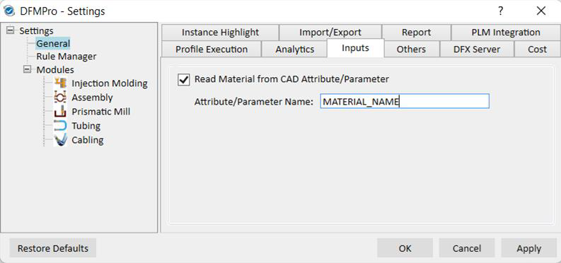
</div>

* Read Material from CAD Attribute / Parameter（CAD属性／パラメータから材料情報を取得）：一部の組織では、**CAD 属性（Attribute）またはパラメータ（Parameter）に材料情報を定義する標準運用**を行っています。DFMPro では、設定を通じて **CAD の属性またはパラメータから材料情報を読み取る**ことができます。**Read Material from CAD Attribute / Parameter** オプションを使用して、対象となる **Attribute / Parameter 名**を定義します。設定後、DFMPro は **材料に関する情報を自動的に読み取り、ルール検証に使用**します。


<!--Page.129-->

<!--
Others 
• Rule Files Path: This setting defines a Standard directory where standard rule files are kept. 
Rule files in this directory will be listed in the Rule configuration selection dropdown. 
• Log Files Path: This setting defines a Standard directory where the DFMPro log file is saved. 
If not specified, the log file path will be saved in the temp folder. 
“%temp%DFMPro_Log” 
• Log Level: This setting enables the user to set the category of logging information written into 
the DFMPro log file. Users can set the log file level and generate a detailed log when required. 
In case of an exception, this detailed log will be shared with the offshore team to understand 
the issue better. 
The selection of different levels will write a different combination of logs: 
o Level 1 - Error Logs 
o Level 2 - Error And Warning Logs 
o Level 3 - Error, Warning, Debug, and Info Logs 
• Add Run Detail Info into Parameters:  
o DFMPro_LAST_RUN_BY (User information) 
DFMPro Settings                       
-->


## Others（その他設定）


<div style="text-align: center;">
  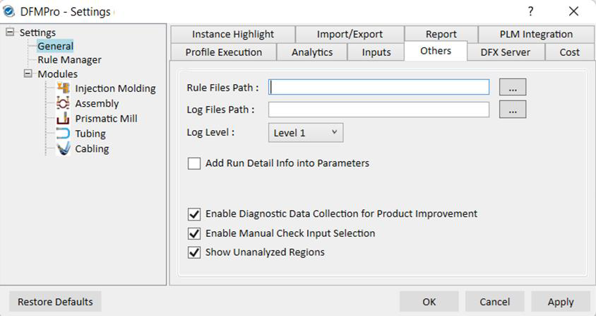
</div>

* Rule Files Path（ルールファイル保存パス）：この設定では、**標準ルールファイルを保存するディレクトリ**を指定します。このディレクトリに保存されているルールファイルは、**Rule Configuration の選択ドロップダウンリストに表示**されます。


* Log Files Path（ログファイル保存パス）：この設定では、**DFMPro のログファイルを保存するディレクトリ**を指定します。保存先が指定されていない場合、ログファイルは以下の **一時フォルダ**に保存されます。

```%temp%\DFMPro_Log```

* Log Level（ログレベル）：この設定では、**DFMPro ログファイルに記録するログ情報の種類**を指定できます。必要に応じてログレベルを変更し、**詳細ログを生成**することが可能です。
例外（エラー）が発生した場合、この詳細ログを **オフショアチームに共有して問題の原因を特定**するために使用します。

> ログレベルごとに記録される内容は以下の通りです。

> * **Level 1**：Error Logs（エラーログのみ）

> * **Level 2**：Error + Warning Logs（エラーおよび警告ログ）

> * **Level 3**：Error + Warning + Debug + Info Logs（すべてのログ）


<!--Page.130-->

<!--
o DFMPro_LAST_RUN_TIME (DFMPro last run time) 
o DFMPro_RULEFILE (Rule file name) 
o DFMPro_PROCESS (Manufacturing Process) 
o DFMPro_STATUS [REVIEWED / NOT REVIEWED / REVIEW IN PROGRESS (%)] 
❖ REVIEWED: The designer will verify all failure instances and take appropriate action, 
like correcting or ignoring the design. 
❖ NOT REVIEWED: The designer will not check all failure instances and take 
appropriate action. 
❖ REVIEW IN PROGRESS (%): Designer has not verified all failure instances, and 
verification is WIP. % value shows how many failure instances are verified out of all 
failed instances of all failed rules. 
o DFMPRO_REGION (Location of manufacturing facility) 
o DFMPRO_BATCH_QUANTITY (Quantity of parts manufactured for a batch) 
o DFMPPRO_ANNUAL_QUANTITY (Quantity of parts manufactured throughout the year) 
o  DFMPRO_LIFE_CYCLE (Lifecycle years of manufacturing) 
o DFMPRO_COST_TEMPLATE (Report template format) 
o DFMPRO_STOCK_TYPE (Stock type name) 
DFMPro Settings                 
-->


* Add Run Detail Info into Parameters（実行情報をパラメータに追加）

DFMPro の実行情報を **パラメータとして記録**します。

例：

### DFMPro 実行情報パラメータ

* **DFMPro_LAST_RUN_BY**（解析を実行したユーザー情報）

* **DFMPro_LAST_RUN_TIME**（DFMPro の最終実行日時）

* **DFMPro_RULEFILE**（使用されたルールファイル名）

* **DFMPro_PROCESS**（製造プロセス）

* **DFMPro_STATUS** `[REVIEWED / NOT REVIEWED / REVIEW IN PROGRESS (%)]`

> * **REVIEWED**：設計者がすべての失敗インスタンスを確認し、設計修正または Ignore などの適切な対応を実施した状態。

> * **NOT REVIEWED**：設計者が失敗インスタンスを確認しておらず、対応が行われていない状態。

> * **REVIEW IN PROGRESS (%)**：設計者がすべての失敗インスタンスを確認しておらず、**確認作業が進行中（Work In Progress）**の状態。

>> **％の値**は、**すべての失敗ルールにおける失敗インスタンスのうち、確認済みの割合**を示します。


* **DFMPRO_REGION**（製造拠点の所在地）

* **DFMPRO_BATCH_QUANTITY**（1バッチあたりの製造数量）

* **DFMPRO_ANNUAL_QUANTITY**（年間製造数量）

* **DFMPRO_LIFE_CYCLE**（製品の製造ライフサイクル年数）

* **DFMPRO_COST_TEMPLATE**（レポートテンプレート形式）

* **DFMPRO_STOCK_TYPE**（素材ストックの種類）
 


<!--Page.131-->

<!--
• Automatic Save: 
o Check - After adding a parameter into a part file, a part file will automatically get saved. 
o Uncheck – A user should save a part file to add parameter info to a part file. 
By default, this setting is unchecked. However, the Admin can select/unselect it. For non
admin users, this setting will be disabled. 
• Enable Diagnostic Data Collection for Product Improvement: This setting is to turn on/turn 
off the usage data collection process. By default, this option is always selected. This option 
allows for collecting DFMPro Usage Data from the customer, improving product quality and 
performance. 
• Enable Manual Check Input Selection: This setting turns on/off the manual check input 
selection dialog box. By default, this option is always selected. This option allows users to turn 
off the manual check selection dialog box to select manually checked rules.  
DFMPro Settings                       
-->


<div style="text-align: center;">
  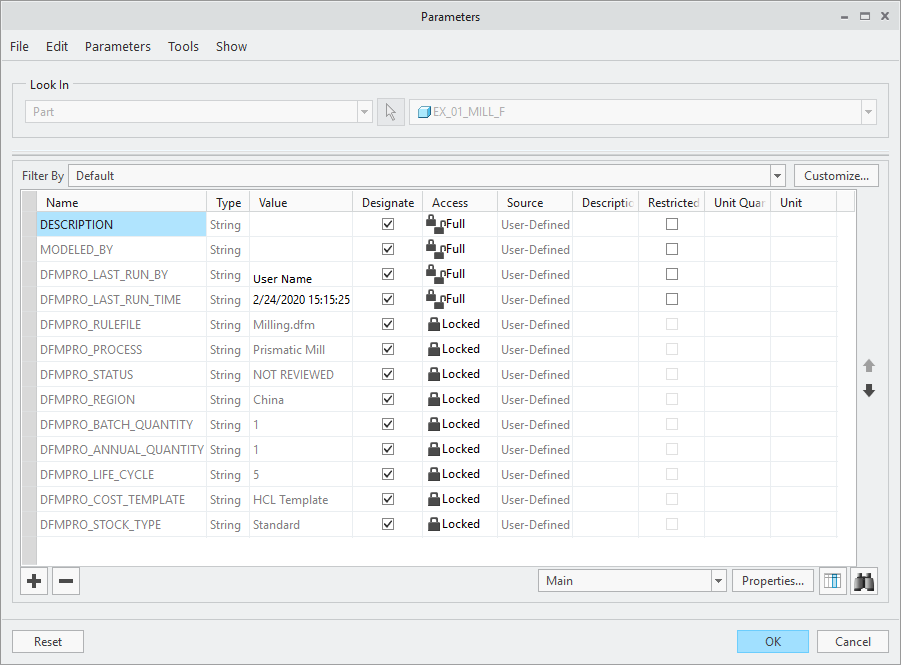
</div>


* Automatic Save（自動保存）

> * **Check（チェックあり）**：パーツファイルにパラメータが追加された後、**パーツファイルは自動的に保存されます。**

> * **Uncheck（チェックなし）**：パーツファイルへパラメータ情報を追加する場合、**ユーザーが手動で保存する必要があります。**

> ※デフォルトでは **チェックなし** になっています。
> この設定は **管理者のみ変更可能** であり、一般ユーザーには無効（グレーアウト）で表示されます。


* Enable Diagnostic Data Collection for Product Improvement（製品改善のための診断データ収集を有効化）：この設定では、**使用状況データの収集を有効／無効**にできます。
デフォルトでは **常に有効（チェックあり）** です。この機能により、顧客環境から **DFMPro の使用データ**を収集し、**製品品質やパフォーマンス改善**のために利用されます。


* Enable Manual Check Input Selection（手動チェック入力選択を有効化）：この設定は、**Manual Check Input Selection ダイアログの表示／非表示**を制御します。
デフォルトでは **有効（チェックあり）** です。この機能により、ユーザーは**手動チェック対象のルールを選択するダイアログを表示／非表示にすることができます。**


<!--Page.132-->
<!--
• Show Unanalyzed Regions: This setting displays unanalyzed regions in DFMPro results. By 
default, it will be selected.  
DFX Server 
• Allow server analysis: Based on the selection, the DFX Server tab and Local/Server options 
will be available on the DFMPro User Interface to execute the server or local analysis. 
It is a global-level setting. However, the Admin can select/unselect it. For non-admin users, 
this setting will be disabled. 
• Server Connection Protocol: Users can select any option for server connection. 
• Server: Enter the Server machine name already defined on the DFX Server to configure and 
click the Validate button to verify it. 
DFMPro Settings                       
-->

* Show Unanalyzed Regions（未解析領域の表示）：この設定を有効にすると、**DFMPro の解析結果において未解析領域を表示**します。**デフォルトでは有効（チェックあり）**になっています。


## DFX Server


<div style="text-align: center;">
  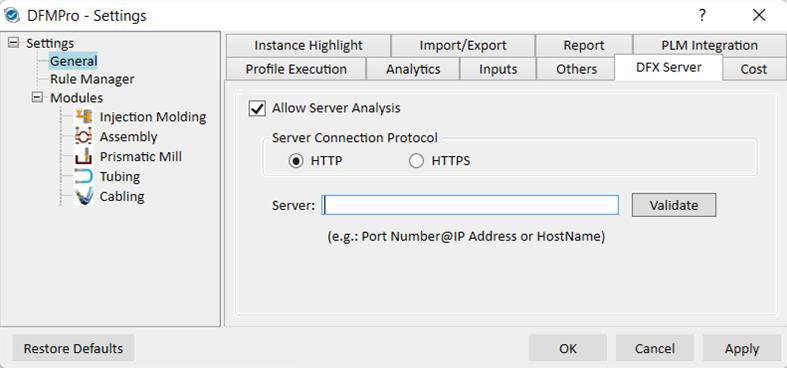
</div>

* Allow server analysis（サーバー解析を許可）：この設定を有効にすると、DFMProユーザーインターフェースに* **DFX Server タブ**、**Local / Server の解析実行オプション**の項目が表示されます。
これにより、解析を**ローカルマシン**、**DFX Server**のいずれかで実行できるようになります。

> ※この設定は **グローバル設定**です。**管理者のみ変更可能**で、一般ユーザーには無効（グレーアウト）で表示されます。

* Server Connection Protocol（サーバー接続プロトコル）：サーバー接続に使用する **通信プロトコルを選択**します。

* Server（サーバー）：DFX Server に設定されている **サーバーマシン名**を入力します。入力後、**Validate ボタン**をクリックするとサーバー接続の確認を行うことができます。


<!--Page.133-->
<!--
Cost 
• Server Name: SQL Database server name. 
• Database Name: Name of Cost database. 
• Display Currency: Select the required currency type from the dropdown list for cost 
calculation. 
• Rejection Rate (%): The percentage applied to the total cost is calculated for a part and 
reflects on the Cost report as part of the Landed Cost. 
• SG&A (%): The percentage applied to total cost is calculated for a part and reflects on the 
Cost report as part of the Landed Cost. 
• Profit Margin (%): The percentage applied to landed cost is calculated for a part and reflects 
on the Cost report as part of the Net Price. 
• Tooling Cost Calculations: 
o Manual: This option allows manually adding tooling costs in the Input dialog box. 
o Automatic – This option is to calculate tooling costs automatically. 
Note:  For both cases (Manual or Automatic), the total tooling cost will amortize with the 
total production quantity for 5 years. 
DFMPro Settings                       
-->


### Cost（コスト設定）


<div style="text-align: center;">
  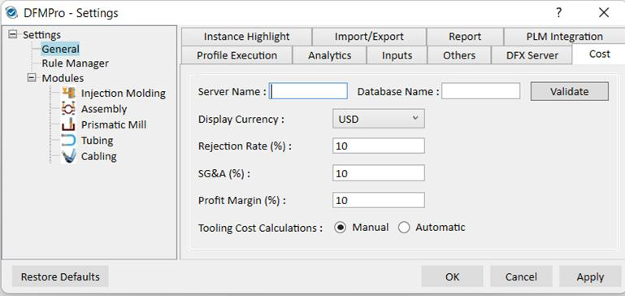
</div>

* Server Name（サーバー名）：コスト計算で使用する **SQLデータベースサーバー名**を指定します。

* Database Name（データベース名）：使用する **Costデータベースの名称**を指定します。

* Display Currency（表示通貨）：コスト計算で使用する **通貨の種類**をドロップダウンリストから選択します。

* Rejection Rate (%)（不良率）：総コストに対して適用される **不良率（％）** を設定します。この値は **部品コスト計算に反映**され、コストレポートでは **Landed Cost（着地コスト）**の一部として表示されます。

* SG&A (%)（販売費および一般管理費）：総コストに対して適用される **SG&A（販売費および一般管理費）割合（％）** を設定します。この値は **部品コスト計算に反映**され、コストレポートでは **Landed Cost** の一部として表示されます。

* Profit Margin (%)（利益率）：**Landed Cost に対して適用される利益率（％）** を設定します。この値は **部品コスト計算に反映**され、コストレポートでは **Net Price（最終価格）** の一部として表示されます。

* Tooling Cost Calculations（金型コスト計算）：金型費用の計算方法を選択します。

> * Manual（手動）：Input ダイアログボックスで **金型コストを手動入力**します。

> * Automatic（自動）：**金型コストを自動計算**します。


> Note（注意）：Manual / Automatic のどちらの場合でも、**総金型コストは5年間の総生産数量で按分（償却）されます。**


<!--Page.134-->
<!--
Rule Manager tab 
Click on the Rule Manager tab will display the General tab on the right-side pane.  
General 
• Length Unit: This setting defines the length unit for the rules file.  
• Angular Unit: This setting defines the angular unit for rule files. 
DFMPro Settings                       
-->


## Rule Manager タブ

**Rule Manager タブ**をクリックすると、右側のペインに **General タブ**が表示されます。


### General（一般設定）


<div style="text-align: center;">
  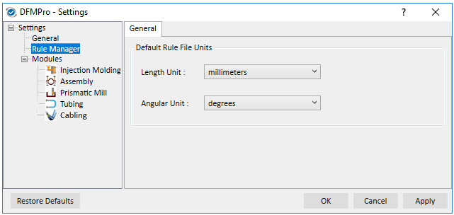
</div>

* Length Unit（長さ単位）：この設定では、**ルールファイルで使用する長さの単位**を定義します。

* Angular Unit（角度単位）：この設定では、**ルールファイルで使用する角度の単位**を定義します。


※これらの設定は、**DFMPro のルール評価時に使用される単位系**に影響します。


<!--Page.135-->
<!--
Module Specific settings 
Injection Molding tab – Cost 
Runner Type:  
• Hot: By default, a Hot runner is selected for the Injection Molding module.  
• Cold: Select the Cold Runner option and set the Sprue Runner Weight percentage. 
DFMPro Settings                       
-->

## Module Specific Settings（モジュール別設定）

### Injection Molding タブ – Cost


<div style="text-align: center;">
  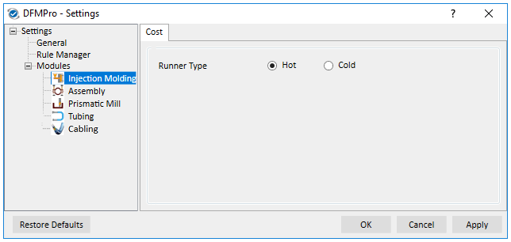
</div>


<div style="text-align: center;">
  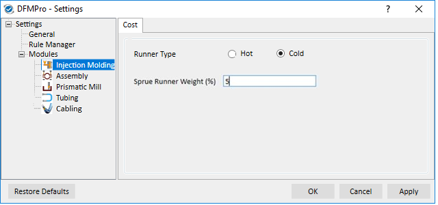
</div>


### Runner Type（ランナータイプ）

射出成形における **ランナー方式**を設定します。

* **Hot（ホットランナー）**：デフォルトでは **Hot Runner（ホットランナー）** が選択されています。

* **Cold（コールドランナー）**：**Cold Runner（コールドランナー）** を選択した場合、**Sprue Runner Weight（スプルー・ランナー重量割合）** を設定する必要があります。


<!--Page.136-->

<!--
Assembly tab 
General 
• Display Only Failed Components: This setting easily views failure results. Click on the failure 
instance will only display failure parts on the screen, and the rest remain temporarily hidden. 
• Execute Assembly Rules only on Top Level Assembly Parts: This setting executes assembly 
rules only on top-level parts in Assembly. If the checkbox is selected, users will have an option 
in the User Inputs section to restrict the analysis to the top-level or analyze the entire 
assembly.  
For the following listed below, individual rule configurations will take precedence over 
DFMPro Settings: 
o Bolt and Screw Rationalization 
o Hardware Rationalization 
o Preferred Hardware 
o Recommended Bolted Joints 
Users will have the option to modify the top-level or all-level analysis selection for these rules 
separately during configuration. 
For all other rules, DFMPro Settings selection will take precedence.  
DFMPro Settings              
-->


## Assembly タブ

### General（一般設定）


<div style="text-align: center;">
  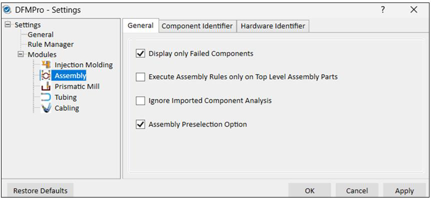
</div>

* Display Only Failed Components（失敗コンポーネントのみ表示）：この設定を有効にすると、**失敗結果を簡単に確認できる表示モード**になります。
失敗インスタンスをクリックすると：**不具合が発生している部品のみ画面に表示**、その他の部品は **一時的に非表示**になります。

* Execute Assembly Rules only on Top Level Assembly Parts（アセンブリルールをトップレベル部品のみに適用）：
この設定を有効にすると、**アセンブリルールはトップレベルの部品のみに対して実行**されます。
チェックボックスを有効にすると、**User Inputs セクション**で* **Top Level**（トップレベル部品のみ解析）、**All Level**（アセンブリ全体を解析
）の選択が可能になります。

例外ルール：以下のルールでは、**Rule Configuration の個別設定が DFMPro Settings より優先**されます。

* **Bolt and Screw Rationalization**
* **Hardware Rationalization**
* **Preferred Hardware**
* **Recommended Bolted Joints**

これらのルールでは、**設定時に Top-level / All-level の解析範囲を個別に変更できます。**

その他のルール：上記以外のルールについては、**DFMPro Settings の設定が優先されます。**

この設定は **デフォルトではチェックなし**になっています。
管理者のみチェック／チェック解除が可能で、**一般ユーザーには無効（グレーアウト）**で表示されます。


<!--Page.137-->
<!--
This setting is unchecked by default. However, the admin can select/deselect it. For non
admin users, this setting will be disabled. 
• Ignore Imported Component Analysis: This setting defines a workflow to Ignore Supplier 
Component Analysis, avoids showing results for the same, and improves analysis time. 
This setting is unselected by default; however, the Admin can only select/unselect it.  For non
admin, this setting will be disabled.  
• Assembly Preselection Option: By default, the checkbox is selected. When selected in the 
Inputs group box, the Assembly Analysis will display the Entire Assembly and Pre-Selected 
Components options in the dropdown list to select. Only the Entire Assembly option will be 
available if this is not selected. 
Component Identifier 
The dropdown will display a list of different supported component identifiers. Users must set a 
FileName and Attribute/Parameter Name only in the component identifier to give values related 
to the part name and attribute name input in the rule configuration. 
DFMPro Settings                       
-->


* Ignore Imported Component Analysis（インポート部品の解析を無視）：この設定は、**サプライヤーから提供された部品の解析を無視するワークフロー**を定義します。

> この設定を有効にすると：

> * サプライヤー部品の解析結果が表示されなくなる
> * 同一結果の表示を回避できる
> * **解析時間の短縮**につながる

> ※この設定は **デフォルトでは無効（チェックなし）**です。
> また、**管理者のみ変更可能**であり、一般ユーザーには無効（グレーアウト）で表示されます。

* Assembly Preselection Option（アセンブリ事前選択オプション）：デフォルトでは **チェックあり**になっています。

この設定が有効な場合、**Inputs グループボックスの Assembly Analysis** に以下の選択肢が表示されます。

> * **Entire Assembly（アセンブリ全体）**
> * **Pre-Selected Components（事前選択コンポーネント）**

> この設定が無効の場合は、**Entire Assembly のみ**が選択可能になります。

### Component Identifier（コンポーネント識別子）

ドロップダウンリストには、**対応しているコンポーネント識別子の一覧**が表示されます。

ユーザーは **Component Identifier の設定で以下を指定する必要があります。**

* **FileName**
* **Attribute / Parameter Name**

これらの値は、**ルール設定（Rule Configuration）で使用される部品名や属性名の入力値として使用**されます。


<div style="text-align: center;">
  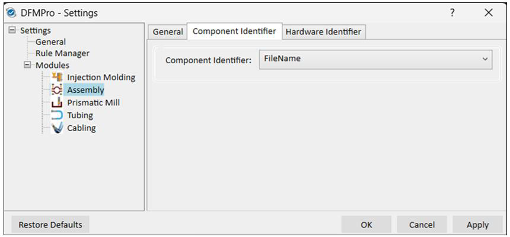
</div>

<!--Page.138-->
<!--
Hardware Identifier 
The dropdown will display a list of supported hardware identifier processes, i.e., 
Database/Filename and Feature Tree. The user can select the required process by which DFMPro 
can retrieve the thread data during analysis.  
Prismatic Mill tab 
• Display Machining Setup: For Prismatic Mill, DFMPro provides an option to view and edit the 
machining setup. The user will check the machine setups with this setting by clicking the 
“Machining Setup” check box. The number of machining setups and feature lists will help the 
design engineer to understand the setups. Based on the setup information, the designer can 
optimize the features of the design. 
DFMPro Settings                       
-->


### Hardware Identifier（ハードウェア識別子）

ドロップダウンリストには、以下の **ハードウェア識別方法**が表示されます。

* **Database / Filename**
* **Feature Tree**

ユーザーは、DFMPro が解析時に **ねじ（スレッド）情報を取得する方法**として、
必要な識別方式を選択します。


<div style="text-align: center;">
  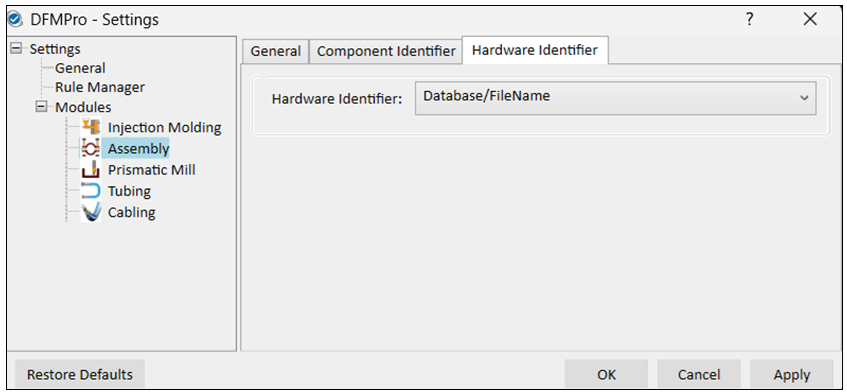
</div>

### Prismatic Mill タブ

* Display Machining Setup（加工セットアップ表示）：Prismatic Mill（プリズマティック加工）では、**加工セットアップを表示および編集する機能**が提供されています。

ユーザーは **Machining Setup チェックボックス**を有効にすることで、
加工セットアップの内容を確認できます。

この機能では以下を確認できます：

* 加工セットアップの数
* 各セットアップに含まれるフィーチャ一覧

これにより設計者は：

* 加工工程の構成を理解できる
* セットアップ数を減らす設計改善が可能
* フィーチャ配置を最適化できる


<div style="text-align: center;">
  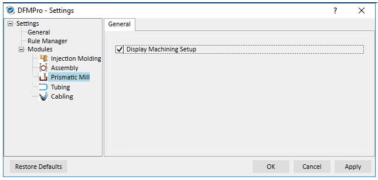
</div>


<!--Page.139-->

<!--
Tubing tab 
This setting is provided to identify the tube through the Attribute/Parameter name and value, 
which is already defined in the settings file. In addition, users can add pipe attribute names and 
their values. 
DFMPro Settings                       
-->


### Tubing タブ

この設定では、**チューブを識別するための Attribute（属性）または Parameter（パラメータ）の名称と値**を指定します。

これらの情報は、**設定ファイル内にあらかじめ定義**されています。

また、ユーザーは以下を追加することも可能です：

* **パイプ属性名（Pipe Attribute Name）**
* **その属性に対応する値（Attribute Value）**

これにより、DFMPro は **指定された属性情報をもとにチューブを識別し、解析に使用**します。


<div style="text-align: center;">
  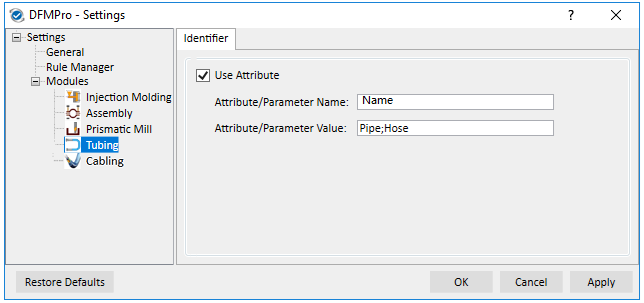
</div>

<!--Page.140-->
<!--
Tube Identification 
Priority of tube identification will be according to the information available in 
attributes/parameters against the values configured in settings. Please refer to the image below. 
Note: Pipes created using the Pipe command and Pipe Application are considered for validation. 
Cabling tab 
• Cable: This setting identifies the cable through the Attribute/Parameter name and value. 
Users can add cable attribute names and their values. 
• Cable Bundle: A cable bundle is a sub-assembly in which several cables are present. This 
setting identifies the cable bundle through the Attribute/Parameter name and value. 
• Cable Support: Users can define a list of cable support components. Support components are 
identified with part Attribute/Parameter names and their values. Users can define multiple 
support components separated by “;” (semicolons). 
o Vicinity Distance: Often, support components are not touching with cable/cable bundle 
and are placed near the cable. DFMPro has provided the “Vicinity Distance” value to 
DFMPro Settings                       
-->


### Tube Identification（チューブ識別）

チューブの識別は、**設定ファイルで定義された Attribute（属性）／Parameter（パラメータ）の値**に基づいて行われます。

識別の優先順位は、**設定された属性／パラメータ情報の有無**によって決定されます。
詳細については、以下の図を参照してください。

Note（注意）：**Pipe コマンドまたは Pipe Application を使用して作成されたパイプのみ**が、解析対象として検証されます。


### Cabling タブ


<div style="text-align: center;">
  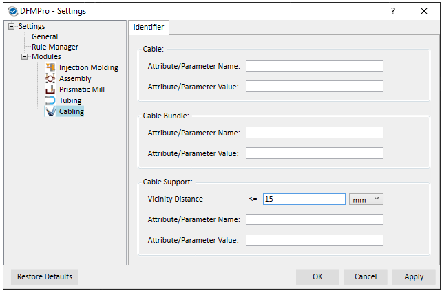
</div>


* Cable（ケーブル）

> この設定では、**Attribute／Parameter の名称および値**を使用してケーブルを識別します。

> ユーザーは以下を追加できます：

> * ケーブル属性名
> * 属性値

* Cable Bundle（ケーブルバンドル）：ケーブルバンドルとは、**複数のケーブルを含むサブアセンブリ**のことです。この設定では、**Attribute／Parameter の名称および値**によってケーブルバンドルを識別します。

* Cable Support（ケーブルサポート）：ユーザーは **ケーブルサポート部品の一覧**を定義できます。

> サポート部品は、以下の情報で識別されます：

> * 部品の **Attribute／Parameter 名**
> * その **値**

> 複数のサポート部品を指定する場合は、

> ```;（セミコロン）```

> で区切って入力します。


>* Vicinity Distance（近接距離）：多くの場合、**サポート部品はケーブルやケーブルバンドルに直接接触していません**。通常は **ケーブルの近くに配置**されています。
そのため DFMPro では、**Vicinity Distance（近接距離）**という設定を用いてケーブルとサポート部品の関係を識別します。
この設定は、**適切なケーブルサポート部品を識別するため**に使用されます。
識別されたサポート部品は、**「Recommended Distance Between Cable Supports（ケーブルサポート間の推奨距離）」**ルールの検証時に入力情報として使用されます。

>> この設定は **グローバル設定（Global-level setting）**であり、**管理者のみ設定・変更が可能**です。


**Note（注意）**：設定の詳細については、**DFMPro Help ファイルの「DFMPro Settings」セクション**を参照してください。


<!--Page.141-->

<!--
identify the right support components, which is used as input for the Recommended 
Distance Between Cable Supports rule validation.  
This is a Global-level setting, and Admin can configure them.  
Note:  For more details about Settings, refer to the DFMPro Settings section in the DFMPro 
Help file.  
DFMPro Settings                       
-->


<!--Page.142-->

<div style="page-break-after: always;"></div>

<!--# Dock/Undock Feature--> 
<!--
# ドッキング／アンドッキング機能

DFMPro allows to rotate pane as per requirement. Click on the Dock/Undock button in the 
DFMPro User Interface. 
Dock/Undock Feature                       
-->


# ドッキング／アンドッキング機能

DFMPro では、ユーザーの作業環境に応じて **ペインの配置を変更**することができます。

DFMPro ユーザーインターフェースにある **Dock / Undock ボタン**をクリックすることで、
ペインをドッキングまたはアンドッキングできます。


<div style="text-align: center;">
  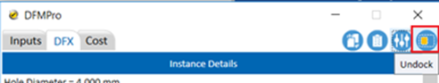
</div>


<!--Page.143--> 